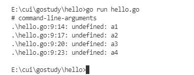

# 20211226


## 开课


上课时间：每周日：9:30~18:30

视频需要转码、审核、上传，需要时间。

### 搭建Go语言开发环境

https://www.liwenzhou.com/posts/Go/install_go_dev/


查看Go版本：

```bash
❯ go version
go version go1.17.5 darwin/amd64
```


配置GoPROXY

```bash
go env -w GOPROXY=https://goproxy.cn,direct
```


VSCode安装Go插件教程：

https://www.liwenzhou.com/posts/Go/00_go_in_vscode/

点右下角 Install All


### 创建第一个Go程序

新建项目目录 hello

进到目录中编写一个main.go文件


执行初始化命令：

```bash
go mod init hello
```

- *hello*是你的项目名
- 只需要在创建项目的时候在项目的根目录下执行一次！

一个可执行的go程序。

```go
package main

import "fmt"

func main() {
	fmt.Println("Hello world!")
}
```

编译可执行程序

在项目的根目录下执行

```bash
go build
```

指定编译后的文件名称

```bash
go build -o xxx
```


### 多个go文件

一个go项目下可以存在多个go文件。

此时，如果使用`go run` 执行，那么就需要把所有的源文件都带上。

```bash
go run const.go int.go hello.go
```

否则就容易出现以下问题：



```bash
❯ go run hello.go
# command-line-arguments
./hello.go:63:14: undefined: c4
./hello.go:64:14: undefined: d3
./hello.go:64:18: undefined: d4
```


**无论是VsCode还是Goland 推荐大家一个窗口打开一个项目！**

**无论是VsCode还是Goland 推荐大家一个窗口打开一个项目！**

**无论是VsCode还是Goland 推荐大家一个窗口打开一个项目！**


### 变量

```go
package main

import "fmt"

var version string
var age11 = 18

// name12 := "小王子"  // 函数外语句必须以关键字开头

func main() {
	fmt.Println("Hello world!")

	/*
		多行注释
	*/
	// 变量的声明
	var name string // 声明变量

	// 批量声明
	var (
		age  int  // 0
		isOk bool // false
	)
	// var age int
	// var isOk bool

	age = 100 // 变量赋值
	fmt.Println(name, age, isOk)

	var age2 int = 18 // 声明变量并赋值
	fmt.Println(age2)

	// 没有指定类型？
	var name3, age3 = "jade", 28

	// var (
	// 	name3 string = "jade"
	// 	age3 int = 28
	// )

	fmt.Println(name3, age3)

	var age4 int8 = 28 // 如果不想用编译器推导的类型，就需要显式指定变量的类型
	fmt.Println(age4)

	// 双引号表示字符串，单引号表示字符

	var x byte = 'a'   // 字符
	var s string = "a" // 字符串
	fmt.Println(x, s)

	// 短变量声明
	s2 := "jade" // var s2 string s2="jade"
	fmt.Println(s2)
	s2 = "小王子"
	fmt.Println(s2)

	// var x2 string
	// x2 = 18 // 只能给变量赋正确类型的值
	// fmt.Println(x2)
}
```


### 常量

```go
// const.go

package main

const pi = 3.14

const (
	v = "v1.0"
	v2
	v3
	v4
)

const (
	week1 = 1
	week2 = 2
	week3 = 3
)

const (
	n1 = iota // 0
	n2        // 1
	n3
	n4
	n5
)

const (
	z1 = iota // 0
)

// 利用iota声明存储的单位常量
const (
	_  = iota             // 0
	KB = 1 << (10 * iota) // 1<<10 <=> 10000000000
	MB = 1 << (10 * iota) // 1<<20
	GB = 1 << (10 * iota) // 1<<30
	TB = 1 << (10 * iota)
	PB = 1 << (10 * iota)
)

// 声明中插队
const (
	c1 = iota // 0
	c2        // 1
	c3 = 100  // 插队
	c4 = iota // 3
)

const (
	d1, d2 = iota + 1, iota + 2 // 1,2
	d3, d4 = iota + 1, iota + 2 // 2,3
)
```

### 基本数据类型

#### 整型


```go
var (
	i1 int8   = 0b1001  // 二进制
	i2 uint64 = 0o644   // 八进制
	i3        = 0x123   // 十六进制 默认为int
	i4 int32  = 123_456 // _分隔让数字更直观
)

// 利用fmt.Printf 格式化打印
v11 := 123
fmt.Println("自带换行")
fmt.Printf("十进制：%d \n", v11)
fmt.Printf("二进制：%b\n", v11)
fmt.Printf("八进制：%o\n", v11)
fmt.Printf("十六进制：%x\n", v11)
```


#### 浮点型

**计算机中浮点数都是不精确的！**

**计算机中浮点数都是不精确的！**

**计算机中浮点数都是不精确的！**

实际写业务遇到浮点数运算都是转成整型来计算的。

```go
func f1() {
	fmt.Printf("%.2f\n", math.MaxFloat32)
}
```

#### 布尔型

```go
var b11 = true
var b12 bool // false
```

注意：

1. 布尔类型变量的默认值为`false`。
2. Go 语言中不允许将整型强制转换为布尔型.
3. 布尔型无法参与数值运算，也无法与其他类型进行转换。

#### 字符串

```go
package main

import (
	"fmt"
	"strings"
)

func f2() {
	// filename 表示windows下一个文件路径
	filename := "C:\\go\\hello\\hello.exe"
	fmt.Println(filename)

	s11 := "永远不要高估自己"
	fmt.Println(s11)

	s12 := "\"永远不要高估自己\""
	fmt.Println(s12)

	// 多行字符串
	s13 := `多行
字符串
	测\n试
	`
	fmt.Println(s13)

	// 字符串操作
	fmt.Println(len(s11))
	// 字符串拼接
	name1 := "jade"
	value1 := "过年好"
	fmt.Println(name1 + value1)

	ret := fmt.Sprintf("大家好，%s祝大家%s", name1, value1)
	fmt.Println(ret)

	// strings
	s14 := "你:好:呀"
	fmt.Println(strings.Split(s14, ":"))

	fmt.Println(strings.Contains(s14, "你"))
	fmt.Println(strings.HasPrefix(s14, "你:")) // true
	fmt.Println(strings.HasSuffix(s14, "啊"))  // false

	fmt.Println(strings.Index(s14, ":"))     // 3
	fmt.Println(strings.LastIndex(s14, ":")) // 7

	// 拼接
	slice1 := []string{"你", "我", "他"}
	fmt.Println(strings.Join(slice1, "-"))

	// 字符和字符串
	y1 := '中' // 字符
	y2 := "中" // 字符串
	fmt.Println(y1, y2)

	// byte 和rune
	fmt.Println([]rune(s14))
	fmt.Println([]byte(s14))
	// for range循环
	idx := 0
	for _, r := range s14 { // rune表示一个汉字
		if r == ':' {
			fmt.Println(idx)
			break
		}
		idx++
	}
}

```

#### 字符

byte和rune

byte：常见的a、b、c等字符 

rune 是用来表示中文、日文等复合字符的


#### 类型转换

```go
package main

import "fmt"

// 类型转换

// T()

func f3() {
	var i11 int8 = 1

	i12 := int64(i11)             // int8 -> int64
	fmt.Printf("i12: %T \n", i12) // int64

	f11 := 12.34                  // float64
	f12 := int64(f11)             // float64 -> int64
	fmt.Printf("f12: %T \n", f12) // int64

	// bool(1) // int -> bool 🚫
}

```

### 运算符

五种运算符

1. 算术运算符
2. 关系运算符
3. 逻辑运算符
4. 位运算符
5. 赋值运算符

#### 补充问题：

很多很多个数字中，除了某个数字只出现一次外，其他数字均出现了两次。问如何找出只出现一次的数字？

```go
// 一堆数找出只出现一次的那个
func f11() {
	nums := []int{17, 4, 3, 3, 9, 11, 9, 11, 17}
	if len(nums)%2 == 0 {
		return
	}
	ret := nums[0]
	for _, num := range nums[1:] {
		ret ^= num // 异或
	}
	fmt.Println(ret)

}
```


### 流程控制语句

#### if

```go
package main

import "fmt"

// if条件判断分支

func f5() {
	score := 89 // 假设从数据库中查询出一个同学的分数
	if score > 90 {
		fmt.Println("A")
	} else if score > 65 {
		fmt.Println("勉强留下")
	} else {
		fmt.Println("明年再来")
	}
	fmt.Println(score)
}

func f6() {
	// score只在if分支中有效
	// 因为它只在if分支中声明了score，外部不可见
	if score := 89; score > 90 {
		fmt.Println("A")
	} else if score > 65 {
		fmt.Println(score)
		fmt.Println("勉强留下")
	} else {
		fmt.Println("明年再来")
	}
	// fmt.Println(score)
}

```

#### for

```go
package main

import "fmt"

// for循环

func f7() {
	// 1.标准for循环
	for i := 0; i <= 10; i++ {
		fmt.Println(i) // 0 1 2 ... 10
	}
	// fmt.Println(i) // 不可访问i

	// 2.初始语句省略
	i := 0
	for ; i <= 10; i++ {
		fmt.Println(i) // 0 1 2 ... 10
	}
	fmt.Println(i) // ? 11

	// 3.初始语句和结束语句都可以省略
	j := 0
	for j < 10 {
		fmt.Println(j)
		j++ // 10
	}
	fmt.Println(j) // ? 10

	// 4. 无限循环
	for {
		if j > 12 {
			break // 跳出循环
		}
		fmt.Println("...")
		j++
	}

	// for range 循环
	s := "golang"
	for i, v := range s {
		fmt.Printf("%v:%c \n", i, v)
	}
}

```

#### switch

```go
package main

import "fmt"

// switch

func f8() {
	finger := 3 // 从外界获取的一个值
	switch finger {
	case 1:
		fmt.Println("大拇指")
	case 2:
		fmt.Println("食指")
	case 3:
		fmt.Println("🖕🏻")
	case 4:
		fmt.Println("无名指")
	case 5:
		fmt.Println("小拇指")
	default:
		fmt.Println("无效的输入")
	}

	num := 9
	switch num {
	case 1, 3, 5, 7, 9:
		fmt.Println("奇数")
	case 2, 4, 6, 8:
		fmt.Println("偶数")
	}

	switch {
	case num%2 != 0:
		fmt.Println("奇数")
	case num%2 == 0:
		fmt.Println("偶数")
	default:
		fmt.Println("num=0")
	}
}

```


#### goto

```go
package main

import "fmt"

// goto 语句

func gotoDemo1() {
	var breakFlag bool
	for i := 0; i < 10; i++ {
		for j := 0; j < 10; j++ {
			if j == 2 {
				// 设置退出标签
				breakFlag = true
				break
			}
			fmt.Printf("%v-%v\n", i, j)
		}
		// 外层for循环判断
		if breakFlag {
			break
		}
	}
}

func gotoDemo2() {
	for i := 0; i < 10; i++ {
		for j := 0; j < 10; j++ {
			if j == 2 { // 退出整个两层for循环
				goto breakLabel
			}
			fmt.Printf("%v-%v\n", i, j)
		}
	}
breakLabel:
	//
}

```


#### continue

```go
package main

import "fmt"

func f9() {
	for i := 0; i < 10; i++ {
		if i%2 == 0 {
			continue // 结束本轮循环，继续下一次循环
		}
		fmt.Println(i)
	}
}

```


### 练习题

九九乘法表

```go
package main

import "fmt"

// 九九乘法表

func f10() {
	for i := 1; i < 10; i++ {
		for j := i; j < 10; j++ {
			fmt.Printf("%d*%d=%d\t", j, i, j*i)
		}
		fmt.Println()
	}

	for i := 1; i < 10; i++ {
		for j := 1; j <= i; j++ {
			fmt.Printf("%d*%d=%d\t", j, i, j*i)
		}
		fmt.Println()
	}

}

```


## 课后作业

1. 查一下计算机中如何表示浮点数。
2. 课上老师写的代码自己动手写一下。
3. 预习博客：数组、切片、map、函数的内容。


元旦上不上课，等通知。。。


