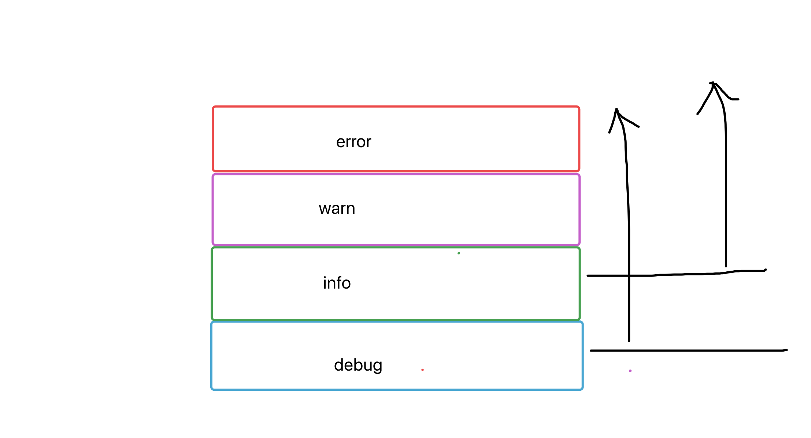
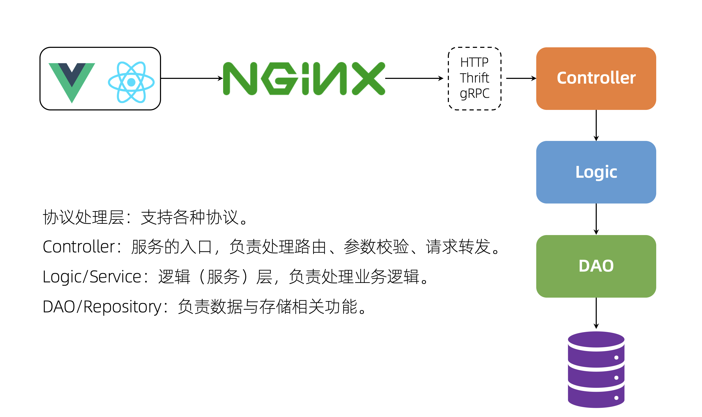

# day15课上笔记（23人）


## 内容回顾

1. validate (校验、验证)

   1. gin框架里面用的就是 validate 包，只不过在gin框架中使用 `binding `作为tag
   2. 单独使用 validate 包，那么应该使用 `validate` 作为tag
   3. 需要掌握的内容是
      1. 内置的校验规则：gt、eq、mobile、email
      2. 自定义规则：自定义结构体级别的规则、自定义字段级别的规则
      3. 翻译功能：validate本身支持i18n，能够自动翻译一些简单的报错信息

2. viper 配置读取

   1. 为什么程序要有配置？
      1. 没有配置那全都写死在代码里，让程序没有了变通的余地
         1. 不同的环境使用不同的mysql地址等
         2. 一些支持后期更改的文案等

   2. viper就是用来从**外界**读取配置信息的，也支持将新配置写入配置文件
      1. 配置文件
      2. 环境变量（云原生用的比较多的）
      3. 命令行参数
      4. 配置中心（etcd、consul等）
   3. viper支持配置热加载
      1. 开启配置变更监控：`viper.WatchConfig()`
      2. 配置变更回调函数：`viper.OnConfigChange(func(in fsnotify.Event){// 自定义配置变更的逻辑})`
   4. 重难点
      1. 指定配置文件后缀和路径
      2. 获取配置时的优先级

​	


## 今日内容

### zap日志库

uber开源的一个日志库，可学习的地方非常多。

https://www.liwenzhou.com/posts/Go/zap/


#### 基本使用

```go
func main() {
	// 获取Logger对象
	// zap.NewExample()
	// zap.NewDevelopment()
	// 生产环境的对象
	logger, err := zap.NewProduction()
	if err != nil {
		panic(err)
	}
	// 记录日志
	var uid int64 = 18967553
	isLogin := true
	name := "杨俊"
	data := []int{1, 2}

	// 默认是输出JSON格式，日志会输出到 标准输出（终端）
	logger.Info(
		"日志信息",
		zap.Int64("uid", uid),
		zap.Bool("isLogin", isLogin),
		zap.String("name", name),
		// zap.Any("data", data),
		zap.Ints("data", data),
	)
}
```


业界比较常用的开源EFK(elasticsearch+filebeat+kibana)日志收集。


#### 日志级别

开发阶段会记录很多debug级别的日志方便调试。

实际生产环境不需要记录那些debug日志，所以可以将最终生产环境的日志级别定位info,只有大于等于info级别的日志才会记录。



```go
// 实际记录日志的时候 log.check 就是针对日志级别做检查，只有满足条件的日志才ce.Write(fields...)
func (log *Logger) Info(msg string, fields ...Field) {
	if ce := log.check(InfoLevel, msg); ce != nil {
		ce.Write(fields...)
	}
}
```


#### zap日志库支持的自定义配置

1. 自定义编码类型（普通文本、JSON）
   1. 字段的key
   2. 时间格式
   3. 日志级别的大小写
2. 输出位置（文件、终端、多个文件）
3. 日志级别
   1. 自定义基于日志级别的策略，比如忽略掉warn级别的日志（有兴趣的同学可以看一下）

两种比较特殊的配置场景：

1. 同时输出日志到文件和终端
2. 将全量日志输出到 `xx.log`，同时将err级别的日志输出到`xx.err.log`里


#### logger 用法

1. 全局的logger对象
2. zap.L()


#### 日志切割

通常在公司里面一个小时切割一次日志文件，找起来方便，文件本身也不会太大

一般日志文件大小不要超过500M

zap本身是没有日志切割功能，

日志切割可以使用系统工具：logrotate，也可以写脚本

zap日志库有第三方的插件能够实现日志切割

```go
func getLogWriter() zapcore.WriteSyncer {
	lumberJackLogger := &lumberjack.Logger{
		Filename:   "./test.log",
		MaxSize:    10,
		MaxBackups: 5,
		MaxAge:     30,
		Compress:   false,
	}
	return zapcore.AddSync(lumberJackLogger)
}
```


### gin框架集成zap日志库

gin框架本身的日志怎么用zap日志库去记录呢？

https://www.liwenzhou.com/posts/Go/use_zap_in_gin/

本质上是编写两个中间件，在中间件中使用zap日志库去记录日志。

Logger() :记录每一次请求相关信息的日志

Recovery()：recover 程序中可能出现的panic,并且记录日志


### 搭建通用web开发脚手架


gin

viper

zap

大组合

### 代码层级结构 CLD分层




## 本周作业

1. 把zap日志库初始化的配置（日志文件名、日志级别都使用viper从配置文件读取）
2. 自己动手搭建一套适合自己的web开发脚手架


## 后续课程计划

微服务相关

RPC，预习连接：https://www.liwenzhou.com/posts/Go/rpc/

pb

grpc

consul—服务注册与服务发现

配置中心

直播电商业务流程

直播电商开发

延时队列

最后补充一下Go泛型等新特性