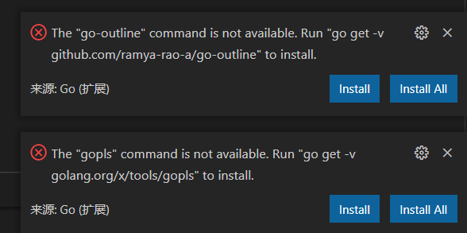
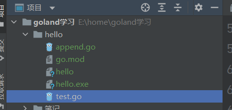
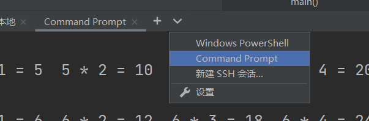
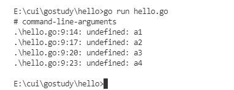
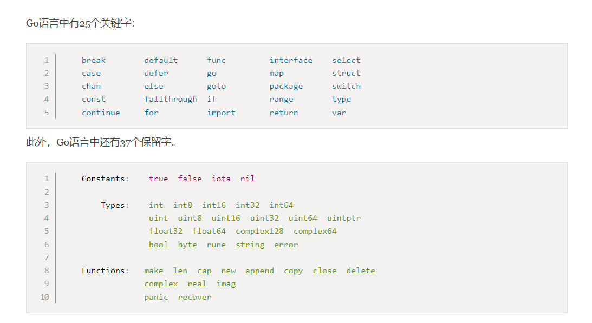
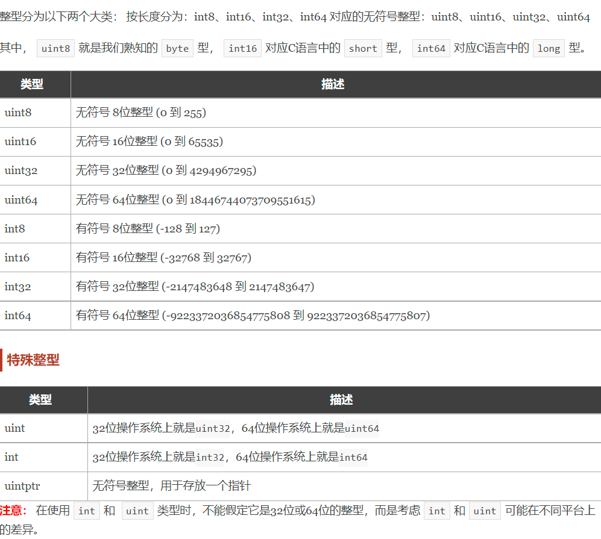
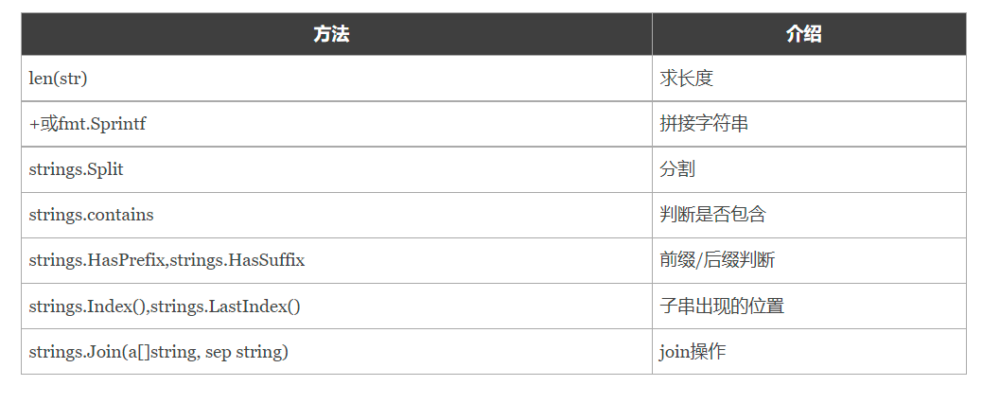
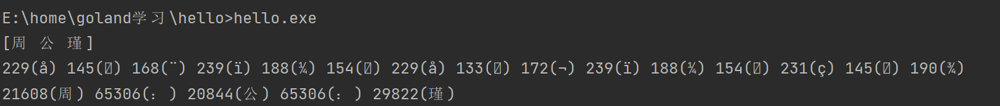

# go基础

## 一、环境搭建

### 1，搭建Go语言开发环境

https://www.liwenzhou.com/posts/Go/install_go_dev/

查看Go版本：

```bash
❯ go version
go version go1.17.5 darwin/amd64
```

配置GoPROXY（代理环境）

```bash
go env -w GOPROXY=https://goproxy.cn,direct
```


VSCode安装Go插件教程：

https://www.liwenzhou.com/posts/Go/00_go_in_vscode/

点右下角 Install All




### 2，创建第一个Go程序

- 新建项目目录 hello

- **进到目录中编写一个test.go文件**



- 进入到命令行的终端

  

- 执行初始化命令：

```bash
go mod init hello   // hello 是文件夹的名称
```

- - *hello*是你的项目名
- - 只需要在创建项目的时候在项目的根目录下执行一次！

- 一个可执行的go程序。

```go
package main

import "fmt"

func main() {
	fmt.Println("Hello world!")
}
```

编译可执行程序

在项目的根目录下执行

```bash
go build
```

指定编译后的文件名称

```bash
go build -o xxx
```

- 扩展内容

```bash
# 通过更换环境变量，可以实现编译任何系统环境（windows、linux、mac）的可执行文件
SET CGO_ENABLED=0
SET GOOS=darwin     # darwin是mac环境
SET GOARCH=amd64
go build


# 详情参考
https://www.liwenzhou.com/posts/Go/install_go_dev/
```


### 3，多个go文件

- 一个go项目下可以存在多个go文件

此时，如果使用`go run` 执行，那么就需要把所有的源文件都带上。

```bash
go run const.go int.go hello.go
```

否则就容易出现以下问题：



```bash
❯ go run hello.go
# command-line-arguments
./hello.go:63:14: undefined: c4
./hello.go:64:14: undefined: d3
./hello.go:64:18: undefined: d4
```

- 多个go文件如何编译执行

```bash
# go mod init ... 会自动的配置文件之间的依赖关系，只需要配置一次即可！！！
# go build        本质是编译main函数,所以，多个go文件只能存在一个main函数，其他的其他的文件只能定义其他函数名称，放到main函数内部统一执行。
# 每次代码写完都要保存，然后编译可执行文件，执行
```

### 4，关键字和保留字

系统字符，不能够用作变量



### 5，变量

- 三种方式定义变量

```go
// 1
var a int
a = 1

// 2
var a int = 1

// 3
a := 1
```

- 批量定义

```go
// 1
var (
    a int8
    b string
    c bool
    d float32
)

// 2
var a,b = "name", 2

```

- 匿名变量

```go
func foo() (int, string) {
	return 10, "Q1mi"
}
func main() {
	x, _ := foo()
	_, y := foo()
	fmt.Println("x=", x)
	fmt.Println("y=", y)
}

// 匿名变量不占用命名空间，不会分配内存，所以匿名变量之间不存在重复声明。
```

- 注意事项

```bash
函数外的每个语句都必须以关键字开始（var、const、func等）
:=不能使用在函数外。
_多用于占位，表示忽略值。
```


### 6，常量

```go
// const.go

package main

const pi = 3.14

const (
	v = "v1.0"
	v2
	v3
	v4
)

const (
	week1 = 1
	week2 = 2
	week3 = 3
)


/*
iota是go语言的常量计数器，只能在常量的表达式中使用。
iota在const关键字出现时将被重置为0。const中每新增一行常量声明将使iota计数一次(iota可理解为const语句块中的行索引)。 使用iota能简化定义，在定义枚举时很有用。
*/
const (
	n1 = iota // 0
	n2        // 1
	n3
	n4
	n5
)

const (
	z1 = iota // 0
)

// 利用iota声明存储的单位常量
const (
	_  = iota             // 0
	KB = 1 << (10 * iota) // 1<<10 <=> 10000000000
	MB = 1 << (10 * iota) // 1<<20
	GB = 1 << (10 * iota) // 1<<30
	TB = 1 << (10 * iota)
	PB = 1 << (10 * iota)
)

// 声明中插队
const (
	c1 = iota // 0
	c2        // 1
	c3 = 100  // 插队
	c4 = iota // 3
)

const (
	d1, d2 = iota + 1, iota + 2 // 1,2
	d3, d4 = iota + 1, iota + 2 // 2,3
)
```

### 7，其他

```go
// var a string = 1     单行注释


/*
多行注释
*/  


a := 'a'   // 单引号:表示字节
a := "a"   // 双引号:表示字符
```


## 二、基本数据类型

#### 1，整型

```go
var (
	i1 int8   = 0b1001  // 二进制
	i2 uint64 = 0o644   // 八进制
	i3        = 0x123   // 十六进制 默认为int
	i4 int32  = 123_456 // _分隔让数字更直观
)

// 利用fmt.Printf 格式化打印
v11 := 123
fmt.Println("自带换行")
fmt.Printf("十进制：%d \n", v11)
fmt.Printf("二进制：%b \n", v11)
fmt.Printf("八进制：%o \n", v11)
fmt.Printf("十六进制：%x \n", v11)
```



#### 2，浮点型

**计算机中浮点数都是不精确的！**

```bash
# 小数转换二进制方法是"乘2取整，顺序排列"
0.625 * 2 = 1.25  ------ 1
0.25 * 2 = 0.5 --------- 0
0.5 * 2 = 1 ------------ 1
最终： 0.101
# 看似没啥问题，但是这只是一个特例，对于0.1来说

0.1 * 2 = 0.2 -------0
0.2 * 2 = 0.4 -------0
0.4 * 2 = 0.8 -------0
0.8 * 2 = 1.6 -------1
0.6 * 2 = 1.2 -------0
0.2 * 2 = 0.4 -------0
...
# 陷入无限循环的境地，为了解决这种问题，引入IEEE二进制浮点数算术标准（IEEE 754），提出了一种使用近似值表示小数的方式，并且引入了精度的概念。一个浮点数a由两个数m和e来表示：a = m × b^e

# 由于计算机中保存的小数其实是十进制的小数的近似值，并不是准确值，所以，千万不要在代码中使用浮点数来表示金额等重要的指标。建议使用BigDecimal或者Long（单位为分）来表示金额
```

实际写业务遇到浮点数运算都是转成整型来计算的。

```go
func f1() {
	fmt.Printf("%.2f\n", math.MaxFloat32)
}
```

#### 3，布尔型

```go
var b11 = true
var b12 bool // false
```

注意：

1. 布尔类型变量的默认值为`false`。
2. Go 语言中不允许将整型强制转换为布尔型.
3. 布尔型无法参与数值运算，也无法与其他类型进行转换。

#### 4，字符串

```go
package main

import (
	"fmt"
	"strings"
)

func f2() {
	// filename 表示windows下一个文件路径
	filename := "C:\\go\\hello\\hello.exe"
	fmt.Println(filename)

	s11 := "永远不要高估自己"
	fmt.Println(s11)

	s12 := "\"永远不要高估自己\""
	fmt.Println(s12)

	// 多行字符串，不会解释zhuan'yi'zi
	s13 := `多行
字符串
	测\n试
	`
	fmt.Println(s13)
}

```

- 字符串操作

```go

    
	// 字符串操作
	fmt.Println(len(s11))
	// 字符串拼接
	name1 := "jade"
	value1 := "过年好"
	fmt.Println(name1 + value1)

	ret := fmt.Sprintf("大家好，%s祝大家%s", name1, value1)
	fmt.Println(ret)

	// strings
	s14 := "你:好:呀"
	fmt.Println(strings.Split(s14, ":"))

	fmt.Println(strings.Contains(s14, "你"))
	fmt.Println(strings.HasPrefix(s14, "你:")) // true
	fmt.Println(strings.HasSuffix(s14, "啊"))  // false

	fmt.Println(strings.Index(s14, ":"))     // 3
	fmt.Println(strings.LastIndex(s14, ":")) // 7

	// 拼接
	slice1 := []string{"你", "我", "他"}
	fmt.Println(strings.Join(slice1, "-"))
```



#### 5，字符

byte和rune

byte：常见的a、b、c等字符 

rune 是用来表示中文、日文等复合字符的

```go
/*一个汉字字符是3个字节，28位二进制数据，普通bytes打印出来的是一个字节，8位，所以bytes打印出来只是中文28位里面的前8位，不是你想要的。所以引入rune类型，把中文这个字符归为一个打印 */

s := "周：公：瑾"
fmt.Println(strings.Split(s, "："))

for i := 0; i < len(s); i++ { //byte
    fmt.Printf("%v(%c) ", s[i], s[i])
}
fmt.Println()
for _, r := range s { //rune
    fmt.Printf("%v(%c) ", r, r)
}
fmt.Println()

```



#### 6，类型转换

```go
package main

import "fmt"

// 类型转换

// T()

func f3() {
	var i11 int8 = 1

	i12 := int64(i11)             // int8 -> int64
	fmt.Printf("i12: %T \n", i12) // int64

	f11 := 12.34                  // float64
	f12 := int64(f11)             // float64 -> int64
	fmt.Printf("f12: %T \n", f12) // int64

	// bool(1) // int -> bool 🚫
}

```

## 三、运算符

#### 五种运算符

（详情参考https://www.liwenzhou.com/posts/Go/03_operators/）

1. 算术运算符
2. 关系运算符
3. 逻辑运算符
4. 位运算符
5. 赋值运算符

#### 补充问题：

很多很多个数字中，除了某个数字只出现一次外，其他数字均出现了两次。问如何找出只出现一次的数字？

```go
// 一堆数找出只出现一次的那个
func f11() {
	nums := []int{17, 4, 3, 3, 9, 11, 9, 11, 17}
	if len(nums)%2 == 0 {
		return
	}
	ret := nums[0]
	for _, num := range nums[1:] {
		ret ^= num // 异或
	}
	fmt.Println(ret)

}
```


## 四、流程控制语句

#### 1，if

```go
if 表达式1 {
    分支1
} else if 表达式2 {
    分支2
} else{
    分支3
}
```

```go
package main

import "fmt"

// if条件判断分支

func f5() {
	score := 89 // 假设从数据库中查询出一个同学的分数
	if score > 90 {
		fmt.Println("A")
	} else if score > 65 {
		fmt.Println("勉强留下")
	} else {
		fmt.Println("明年再来")
	}
	fmt.Println(score)
}


// 特殊写法，变量封存在结构体中，不能够被外部引用
func f6() {
	// score只在if分支中有效
	// 因为它只在if分支中声明了score，外部不可见
	if score := 89; score > 90 {
		fmt.Println("A")
	} else if score > 65 {
		fmt.Println(score)
		fmt.Println("勉强留下")
	} else {
		fmt.Println("明年再来")
	}
	// fmt.Println(score)
}

```

#### 2，for

```bash
for 初始语句;条件表达式;结束语句{
    循环体语句
}
```

```go
package main

import "fmt"

// for循环

func f7() {
	// 1.标准for循环
	for i := 0; i <= 10; i++ {
		fmt.Println(i) // 0 1 2 ... 10
	}
	// fmt.Println(i) // 不可访问i

	// 2.初始语句省略
	i := 0
	for ; i <= 10; i++ {
		fmt.Println(i) // 0 1 2 ... 10
	}
	fmt.Println(i) // ? 11

	// 3.初始语句和结束语句都可以省略
	j := 0
	for j < 10 {
		fmt.Println(j)
		j++ // 10
	}
	fmt.Println(j) // ? 10

	// 4. 无限循环
	for {
		if j > 12 {
			break // 跳出循环
		}
		fmt.Println("...")
		j++
	}

	// for range 循环
	s := "golang"
	for i, v := range s {  // 分别接收索引值和变量值
		fmt.Printf("%v:%c \n", i, v)
	}
}

```

#### 3，switch

```go
package main

import "fmt"

// switch

func f8() {
	finger := 3 // 从外界获取的一个值
	switch finger {
	case 1:
		fmt.Println("大拇指")
	case 2:
		fmt.Println("食指")
	case 3:
		fmt.Println("🖕🏻")
	case 4:
		fmt.Println("无名指")
	case 5:
		fmt.Println("小拇指")
	default:  // 非必须定义，但是一个结构体中最多出现一个
		fmt.Println("无效的输入")
	}

	num := 9
	switch num {
	case 1, 3, 5, 7, 9:
		fmt.Println("奇数")
	case 2, 4, 6, 8:
		fmt.Println("偶数")
	}

	switch {
	case num%2 != 0:
		fmt.Println("奇数")
	case num%2 == 0:
		fmt.Println("偶数")
	default:
		fmt.Println("num=0")
	}
}

```


#### 4，goto

```go
package main

import "fmt"

// 普通跳出两层循环 语句

func gotoDemo1() {
	var breakFlag bool
	for i := 0; i < 10; i++ {
		for j := 0; j < 10; j++ {
			if j == 2 {
				// 设置退出标签
				breakFlag = true
				break
			}
			fmt.Printf("%v-%v\n", i, j)
		}
		// 外层for循环判断
		if breakFlag {
			break
		}
	}
}


// 使用goto跳出任意层循环
func gotoDemo2() {
	for i := 0; i < 10; i++ {
		for j := 0; j < 10; j++ {
			if j == 2 { // 退出整个两层for循环
				goto breakLabel  // 对应下面代码kuai
			}
			fmt.Printf("%v-%v\n", i, j)
		}
	}
breakLabel:   // 对映上面goto代码块
	//
}

```


#### 5，continue

```go
package main

import "fmt"

func f9() {
	for i := 0; i < 10; i++ {
		if i%2 == 0 {
			continue // 结束本轮循环，继续下一次循环
		}
		fmt.Println(i)
	}
}

```

#### 6，break

```go
// break语句可以结束for、switch和select的代码块。
// !! 不止可以跳出单层循环，可以跳出全部循环，类似goto
// break语句还可以在语句后面添加标签，表示退出某个标签对应的代码块，标签要求必须定义在对应的for、switch和 select的代码块上。 

func breakDemo1() {
BREAKDEMO1:
	for i := 0; i < 10; i++ {
		for j := 0; j < 10; j++ {
			if j == 2 {
				break BREAKDEMO1
			}
			fmt.Printf("%v-%v\n", i, j)
		}
	}
	fmt.Println("...")
}
```


#### 7，练习题

九九乘法表

```go
package main

import "fmt"

// 九九乘法表

func f10() {
	for i := 1; i < 10; i++ {
		for j := i; j < 10; j++ {
			fmt.Printf("%d*%d=%d\t", j, i, j*i)
		}
		fmt.Println()
	}

	for i := 1; i < 10; i++ {
		for j := 1; j <= i; j++ {
			fmt.Printf("%d*%d=%d\t", j, i, j*i)
		}
		fmt.Println()
	}

}

```


