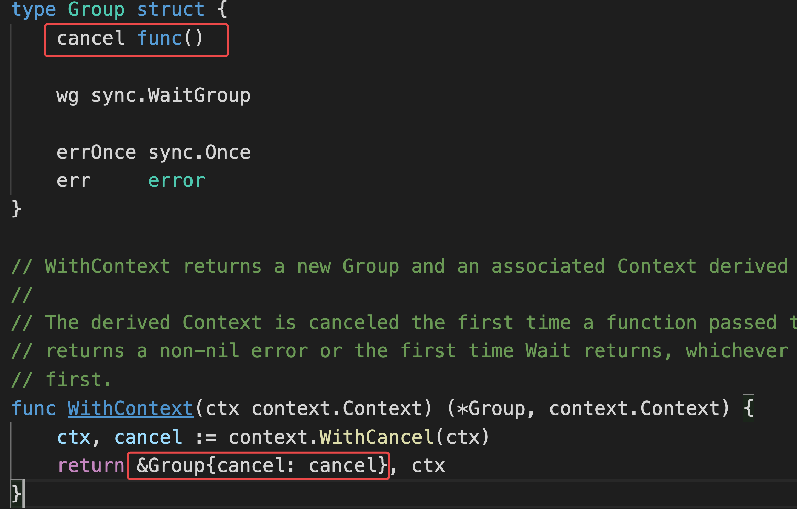
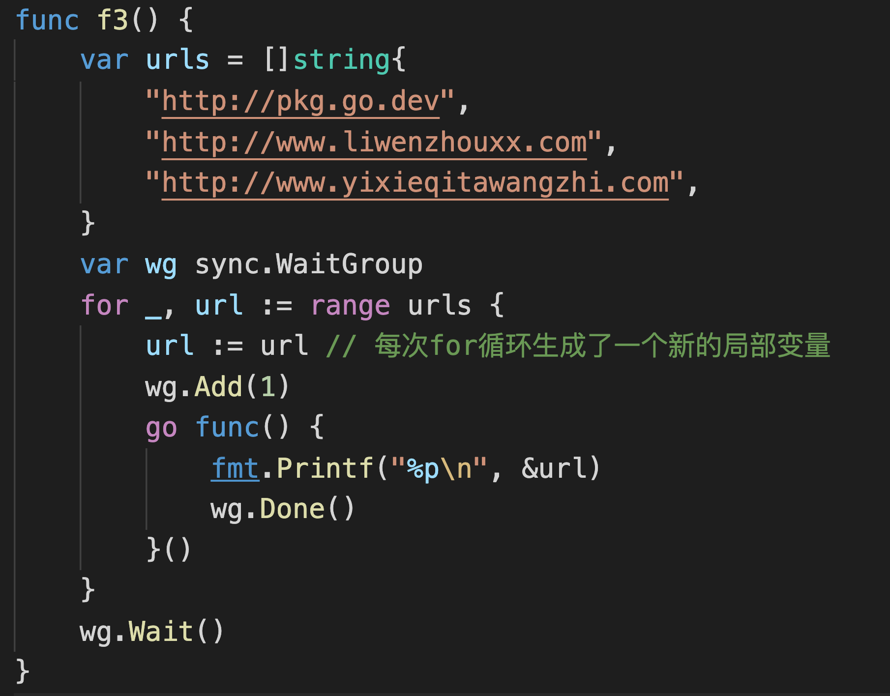
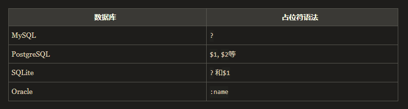

# 并发错误处理

https://www.liwenzhou.com/posts/Go/error-in-goroutine/

## goroutine中的panic

**panic和error的区别是什么？**

error：是程序运行过程中预期可能出现的问题（错误）

panic：恐慌，是一些程序运行期间不可预期（意想不到的）的问题；代码写的有瑕疵

- 空指针
- 索引越界
- 死锁

程序遇到panic就崩掉了，可以通过recover实现平滑退出。


## errgroup
适用场景：

适合大任务拆分成多个可以并发的子任务

提供的能力：

为那些子任务的goroutine提供 sync.Wait()、error传递、基于context的取消。




g.Go(func()error)：开启一个goroutine去执行任务，只执行一次将错误赋值给`g.err`，调用一次`g.cancel`

g.Wait() : 会等待所有的子任务goroutine完成, 返回的是`g.err`


errgroup.WithContext()

看一下示例，尝试理解。


for range循环




# 操作数据库

## 2.1 docker安装mysql

参考教程`https://www.runoob.com/docker/docker-install-mysql.html`

docker快速启动一个MySQL Server容器

```bash
docker run --name mysql8019 -p 3306:3306 -d -e MYSQL_ROOT_PASSWORD=bt254618 mysql:8.0.19
```

参数说明：

- **-p 3306:3306** ：映射容器服务的 3306 端口到宿主机的 3306 端口，外部主机可以直接通过 **宿主机ip:3306** 访问到 MySQL 的服务。
- **MYSQL_ROOT_PASSWORD=bt254618**：设置 MySQL 服务 root 用户的密码。

启动一个终端容器 连接上面的MySQL Server

```bash
# docker服务相关命令
docker start mysql8019
docker stop mysql8019
docker restart mysql8019
```

```bash
# 通过bash进入mysql
docker exec -it mysql bash
```


出现这个错误就是没有导入驱动：


## 2.2 go连接数据库

```go
//1, 声明全局数据库对象
var db *sql.DB

//2, 定义初始化数据库函数
func initDB() (err error) {
    dsn := "root:bt254618@tcp(127.0.0.1:3306)/test"  
    //	格式：dsn := "user:password@tcp(127.0.0.1:3306)/sql_test?charset=utf8mb4&parseTime=True"
    db, err = sql.Open("mysql", dsn) // 仅粗略验证dsn的格式是否正确，并没有真正的创建与数据库的连接
    if err := nil {
        fmt.Println("database connect error")
       	return err 
    }
    // 测试数据库ping
    err = db.Ping()
    if err := nil {
        fmt.Println("database Ping error")
        return err
    }
    return nil   // 如果无错误信息，返回nil
}

// 3, 主函数连接数据库
func mysqlDemo() {
    if err := initDB(); err != nil {
        fmt.Println("database init error!")
        return
    }
    defer db.Close()   // 最后关闭数据库，防止出现内存泄漏
}
```

## 2.3 go操作数据库增删改查

连接数据库之前一定要下载引入对应的sql驱动

```go
import (
    _ "github.com/go-sql-driver/mysql" // mysql驱动，主要使用内部的init方法
)
```


### 2.3.1 单行查询`db.QueryRow`

```go
type user struct{
    id int 
    name string
    age int
}  // 声明结构体

func queryRowdb(name string) {
    sqlstr := "select * from user where name = ?;" // 原生sql语句，？为sql的占位符，不同sql占位符略有差异
    var u user 
    err := db.QueryRow(sql, name).Scan(&u.id, &u.name, &u.age)  // 获取数据，并赋予结构体，注意使用指针才能赋值
    if err != nil {
        fmt.Println("scan failed", err)
        return 
    }
    fmt.Printf("get data: %#v", u)
}
```



### 2.3.2 多行查询`db.Query`

```go
func queryDB() {
	// 多行查询
	sqlstr := `select * from user`
	rets, err := db.Query(sqlstr) // 此处也可以指定参数
	if err != nil {
		fmt.Println("database query error")
		return
	}

	// 循环读取结果集中的数据
	for rets.Next() {
		var u user
		err = rets.Scan(&u.id, &u.name, &u.age)
		if err != nil {
			fmt.Println("data scan error")
		}
		fmt.Printf("get datas: %#v\n", u)
	}
}
```

### 2.3.3 增删改`db.Exec`

```go
func execDB(option string) {
	var sqlstr string // 先声明变量，不然再switch里面声明，变量无法传递到switch代码块外部
	switch option {
	case "insert":
		sqlstr = `insert into user(name, age) values("zhaozilong", "28")`
	case "update":
		sqlstr = `update user set name="zhangyide" where id = 5`
	case "delete":
		sqlstr = `delete from user where id = 5`
	default:
		sqlstr = ``
	}
	ret, err := db.Exec(sqlstr)
	if err != nil {
		fmt.Println("database exec error")
		return
	}
	n, _ := ret.RowsAffected() // 获取收到影响的行数
	fmt.Println("affected rows: ", n)
}
```

## 2.4 go实现mysql预处理

### 什么是预处理？

普通SQL语句执行过程：

1. 客户端对SQL语句进行占位符替换得到完整的SQL语句。
2. 客户端发送完整SQL语句到MySQL服务端
3. MySQL服务端执行完整的SQL语句并将结果返回给客户端。

预处理执行过程：

1. 把SQL语句分成两部分，命令部分与数据部分。
2. 先把命令部分发送给MySQL服务端，MySQL服务端进行SQL预处理。
3. 然后把数据部分发送给MySQL服务端，MySQL服务端对SQL语句进行占位符替换。
4. MySQL服务端执行完整的SQL语句并将结果返回给客户端。

### 为什么要预处理？

1. 优化MySQL服务器重复执行SQL的方法，可以提升服务器性能，提前让服务器编译，一次编译多次执行，节省后续编译的成本。
2. 避免SQL注入问题。

```go
sqlStr := "select id, name, age from user where id > ?"
stmt, err := db.Prepare(sqlstr)  
// Prepare方法会先将sql语句发送给MySQL服务端，返回一个准备好的状态用于之后的查询和命令。返回值可以同时执行多个查询和命令。
if err != nil {
    fmt.Println("db prepare error ")
    return 
}
defer smat.Close()

// 后续可以多次执行，省略编译过程，效率更高
rows, err := stmt.Query(2)
...
rows, err := stmt.Query(3)
...
rows, err := stmt.Query(4)
...
```

## 2.5 go实现mysql事务

- `db.Begin` 开启事务
- `db.Rollback`  事务回滚
- `db.Commit`  提交事务

```go
func transactionDemo(){
	// 初始化事务
    tx, err := db.Begin()
	if err != nil {
        if tx != nil {
            tx.Rollback()  // 回滚
        }
        fmt.Println("transaction begin error! ")
        return
    }
    
    // 执行sql
    ...
    ret, err := tx.Exec(sqlstr)
    affrow = ret.RowsAffected()
    ...
    if err != nil {
        tx.Rollback()
        fmt.Println("exec error")
    	return 
    }
    
    // 提交事务
    if affrow == 1{
        tx.Commit()
    } else {
        tx.Rollback()
    }
}
```


## 2.6 sqlx

```bash
# 参考文献
https://www.liwenzhou.com/posts/Go/sqlx/
https://www.cnblogs.com/sunlong88/p/12910300.html
```

```go
// 连接数据库
var db *sqlx.DB
func initDB() (err error){
    dsn := "user:password@tcp(127.0.0.1:3306)/sql_test?charset=utf8mb4&parseTime=True"
    db, err = sqlx.Connect("mysql", dsn)
    if err != nil {
        fmt.Println("sqlx connect error! ")
        return err 
    }
    return nil
}
```

### 2.6.1 sqlx单行查询 `dbx.Get`

```go
func queryRowDB(name string) {
	// 单行查询
	sqlstr := `select * from user where name = ?`
	var u user
	err := dbx.Get(&u, sqlstr, name)
	if err != nil {
		fmt.Println("dbx get error: ", err)
		return
	}
	fmt.Printf("sqlx get data: %#v\n", u)
}
```

### 2.6.1 sqlx多行查询 `dbx.Select`

```go
func queryDB() {
	// 多行查询
	sqlstr := `select * from user`
	var users []user
	err := dbx.Select(&users, sqlstr)
	if err != nil {
		fmt.Println("dbx select error: ", err)
		return
	}
	fmt.Printf("sqlx get datas: %#v\n", users)
}
```

### 2.6.1 sqlx增删改 `dbx.Exec`

```go
func execDb(option string) {
	var sqlstr string // 先声明变量，不然再switch里面声明，变量无法传递到switch代码块外部
	switch option {
	case "insert":
		sqlstr = `insert into user(name, age) values("zhaozilong", "28")`
	case "update":
		sqlstr = `update user set name="zhangyide" where name = "zhaozilong"`
	case "delete":
		sqlstr = `delete from user where name = "zhangyide"`
	default:
		sqlstr = ``
	}
	ret, err := dbx.Exec(sqlstr)
	if err != nil {
		fmt.Println("database exec error")
		return
	}
	n, _ := ret.RowsAffected() // 获取收到影响的行数
	fmt.Println("affected rows: ", n)
}
```

### 2.6.1 sqlx从map，切片，结构体获取数据 `dbx.NamedExec`

```go
func namedexecDemo() {
	// 根据结构体，map插入数据
	person := make(map[string]interface{}) // 初始化键为string类型，值为空接口（任意类型）的map
	person["name"] = "wuzetian"
	person["age"] = 8
	fmt.Printf("user : %#v\n", person)

	sqlstr := `insert into user(name, age) values(:name, :age)` // :str  固定格式
	_, err := dbx.NamedExec(sqlstr, person)
	if err != nil {
		fmt.Println("sqlx namedexec error: ", err)
		return
	}
	fmt.Println("sqlx namedexec success!")
}
```

### 2.6.1 sqlx从map，切片，结构体获取结构映射查询 `dbx.NamedQuery`

```go
func namedQueryDemo(){
	sqlStr := "SELECT * FROM user WHERE name=:name"
	// 使用map做命名查询
	rows, err := db.NamedQuery(sqlStr, map[string]interface{}{"name": "七米"})
	if err != nil {
		fmt.Printf("db.NamedQuery failed, err:%v\n", err)
		return
	}
}
```

## 2.7 sqlx事务

```go
tx, err := dbx.Beginx()   // 开启事务
tx.Rollback()    // 事务回滚
tx.Commit()    // 提交事务
```

## 2.8 sqlx批量插入 `sqlx.In`

```sql
select id, name, age from user where id in (?,?,?), (101,103,105);

insert into user (name, age) values((?,?),(?,?)) , ((jade,18), (lishuo,28))
```


## 本周作业

1. 把课上写的例子全部手敲一遍。


## 今日分享

在知道生活的真像后仍然热爱生活。


