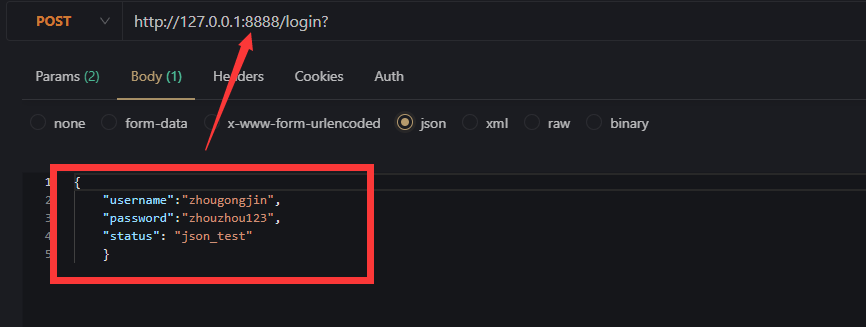

# redis

- 博客地址：https://www.liwenzhou.com/posts/Go/go_redis/
- redis常用命令：https://www.redis.com.cn/commands.html
- go-redis官方文档：[Introduction | go-redis (uptrace.dev)](https://redis.uptrace.dev/guide/)
- go的各种数据库驱动：https://github.com/golang/go/wiki/SQLDrivers

## 1.1 准备redis环境

推荐使用docker快速起一个环境

```bash
docker pull redis
docker run --name redis -p 6379:6379 redis 
```

## 1.2 驱动包

目前社区里用的比较多的是 redigo 和 go-redis

我推荐使用`go-redis`，目前最新的是v8版本

```bash
go get github.com/go-redis/redis/v8
```

## 1.3 go-redis使用

### 1.31 连接redis

- !!!!声明数据库对象   `var rbd *redis.Client`

- 基本连接模式

```go
func redisInit() {
    cn := rdb.Conn(ctx)
    defer cn.Close()
}
```

- 连接池模式

```go
func initClient() (err error) {
	// 此处应该是初始化全局的redis连接对象
	rdb = redis.NewClient(&redis.Options{
		Addr: "127.0.0.1:6379",
		// 下面那都是默认值
		Password: "", // no password set
		DB:       0,  // use default DB
		PoolSize: 100, // 连接池大小
	})

    // go-redis  V8特性，要传递ctx，用来控制redis连接
	ctx, cancel := context.WithTimeout(context.Background(), 500*time.Millisecond)
	defer cancel()

	_, err = rdb.Ping(ctx).Result()
	return err
}
```

此外还有 cluster 模式、sentinel模式、ring模式

TLS模式


### 1.32 获取返回值
- `val, err := rbd.Get(...).Result()`  一步到位，获取返回值和错误信息
- `ret := rbd.Get(...)`   先获取返回的对象
- `ret.Err()`   从返回对象中拆出错误信息
- `ret.Val()`   从返回对象中拆出值


```go
func demo1() {
	ctx, cancel := context.WithTimeout(context.Background(), 500*time.Millisecond)
	defer cancel()
	// 设置值 类的命令一般用 Err()
	err := rdb.Set(ctx, "name", "wuyong", 10*time.Second).Err()
	fmt.Println(err)

	// 获取值 类的命令后面一般用 Result()
	v, err := rdb.Get(context.Background(), "name").Result()
	if err != nil {
		// 排除掉key不存在的场景
		if err == redis.Nil {
			// 返回的err是key不存在时...
		}
		fmt.Println(err)
		return
	}
	fmt.Println(v, err)

	// 我只想用value,如果出错了就用默认值
	fmt.Println("------")
	fmt.Printf("Err()==redis.Nil:%#v\n", rdb.Get(context.Background(), "namexxxxx").Err() == redis.Nil)
	fmt.Printf("Err()==nil:%#v\n", rdb.Get(context.Background(), "namexxxxx").Err() == nil)
	fmt.Printf("Val():%#v\n", rdb.Get(context.Background(), "namexxxxx").Val())
	nv, nerr := rdb.Get(context.Background(), "namexxxxx").Result()
	fmt.Printf("Result():%#v %#v\n", nv, nerr)
}
```

### 1.33 万能do命令

```go
val, err := rdb.Do(ctx, "get", "name").Result()   // get方法，获取key为name的值
if err != nil {
	if err == redis.Nil {
		fmt.Println("key does not exists")
		return
	}
	panic(err)
}
fmt.Println(val.(string))
```

### 1.34 pipeline实现redis加速

- 方式1`rdb.Pipeline()`  rdb已经初始化


- 方式2 `rdb.Pipelined(...)`  自动执行


### 1.35 redis事务


### 1.36 watch


# gin框架

- 博客地址：https://www.liwenzhou.com/posts/Go/Gin_framework/
- 官方中文文档：https://gin-gonic.com/zh-cn/docs/

## 2.1 基础运行

```go
func ginDemo() {
    r := gin.Default()  // Default 使用 Logger 和 Recovery 中间件, 要使用自定义的中间件，要使用gin.New()
    
    // 测试get请求
	r.GET("/index", func(c *gin.Context) {
		c.JSON(200, gin.H{
			"message": "get",
		})
	})
	// 测试post请求
	r.POST("/index", func(c *gin.Context) {
		c.JSON(200, gin.H{
			"message": "post",
		})
	})
	// 测试put请求
	r.PUT("/index", func(c *gin.Context) {
		c.JSON(200, gin.H{
			"message": "put",
		})
	})
	// 测试delete请求
	r.DELETE("/index", func(c *gin.Context) {
		c.JSON(200, gin.H{
			"message": "delete",
		})
	})
    
    r.Run(":8888")   // 指定端口启动服务
}
```

## 2.2 HTML渲染 `c.HTML`

```go
func ginDemo2() {
	router := gin.Default()
	router.LoadHTMLGlob("templates/*") // 指定html目录
	//router.LoadHTMLFiles("templates/404.html")  // 直接指定文件

	router.NoRoute(func(c *gin.Context) {
		c.HTML(http.StatusOK, "404.html", gin.H{
			"title": "404 website",
		})
	})
    
	router.Run(":8888")
}
```


## 2.3 gin框架获取参数信息

### 2.3.1 获取query参数


```go
router.GET("/login", func(c *gin.Context) {
    //username := c.Query("username") // 直接从url的query中获取参数
    //password := c.Query("password")
    username := c.DefaultQuery("username", "周公瑾") // 尝试从query中获取参数，如果没有设置为后面的默认值
    password := c.DefaultQuery("password", "zhouzhou123")
    c.JSON(200, gin.H{
        "username": username,
        "password": password,
    })
})

```

### 2.3.1 获取body--formdata参数


```go
router.POST("/register", func(c *gin.Context) {
    // DefaultPostForm取不到值时会返回指定的默认值
    // username := c.DefaultPostForm("username", "小王子")
    username := c.PostForm("username")
    address := c.PostForm("address")
    // 输出json结果给调用方
    c.JSON(http.StatusOK, gin.H{
        "message":  "ok",
        "username": username,
        "address":  address,
    })
})
```

### 2.3.1 获取body-json参数



```go
router.POST("/json", func(c *gin.Context) {
    b, err := c.GetRawData() // 从c.request.body中读取请求数据
    if err != nil {
        panic(err)
    }
    var m map[string]interface{}
    // json反序列化数据
    err = json.Unmarshal(b, &m) // 传递指针参能实现对值的修改操作
    if err != nil {
        panic(err)
    }
    c.JSON(http.StatusOK, m)
})
```

### 2.3.1 获取path参数


```go
// 获取path中的参数      :str 字符串占位
router.GET("/index/static/:path/:file", func(c *gin.Context) {
    path := c.Param("path")
    file := c.Param("file")
    c.JSON(http.StatusOK, gin.H{
        "path": path,
        "file": file,
    })
})
```

## 2.4 gin框架参数绑定

```go
// 此处的结构体中的tag标签字段应该与前端传回的字段保持一致
type LoginForm struct { // post参数结构体
	Usr string `form:"username" binding: "required"`
	Pwd string `form:"password" binding: "required"`
}


// 获取post请求体中的参数2---参数绑定
router.POST("/login", func(c *gin.Context) {
    var form LoginForm
    if c.ShouldBind(&form) == nil {
        if form.Usr == "zhougongjin" && form.Pwd == "zhouzhou123" {
            c.JSON(http.StatusOK, gin.H{"status": "welcome to go: " + form.Usr})
        } else {
            c.JSON(http.StatusNonAuthoritativeInfo,
                   gin.H{"status": "username or password wrong"})
        }
    }
})

```

## 2.5 gin框架文件上传


### 2.5.1 单文件上传

```go
// 上传单文件
	router.POST("/upload", func(c *gin.Context) {
		file, err := c.FormFile("file") // 从表单中提取file文件
		if err != nil {
			panic(err)
		}
		fmt.Println(file.Filename)

		dst := "./files/" + file.Filename // 文件保存路径
		fmt.Println(dst)
		c.SaveUploadedFile(file, dst) // 保存文件到指定路径

		c.String(http.StatusAccepted, fmt.Sprintf("'%s' uploaded!", file.Filename))
	})
```


### 2.5.2 多文件上传

```go
// 上传多个文件
	router.MaxMultipartMemory = 2 << 20 // 设置为最大1mb大小
	router.POST("/uploads", func(c *gin.Context) {
		var name []string
		form, _ := c.MultipartForm()
		files := form.File["files"] // form 表单中的上传文件字段参数
		// 遍历文件切片获得每一个文件
		for idx, file := range files {
			fmt.Println(idx, file.Filename)
			name = append(name, file.Filename)
			dst := "./files/" + file.Filename // 文件保存路径
			c.SaveUploadedFile(file, dst)
		}

		c.JSON(http.StatusOK, gin.H{
			"message": "files uploaded",
			"detail":  strings.Join(name, "、"), // 前面的参数是用来拼接的字符串切片，后面的参数是分隔符
		})
	})
```


## 2.6 gin框架日志

### 2.6.1 终端日志输出到文件

```go
// 禁用控制台颜色，将日志写入文件时不需要控制台颜色。
// 此时的gin比一定要初始化配置---gin.Default()
gin.DisableConsoleColor() 

// 日志记录到文件
f, _ := os.Create("gin.log")
gin.DefaultWriter = io.MultiWriter(f)
```

### 2.6.2 定义路由日志的格式

```go
gin.DebugPrintRouteFunc = func(httpMethod, absolutePath, handlerName string, nuHandlers int) {
    log.Printf("endpoint %v %v %v %v\n", httpMethod, absolutePath, handlerName, nuHandlers)
}
```

## 2.7 gin框架自定义中间件

```go
func MyMiddleware() gin.HandlerFunc {
	return func(c *gin.Context) {
		t := time.Now()
		c.Set("name", "周公瑾")
		c.Next() // 走向下一个中间件执行

		// 计算请求耗时
		cost := time.Since(t)
		fmt.Println("请求共耗时： ", cost)

		status := c.Writer.Status()
		fmt.Println("请求状态码： ", status)

	}
}


// 主函数中使用中间件
router := gin.Default()
router.Use(MyMiddleware())  // 绑定中间件
```


## gin框架注意事项

- 当在中间件或 handler 中启动新的 Goroutine 时，**不能**使用原始的上下文，必须使用只读副本

```go
r.GET("/long_async", func(c *gin.Context) {
    // 创建在 goroutine 中使用的副本
    cCp := c.Copy()
    go func() {
        // 用 time.Sleep() 模拟一个长任务。
        time.Sleep(5 * time.Second)

        // 请注意您使用的是复制的上下文 "cCp"，这一点很重要
        log.Println("Done! in path " + cCp.Request.URL.Path)
    }()
})

```

- `c.Request.Body`不能复用

```go
// c.ShouldBind 使用了 c.Request.Body，不可重用。
if errA := c.ShouldBind(&objA); errA == nil {
    c.String(http.StatusOK, `the body should be formA`)
    // 因为现在 c.Request.Body 是 EOF，所以这里会报错。
} else if errB := c.ShouldBind(&objB); errB == nil {
    c.String(http.StatusOK, `the body should be formB`)
} else {
    ...
}


// 读取 c.Request.Body 并将结果存入上下文。
if errA := c.ShouldBindBodyWith(&objA, binding.JSON); errA == nil {
    c.String(http.StatusOK, `the body should be formA`)
    // 这时, 复用存储在上下文中的 body。
} else if errB := c.ShouldBindBodyWith(&objB, binding.JSON); errB == nil {
    c.String(http.StatusOK, `the body should be formB JSON`)
    // 可以接受其他格式
} else if errB2 := c.ShouldBindBodyWith(&objB, binding.XML); errB2 == nil {
    c.String(http.StatusOK, `the body should be formB XML`)
} else {
    ...
}
```


## 按请求方法注册路由

GET POST 。。。 Any

## 返回响应

c.JSON

c.XML

## 参数获取

1. URL query参数
2. form参数，post表单参数
3. json格式
4. param参数

## 更方便的获取参数方式 c.ShouldBind()

注意：

1. 字段首字母大写，并且tag要对应上
2. 要传指针类型

## 小清单例子

## 今日作业

1. 把redis的zeset简单实现一个类似微博热搜排行榜的例子
2. 写一个web版登陆功能， form表单提交或者postman 提交json格式数据，gin框架里面查询mysql数据库返回用户名密码是否正确，正确就返回欢迎，斗否则返回用户名或密码错误。


## 下周内容


## 今日分享

当你迷茫的时候就专注当下多赚钱。
