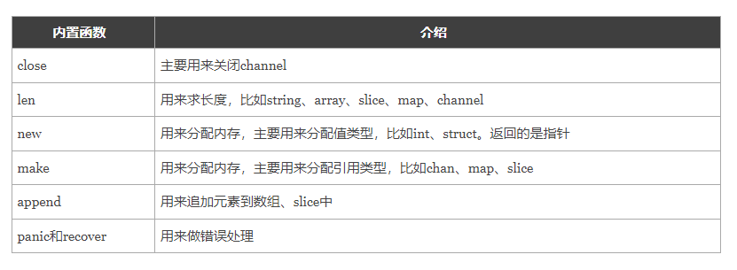

# 函数

https://www.liwenzhou.com/posts/Go/09_function/

## 1，函数的基本定义

```go
// 1，基础函数, 无返回值
func f1(x int){
    ...
}
// 2, 有返回值，但是不指定返回值变量，只指定类型
func f2(x int, y string) bool {
	...
}
// 3，有返回值，指定返回值类型和返回值变量
func f3(x y int)(z int,){
    ...
}
// 4, 可变参数，一定要写在固定参数之后
func f4(x int, y ...string)(z, int){
    ...
}

```

## 2，函数的参数

- 参数的类型简写`x, y int`

- 不定长参数` x ...int`
- **没有默认参数**

## 3，函数返回值

多个返回值`func a(x int) (bool, int){}`，返回值是有序的，本例中一定是bool在int前面

命名返回值`func b(x int) (a int, ){}`，对于命名返回值，可能在和defer结合时候有坑

```go
func f4() (x int) {
	defer func(x int) {
		x++
	}(x)
	return 5
}
// 正常情况下，应该返回5， 但是defer执行在return之后，把x的值修改成为6，同时函数定义了命名返回值，返回x，所以，最终函数返回的是6
```

## 4，函数进阶

变量的作用域

1. 全局变量
2. 局部变量
   1. 函数内定义的变量
   2. 语句块定义的变量
      1. 

## 5，type

只要以`type`关键字开头的都是定义类型。规定了一种具体的函数的输入变量类型，以及函数的返回变量类型。

好处：

- 简化代码，例如函数的形参可以是函数，使用type定义可以简化变量
- 待续...


```go
type calculation func(int, int) int

func add(x, y int) int {
	return x + y
}

func sub(a, b int) int {
	return a - b
}

func f15() {
	var x calculation
	fmt.Printf("%T\n", x) // main.calculation
	fmt.Println(x == nil) // true
	x = add               // 把add赋值给x
	res := x(10, 20)      // ???
	fmt.Println(res)

	add(10, 20)
}
```


**函数签名**

- 函数签名 --> 函数定义（声明）的格式，与参数名称和返回值名称无关

- 函数签名一样 --> 函数的参数、返回值的类型和个数、顺序都要一样

```go
func fi(name string, age int) {}

func fj(age int, name string) {}

type MyFF func(string, int)

func f16() {
	var mf MyFF
	mf = fi
	// mf = fj  // 函数签名不一致
	mf("ddd", 1)
}
```


## 6，高阶函数

高阶函数的特点在于，他的参数或者返回值可能不止局限于普通的变量类型，而是函数类型

```go
// 函数作为参数
func f17(x, y int, op calculation) int {
	res := op(x, y)

	return res
}

// 命名返回值
// 1.函数内部声明了一个变量res
// 2.返回值是res
func f18(x, y int, s string) (res func(int, int) int) {
	switch s {
	case "+":
		return add
	case "-":
		return sub
	}
	return  // 默认就把res返回
}

func f19(x, y int, s string) func(int, int) int {
	var res func(int, int) int // res = nil
	switch s {
	case "+":
		return add
	case "-":
		return sub
	}
	return res
}
```


## 7，匿名函数和立即执行函数

```go
// 函数内部不能出现func开头代码，所以不能再次定义普通函数函数，引入匿名函数
// 匿名函数，没有函数名，定义后需要赋值给其他的变量，或者直接执行（立即执行函数）

// 把匿名函数赋值给变量
func f33() func() {
	f1 := func() {
		fmt.Println("美好的周末就要结束啦~")
	}
	// var f2 func() = func() {
	// 	fmt.Println("美好的周末就要结束啦~")
	// }
	return f1
}

// 匿名函数立即执行
func f34() {
	func() {
		fmt.Println("美好的周末就要结束啦~")
	}()
}
```

## 8，闭包

```go
// 闭包，函数内部再定义函数，同时外部函数返回值是内部函数

func adder() func() int {
	var x int

	// 函数内部使用了它外部函数的变量x
	f := func() int {
		x++
		return x
	}

	// 把匿名函数当成返回值返回了
	return f
}

func adder2() func(int) int {
	var x int
	f := func(y int) int {
		x += y // x = x+y
		return x
	}
	return f
}

// 定义一个累加器
// x的值会被返回的函数一直占用着
func adder3(x int) func(int) int {
	f := func(y int) int {
		x += y // x = x+y
		return x
	}
	return f
}

func makeSuffixFunc(suffix string) func(string) string {
	return func(name string) string {
		if !strings.HasSuffix(name, suffix) {
			return name + suffix
		}
		return name
	}
}
```


## 9，defer

- 什么场景会用到defer
  - 捕获异常
  - 释放资源
  - 关闭文件
  - 释放连接

- defer的执行顺序
  - 先注册的后执行
- defer的执行时机
  - 返回值赋值之后，底层RET指令之前（底层RET涉及到CPU指令集，可以理解为底层汇编）
- defer语句不能接收返回值 `defer x := sub(10, 2)`


## 10，内置函数



panic和recover

```go
func funcB() {
	defer func() {  // 2，函数执行完毕，执行defer代码块
		err := recover()   // 3，出现panic报错后，recover捕获错误信息，继续往下执行
		//如果程序出出现了panic错误,可以通过recover恢复过来
		if err != nil {
			fmt.Println("recover in B")
		}
	}()
	panic("panic in B")  // 1，手动抛出panic异常
}


```

# 指针


2. 

## 1，指针的定义

```go
// 任何程序数据载入内存后，在内存都有他们的地址，这就是指针。而为了保存一个数据在内存中的地址，我们就需要指针变量。
*int     int指针
*string  string指针
*[3]int  长度为3的数组指针

但是，map，切片slice由于有自动扩容机制，所以可能出现内存地址不断变化的情况，所以没有指针

```

## 2，指针的基本操作

就两个操作：

1. 取变量x的内存地址： `&x` 得到的是指针
2. 有了指针变量p，`*p` 根据内存地址去找值

## 3，new和make

new和make都是用来申请内存，new用的较少

区别：

1. 二者都是用来做内存分配的。
2. make只用于slice、map以及channel的初始化，返回的还是这三个引用类型本身；
3. 而new用于类型的内存分配，并且内存对应的值为类型零值，返回的是指向类型的指针


## 本周作业

1. 

```go
/*
你有50枚金币，需要分配给以下几个人：Matthew,Sarah,Augustus,Heidi,Emilie,Peter,Giana,Adriano,Aaron,Elizabeth。
分配规则如下：
a. 名字中每包含1个'e'或'E'分1枚金币
b. 名字中每包含1个'i'或'I'分2枚金币
c. 名字中每包含1个'o'或'O'分3枚金币
d: 名字中每包含1个'u'或'U'分4枚金币
写一个程序，计算每个用户分到多少金币，以及最后剩余多少金币？
程序结构如下，请实现 ‘dispatchCoin’ 函数
*/
var (
	coins = 50
	users = []string{
		"Matthew", "Sarah", "Augustus", "Heidi", "Emilie", "Peter", "Giana", "Adriano", "Aaron", "Elizabeth",
	}
	distribution = make(map[string]int, len(users))
)

func main() {
	left := dispatchCoin()
	fmt.Println("剩下：", left)
}

```


