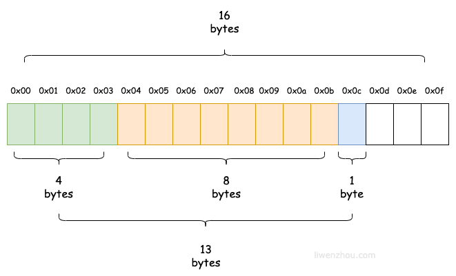
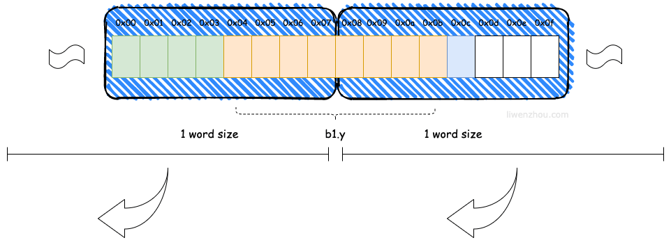
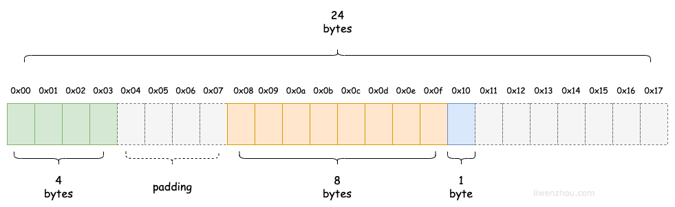
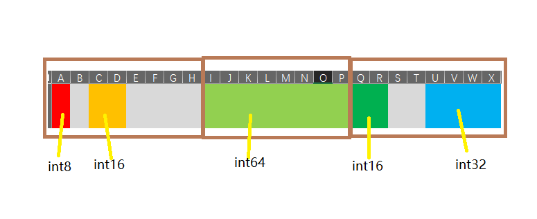
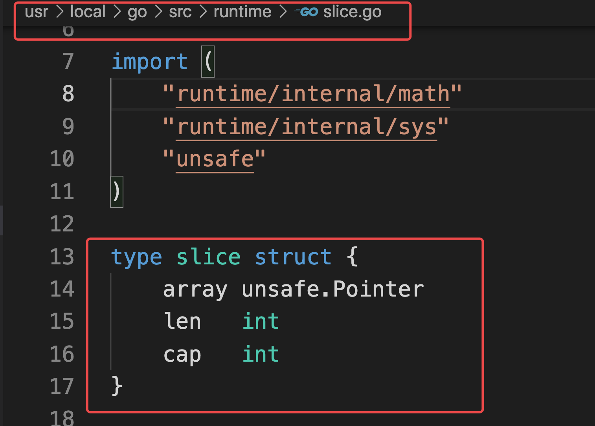

## 结构体和方法

### 1，类型定义

```go
// 类型定义  使用直接空格分隔定义
type MyInt int

type MyFunc fun(int, int)int

type scoreMap map[string]int
```

自定义类型是程序员根据自己的需要创造的新类型

### 2，类型别名

让代码更易读

```go
// 类型别名  使用等号赋值定义，目的是使代码更加易于阅读
type MyString = string
type NewInt = int
type MyInt = int
```

内置的`byte`和`rune` 就是类型别名

```go
type byte = uint8
type rune = int32
```

区别：

类型别名只在源文件中生效，编译时会被替换成原始类型。

#### 类型显式转换

```go
var x MyInt = 100
fmt.Printf("x:%T\n", x)  // main.MyInt

var y NewInt = 100
fmt.Printf("y:%T\n", y)  // int

x = MyInt(y)  // 类型强制转换
y = NewInt(x) // 类型强制转换

f := 1.123
i := int(f) // 浮点数可以强制转换成整数，但是会丢失精度
fmt.Println(i)
```


### 3，结构体

https://www.liwenzhou.com/posts/Go/10_struct/

#### 3.1 结构体定义

```go
// Student 定义一个学生类型
type Student struct {
	name     string
	age      int8
	married  bool
	mapScore map[string]int
}

// Order 定义一个订单类型
type Order struct {
	id         int64
	skuId      int64 // 商品id
	userId     int64
	createTime int64
}
```

#### 3.2 结构体初始化

```go
// 1，键值对初始化
stu2 := Student{
    name: "王俊翔",
    age:  26,
    mapScore: map[string]int{
        "语文": 6,
        "数学": 100,
    },
}

// 2，使用值的列表初始化
stu3 := Student{"周公瑾", 22, {"weight":200, "height":180 }} 
/*
使用这种格式初始化时，需要注意：
1 必须初始化结构体的所有字段。
2 初始值的填充顺序必须与字段在结构体中的声明顺序一致。
3 该方式不能和键值初始化方式混用。
*/


// 3，引用定义，未定义的属性为零值
var stu4 Student
stu4.name = "诸葛亮"
stu4.age = 88

stu3 := Student{} // map[string]int{}
fmt.Printf("%+v\n", stu3)  // 可以打印出来所有的键值对

```

#### 3.3 匿名结构体

```go
// 匿名结构体用来定义一些临时的数据结构

var people1 struct{name string; age int}  // ！！！！单行使用分号，而非逗号
people1.name = "李大钊"
people1.age = 54

```

#### 3.4 结构体的匿名字段

```go
// 结构体允许其成员字段在声明时没有字段名而只有类型，这种没有名字的字段就称为匿名字段。
type person struct{
    string
    int
}

p1 := {"zhougongjin", 18}
// 这里匿名字段的说法并不代表没有字段名，而是默认会采用类型名作为字段名，结构体要求字段名称必须唯一，因此一个结构体中同种类型的匿名字段只能有一个。
```


#### 3.5 结构体指针

`go语言支持直接对结构体指针直接使用" . "来访问结构体内部的成员`

```go
// 结构体字面量初始化
func demo5() {
	stu4 := &Student{} // 取地址  --》 new(Student) --> 结构体指针
	(*stu4).name = "李硕"
	stu4.age = 18 // Go语言中提供的语法糖，支持 结构体指针类型.属性 简写
	fmt.Printf("%+v\n", stu4)

	// var stu5 *Student // nil
	// var stu5 = new(Student)
	var stu5 = &Student{}
	stu5.name = "jade" // (*nil).name =
	fmt.Printf("%+v\n", stu5)
	stu5 = &Student{
		name: "大都督",
	}
	stu5 = new(Student)   // 可以多次初始化

	// var x *int       // nil
	var x = new(int)
	*x = 100 // (*nil) = 100
	fmt.Println(x)
}
```


#### 3.6 空结构体

！！！！ `struct{}`空结构体不占用空间

空结构体的用处：

- 节省内存
- 结合map键不能重复特点，将值设为空结构体，实现集合set方法
- 地址不变

#### 3.7嵌套结构体

```go 
// 结构体支持嵌套语法
type Student struct{
    name string
    age int
}

type Class struct{
    grade int
    student Student
}

// 声明
class1 := Class{1, Student{"zhougongjin", "12"}}

// 引用内部嵌套字段
class1.student.a

```


#### 3.7 go结构体的内存布局(进阶)

```bash
# 两篇参考文献
# https://www.liwenzhou.com/posts/Go/struct_memory_layout/
# https://segmentfault.com/a/1190000017527311?utm_campaign=studygolang.com&utm_medium=studygolang.com&utm_source=studygolang.com

# 特点
结构体占用连续的内存空间。
结构体占用的内存大小是由每个属性的大小和内存对齐决定的。
内存对齐的原理：CPU读取内存是以**word size（字长）**为单位，避免出现一个属性CPU分多次读取的问题。
内存对齐是编译器帮我们根据CPU和平台来自动处理的。
我们利用**对齐的规则**合理的减小结构体的体积。
对齐系数：对于 struct 类型的变量 x，计算 x 每一个字段 f 的 `unsafe.Alignof(x.f)`，`unsafe.Alignof(x)` 等于其中的最大值。
```

##### 3.7.1 普通数据的内存布局

```bash
# 如果理想情况下，内存被存满的话，任意一块内存中的数据都应该如下，不同的数据地址紧密相连，首尾相接
# CPU读取内存数据，并非一次性把数据全部拿过来，而是每次读取8位（不同CPU可能不一样），这样对于普通的单个的变量数据而言，并没有大问题，要么一次性读取完毕，要么分多次读取然后拼接即可，当然也基本没办法优化。
# 但是对于数组，列表，map，结构体这种复合型数据而言，拼接代价极大，要记录每个元素的首尾地址，长度信息等，十分不方便，所以，go语言引入内存对齐机制，让复合型数据内部元素不在紧密相连，而是按照占用内存大小在内存中自动对齐，极大的方便了数据的存储和读取。
```






##### 3.7.2 内存对齐后的存储布局



```go
func demo3() {
	type Store struct {
		s1 int8  // 1
		s2 int16 // 2
		s3 int64 // 8
		s4 int16 // 2
		s5 int32 // 4
	}

	store1 := Store{11, 22, 33, 44, 55}
	fmt.Printf("struct:%p\n", &store1)
	fmt.Printf("s1:%p\n", &store1.s1)
	fmt.Printf("s2:%p\n", &store1.s2)
	fmt.Printf("s3:%p\n", &store1.s3)
	fmt.Printf("s4:%p\n", &store1.s4)
	fmt.Printf("s5:%p\n", &store1.s5)
}

/*
# 结果演示
struct:0xc00001a0f0     结构体的内存地址总是取结构体内部的第一个元素的地址
s1:0xc00001a0f0         -
s2:0xc00001a0f2		   int16 占2字节，所以内存对齐到第一个2的倍数，即偏移两个字节
s3:0xc00001a0f8		   int64 占8字节，内存对齐到在往后的第一个8的倍数，再次偏移八个字节
s4:0xc00001a100		   int16 占2字节，内存对齐到在往后的第一个2的倍数，再次偏移二个字节
s5:0xc00001a104		   int32 占4字节，内存对齐到在往后的第一个4的倍数，再次偏移四个字节
*/

```



##### 3.7.3 好处

了解内存对齐可以帮助我们节省内存空间，对结构体内部的数据按照不同的顺序排列，占用的内存大小可能会有极大的差异

```go
type Store1 struct {
		s1 int8  // 1
		s2 int16 // 2
		s3 int64 // 8
		s4 int8  // 2
		s5 int32 // 4
	}
	type Store2 struct {
		s1 int8  // 1
		s4 int8  //
		s2 int16 // 2
		s5 int32 // 4
		s3 int64 // 8
	}
	s1 := Store1{}
	s2 := Store2{}
	fmt.Println(unsafe.Sizeof(s1), unsafe.Sizeof(s2))

// 24   16

```


##### 3.7.4 特殊情况

空结构体的内存对齐

```bash
# 首先我们需要了解的一个前提是：如果结构或数组类型不包含大小大于零的字段（或元素），则其大小为0。两个不同的0大小变量在内存中可能有相同的地址。

# 由于空结构体struct{}的大小为 0，所以当一个结构体中包含空结构体类型的字段时，通常不需要进行内存对齐。

# 但是当空结构体类型作为结构体的最后一个字段时，如果有指向该字段的指针，那么就会返回该结构体之外的地址。为了避免内存泄露会额外进行一次内存对齐。
```

```go
type ss1 struct {
    m struct{}
    n int
}

type ss2 struct {
    m int
    n struct{}
}

ss11 := ss1{}
ss22 := ss2{}
fmt.Printf("%p, %p\n", &ss11, &ss22)
fmt.Printf("ss11.m:%p\n", &ss11.m)
fmt.Printf("ss11.n:%p\n", &ss11.n)
fmt.Printf("ss22.m:%p\n", &ss22.m)
fmt.Printf("ss22.n:%p\n", &ss22.n)

/*
0xc0000aa090, 0xc0000aa0a0
ss11.m:  0xc0000aa090
ss11.n:  0xc0000aa090
ss22.m:  0xc0000aa0a0
ss22.n:  0xc0000aa0a8
*/
```

hot path 

对于结构体中频繁使用的元素，尽量放在结构体中靠前的位子，可以牺牲部分内存空间来换取执行时间

### 4，方法

#### 1，构造函数

```go
/*Go语言的结构体没有构造函数，我们可以自己实现。 例如，下方的代码就实现了一个person的构造函数。 因为struct是值类型，如果结构体比较复杂的话，值拷贝性能开销会比较大，所以该构造函数返回的是结构体指针类型。*/

func newPerson(name, city string, age int8) *person {  // 返回指针，方便节省空间
	return &person{
		name: name,
		city: city,
		age:  age,
	}
}

p9 := newPerson("张三", "沙河", 90)
fmt.Printf("%#v\n", p9) //&main.person{name:"张三", city:"沙河", age:90}
```


#### 2，方法（类）

Go语言中的`方法（Method）`是一种作用于特定类型变量的函数。这种特定类型变量叫做`接收者（Receiver）`。接收者的概念就类似于其他语言中的`this`或者 `self`。

```go
func (接收者变量 接收者类型) 方法名(参数列表) (返回参数) {
    函数体
}

// 接收者类似于js的this  或者   python的self，
// 一般接收者类型 为 结构体或者结构体指针，接收者变量为接收者类型的首字母的小写

```

##### 接收者

1. 值接收者
2. 指针接收者

```go
type Person struct {
	name string
	age  int
}

// newPerson 构造函数
func newPerson(name string, age int) Person {
	return Person{
		name: name,
		age:  age,
	}
}

// dream 给person定义一个方法
// p ==》 this， self
func (p Person) dream(s string) {
	fmt.Printf("%s的梦想是%s\n", p.name, s)
}

// 使用结构体值作为接收者定义方法
// func (p Person) guonian() {
// 	p.age++ // 值拷贝，改副本
// }

// 使用结构体指针作为接收者定义方法，只有使用指针的时候才能修改源数据
func (p *Person) guonian() {
	p.age++
}
```

**什么时候应该使用指针类型接收者**

1. 需要修改接收者中的值
2. 接收者是拷贝代价比较大的大对象
3. 保证一致性，如果有某个方法使用了指针接收者，那么其他的方法也应该使用指针接收者。

#### 3，为任何类型添加方法

```go
// 不止结构体类型可以定义方法，任何类型都可以定义方法，即接受者的类型可以是任何类型
type MyInt int

func (m MyInt) SayHello() {
    fmt.Println("hello world")
}


```


### 补充

切片的源码



## 本周作业

1. 课上代码自己敲一遍

2. 下面的代码执行结果为？为什么？

   ```go
   type student struct {
   	name string
   	age  int
   }
   
   func main() {
   	m := make(map[string]*student)
   	stus := []student{
   		{name: "小王子", age: 18},
   		{name: "娜扎", age: 23},
   		{name: "大王八", age: 9000},
   	}
   
   	for _, stu := range stus {
   		m[stu.name] = &stu
   	}
   	for k, v := range m {
   		fmt.Println(k, "=>", v.name)
   	}
   }
   ```

3. 编写学生管理系统

   1. 获取用户输入：https://www.liwenzhou.com/posts/Go/go_fmt/
   2. 使用“面向对象”的思维方式编写一个学生信息管理系统。
      1. 学生有id、姓名、年龄、分数等信息
      2. 程序提供展示学生列表、添加学生、编辑学生信息、删除学生等功能


发挥主观能动性。

```go
package main

/*
你有50枚金币，需要分配给以下几个人：Matthew,Sarah,Augustus,Heidi,Emilie,Peter,Giana,Adriano,Aaron,Elizabeth。
分配规则如下：
a. 名字中每包含1个'e'或'E'分1枚金币
b. 名字中每包含1个'i'或'I'分2枚金币
c. 名字中每包含1个'o'或'O'分3枚金币
d: 名字中每包含1个'u'或'U'分4枚金币
写一个程序，计算每个用户分到多少金币，以及最后剩余多少金币？
程序结构如下，请实现 ‘dispatchCoin’ 函数
*/
var (
	coins = 50
	users = []string{
		"Matthew", "Sarah", "Augustus", "Heidi", "Emilie", "Peter", "Giana", "Adriano", "Aaron", "Elizabeth",
	}
	distribution = make(map[string]int, len(users))
)

func main() {
	left := dispatchCoin()
	fmt.Println("剩下：", left)
}

// dispatchCoin 按规则分金币，返回剩余的金币数
func dispatchCoin()int{
  // 1.依次给每个人(拿到每个人的名字)
  for _, name := range users{
    userNum := dispatchForUser(name)
    // 3.登记每个人分了多少金币
    distribution[name] = userNum
    // 4.计算剩下的金币数
    coins = coins - userNum
  }
  return coins
}


func dispatchForUser(name string)int{
   // 2.按规则分金币（对名字判断规则）
    // 2.1 记录下每个人分的金币数
    userNum := 0
  
    for _, c := range name{  // Matthew
      switch c{
        case 'e', 'E':
        userNum = userNum + 1
        case 'i', 'I':
        userNum = userNum + 2
        case 'o', 'O':
        userNum = userNum + 3
        case 'u', 'U':
        userNum = userNum + 4
      }
    }
  return userNum
}
```

