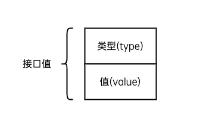
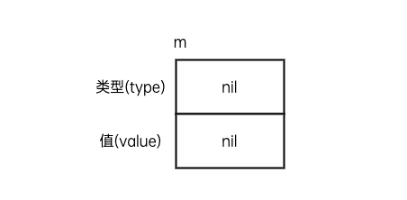
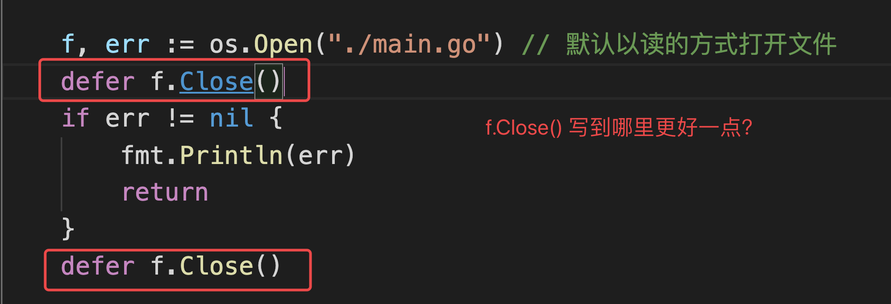

# 接口与、fmt、文件类型

## 1，接口

### 1.1 接口定义

```go
// 接口类型是一组方法的集合，规定了需要实现的所有方法

type 接口类型名 interface{
    方法名1( 参数列表1 ) 返回值列表1
    方法名2( 参数列表2 ) 返回值列表2
    …
}

接口类型名：Go语言的接口在命名时，一般会在单词后面添加er，如有写操作的接口叫Writer
方法名：当方法名首字母是大写且这个接口类型名首字母也是大写时，这个方法可以被接口所在的包（package）之外的代码访问。
参数列表、返回值列表：参数列表和返回值列表中的参数变量名可以省略

// 为什么要使用接口？
接口类型是一种方法的集合，所以一定程度上，接口类型可以赋值为任何类型的变量，根据这个特性，可以将接口类型用作函数的参数，统一为任何类型的变量实现某个方法。
```

### 1.2 实现接口的条件

```go
// 如果一个类型实现了某一个接口中规定的所有方法，那么就称此类型实现了这个接口
type singer interface{
    Sing()
}

type people struct{
    name int
}

type (p people) Sing() {
    fmt.Pringtf("唱歌!")
}  // 称结构体people实现了singer的方法


```

### 1.3 接口和类型之间的关系

```
一个类型可以实现多种接口

多种类型也可以实现同一接口

接口之间可以互相嵌套
```

### 1.4 空接口

```go
// 空接口是没有定义任何方法的接口类型，所以认为任何类型都实现了空接口，所以空接口可以定义为函数的参数，用来存储任何类型的值

package main

import "fmt"

type Any interface {
	// 定义空接口
}

func demo3() {
	var a Any // 空接口可以接受任何类型的变量，鸭子类型
	a = "公瑾"
	fmt.Printf("我的名字：%v\n", a)
	a = 10
	fmt.Printf("我的年龄：%d\n", a)
	a = true
	fmt.Printf("我是男的？%t\n", a)
}


// 应用1： 用作函数参数               应用2： 用作map的值
```

### 1.5 接口值



```go 
	由于接口类型的值可以是任意一个实现了该接口的类型值，所以接口值除了需要记录具体值之外，还需要记录这个值属于的类型。也就是说接口值由“类型”和“值”组成，鉴于这两部分会根据存入值的不同而发生变化，我们称之为接口的动态类型和动态值。
```



```go
空接口的类型和值都为nil
// 初始化（赋予类型）: m = new(car)     类型为car
// 赋值（初始化之后，赋予值）: m = &car("本田")
```


### 1.6 类型断言

```go
// 1，获取接口的类型
fmt.Printf("%T\n", m)

// 2，获取接口的值  x.(T)
v, ok := n.(*Dog)
           
```

### 结构体内部包含匿名接口类型

1. 默认就实现了该接口类型
2. 可以重写接口的方法
3. 但是一定要确保这个接口字段被正确初始化 

## 2，标准库fmt包

```go
https://www.liwenzhou.com/posts/Go/go_fmt/

// 输出
fmt.Print
fmt.Printf
fmt.Println
fmt.Fprint


### 输入

fmt.Scan
```


## 3，文件操作

### 3.1 普通方式读取

```go
// https://www.liwenzhou.com/posts/Go/go_file/
// 1, 打开文件
file, err := os.Open("./file.txt")  

// 1, 读取文件
var tmp = make([]byte, 1024)  // 创建byte类型切片用来存储每次读取的字节
n, err := file.Read(tmp)  // 读取file，放到tmp中，返回读取的字节数，以及可能的报错信息
if err == io.EOF {     // 结束条件
    fmt.Println("文件为空")
    break		// 循环跳出为break， 单词读取跳出为return 
}

// 1, 关闭文件
defer file.Close()   // 在函数运行完毕之后，执行文件关闭操作
```

### 3.2 bufio读取

```go
// 1, 打开文件
file, err := os.Open("./file.txt")  

```

### 3.3 ioutil读取

```go
```

 





# 本周作业

1. 自己把课上文件操作的示例代码敲一遍，有个印象。

2. 预习包的概念和go module

   https://www.liwenzhou.com/posts/Go/11-package/

   
