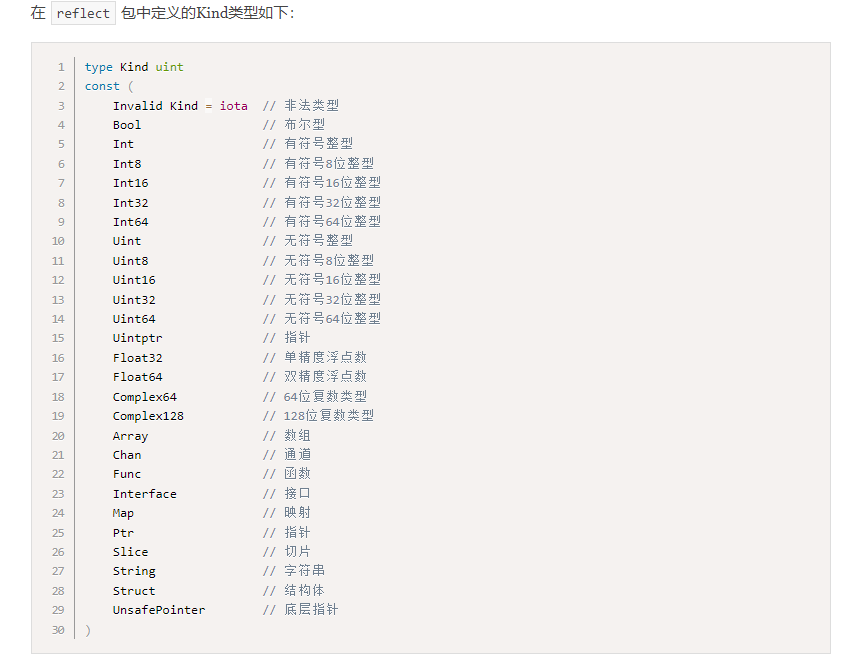

# Error

## 1.1 error接口

```go 
// go语言没有异常捕获相关的代码，而是吧error当作值处理，通过接口类型表示错误
type error interface{
    Error() string   // 接口只有一个Error方法，实现此方法，就认为实现了error接口
}
```

## 1.2 新建error

```go
myerr := errors.New("my errors")  // 初始化一个新的错误实例

```

## 1.3 封装error：`fmt.Errorf`

```go
var EOF = errors.New("EOF")
fmt.Println(EOF)

// %v 普通包装
newerr := fmt.Errorf("包装后的错误(不保留原错误类型)：%v", EOF)
fmt.Println(newerr)

// %w 深层包装
package_err := fmt.Errorf("保留原类型并重新包装的错误类型: %w", EOF)
fmt.Println(package_err)
```

## 1.4 错误结构体类型

```go
type OpErr struct{
    Op string
}
func (e *OpErr) Error() string{
    return e.op     //  定义Error方法，但是没有定义New方法，没有实现errors接口
}
```

## 1.5 errors.New  本质


# package包和go module


`project` ：项目  ---> 一个VsCode窗口 或者 一个GoLand窗口 打开一个项目（project）

`package`:包  --> 一个project 可以由多个 package 组成  

`.go`文件：源码文件 


#### 标识符的可见性


**标识符的首字母 什么时候大写，什么时候小写 都是有考量的！！！**


#### go module


##### go get 下载依赖

默认下载最新版本

```bash
go get github.com/q1mi/hello
```

下载指定版本

```bash
go get github.com/q1mi/hello@v0.1.0
```


默认下载到 `$gopath/pkg/mod/`目录下


导入的路径名由被引入的包的 module 定义


##### go.mod 中 replace 替换语法

# 反射

## 4.1 获取普通变量的类型信息

`reflect.TypeOf`  获取基础变量类型信息, 返回 `reflect.Type` 对象

```go
https://www.liwenzhou.com/posts/Go/13_reflect/

var b bool = true
var d int8 = 32
fmt.Printf("%t: %v; %d: %v\n", b, reflect.TypeOf(b), d, reflect.TypeOf(d))

```

## 4.2 获取非普通变量的类型信息（指针、切片、结构体...）

`.kind()` 从 `reflect.Type`  或者  `reflect.Value`  获取高级封装的底层变量类型（int8...）

`.name()` 从 `reflect.Type`  或者  `reflect.Value`  获取高级封装的初级变量类型（MyInt）

```go
var a *float64 // 指针类型
reflectType(a)

type myint int8 // 自定义类型
var mi myint = 32
reflectType(mi)

type mystring = string // 类型别名
var ms mystring = "周公瑾"
reflectType(ms)

var p = person{"周公瑾", 54}
reflectType(p)

`
Go语言的反射中像数组、切片、Map、指针等类型的变量，它们的.Name()都是返回空。
`
```



## 4.3 获取变量内部的值

`reflect.ValueOf`  获取基础变量类型信息, 返回 `reflect.Value` 对象

```go
func reflectValue(x interface{}) {
	v := reflect.ValueOf(x)
	k := v.Kind()
	switch k {
	case reflect.Int64:
		// v.Int()从反射中获取整型的原始值，然后通过int64()强制类型转换
		fmt.Printf("type is int64, value is %d\n", int64(v.Int()))
	case reflect.Float32:
		// v.Float()从反射中获取浮点型的原始值，然后通过float32()强制类型转换
		fmt.Printf("type is float32, value is %f\n", float32(v.Float()))
	case reflect.Float64:
		// v.Float()从反射中获取浮点型的原始值，然后通过float64()强制类型转换
		fmt.Printf("type is float64, value is %f\n", float64(v.Float()))
	}
}


// 类型互相转换
v := reflect.ValueOf(x)   // 转换为reflect.Value类型对象
v.Int()  // 转换为Int()类型
```

## 4.4 通过反射设置变量的值

`v.Elem().SetInt()`  通过传入指针的方式实现对原值的修改

```go
func reflectSetValue2(x interface{}) {
	v := reflect.ValueOf(x)
	// 反射中使用 Elem()方法获取指针对应的值
	if v.Elem().Kind() == reflect.Int64 {
		v.Elem().SetInt(200)
	}
}
```

## 4.5 isNil()和isValid()
`isNil()`

```go
func (v Value) IsNil() bool
```

`IsNil()`报告v持有的值是否为nil。v持有的值的分类必须是通道、函数、接口、映射、指针、切片之一；否则IsNil函数会导致panic。


`isValid()`

```go
func (v Value) IsValid() bool
```

`IsValid()`返回v是否持有一个值。如果v是Value零值会返回假，此时v除了IsValid、String、Kind之外的方法都会导致panic。

## 4.6 结构体反射


结构体反射是重点。


# 本周作业

1. 编写一个`calc`包实现加减乘除四个功能函数，在`snow`这个包中引入`calc`包并调用其加减乘除四个函数实现数学运算。

2. 利用学到的反射的内容实现以下函数， 把error都用上

   ```go
   // loadStudentData 从文件中加载数据到Student结构体
   func loadStudentData(filename string, obj interface{}) error {
   	// 0. 前置检查
   	// 0.1 obj必须是指针类型，不是就返回错误
   	// 0.2 obj必须是结构体指针, 不是就返回错误
   	// 1. 一行一行读取文件中的内容，解析成键值对 （读一行处理一行）
   	// 2. 根据key去结构体里找字段名
   	// 3. 找到之后赋值
   	return nil
   }
   ```

   