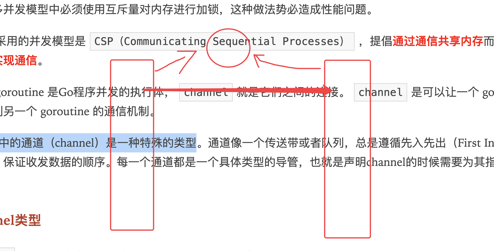
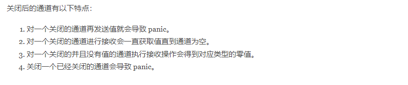
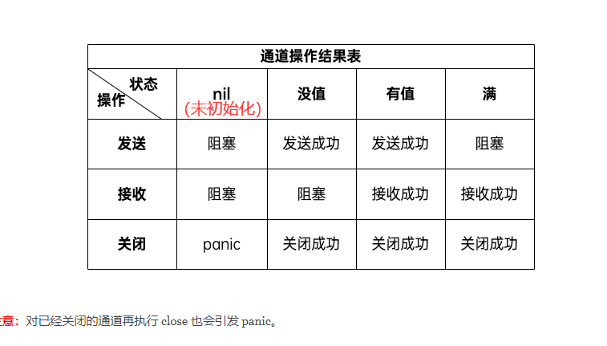
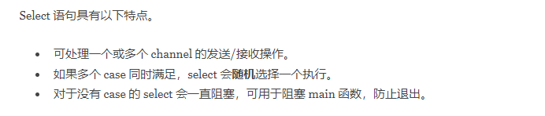

# strconv包

## 1.1 str <==> int 互相转换

```go
https://www.liwenzhou.com/posts/Go/go_strconv/

Atoi()函数用于将字符串类型的整数转换为int类型，函数签名如下。
func Atoi(s string) (i int, err error)
Itoa()函数用于将int类型数据转换为对应的字符串表示
func Itoa(i int) string

// str ==> int
str1 := "100"
dat1, err := strconv.Atoi(str1)
if err != nil {
    fmt.Println("conv error")
    return
}
fmt.Printf("转换后的数字： %d, %v\n", dat1, reflect.TypeOf(dat1))

// int ==> str
str2 := strconv.Itoa(dat1)
fmt.Printf("转换后的字符： %s, %v\n", str2, reflect.TypeOf(str2))
```

## 1.2 str ==> int, uint, bool, float 

```go
func ParseBool(str string) (value bool, err error)
返回字符串表示的bool值。它接受1、0、t、f、T、F、true、false、True、False、TRUE、FALSE；否则返回错误

func ParseInt(s string, base int, bitSize int) (i int64, err error)
返回字符串表示的整数值，接受正负号

func ParseUint(s string, base int, bitSize int) (n uint64, err error)
ParseUint类似ParseInt但不接受正负号，用于无符号整型

func ParseFloat(s string, bitSize int) (f float64, err error)
解析一个表示浮点数的字符串并返回其值

```
## 1.3 int, uint, bool, float  ==> str

```go
func FormatBool(b bool) string
根据b的值返回”true”或”false”

func FormatInt(i int64, base int) string
返回i的base进制的字符串表示。base 必须在2到36之间，结果中会使用小写字母’a’到’z’表示大于10的数字

func FormatUint(i uint64, base int) string
是FormatInt的无符号整数版本

func FormatFloat(f float64, fmt byte, prec, bitSize int) string
函数将浮点数表示为字符串并返回
```

## 1.4 其他

```go
isPrint()
func IsPrint(r rune) bool
返回一个字符是否是可打印的，和unicode.IsPrint一样，r必须是：字母（广义）、数字、标点、符号、ASCII空格。

CanBackquote()
func CanBackquote(s string) bool
返回字符串s是否可以不被修改的表示为一个单行的、没有空格和tab之外控制字符的反引号字符串。
```


int转字符串

```go
// 把字符串转换为int类型
intValue, err := strconv.Atoi("123")
fmt.Println(intValue, err)
// 把int转为字符串
v := 68 // 68 -> "68"

// s := string(v)  // "D"  ascii码

s := strconv.Itoa(v)

fmt.Printf("%#v\n", s) // "68"

s2 := fmt.Sprintf("%v", v) // "68"
fmt.Printf("%#v\n", s2)
```

# time包

## 2.1 时间类型

```go
https://www.liwenzhou.com/posts/Go/go-time/
// 获取当前时间
time.Now()

// 加载时区
NewYork, err := time.LoadLocation("America/New_York")
// 创建时间对象需要指定位置。常用的位置是 time.Local（当地时间） 和 time.UTC（UTC时间）。
timeInLocal := time.Date(2009, 1, 1, 20, 0, 0, 0, time.Local)  // 系统本地时间
timeInUTC := time.Date(2009, 1, 1, 12, 0, 0, 0, time.UTC) // UTC时间
sameTimeInNewYork := time.Date(2009, 1, 1, 7, 0, 0, 0, newYork)  // 纽约时间，需要loadlocation
```

## 2.2 时间戳 <==> 时间类型

```go
now := time.Now()        // 获取当前时间
timestamp := now.Unix()  // 秒级时间戳
milli := now.UnixMilli() // 毫秒时间戳 Go1.17+
micro := now.UnixMicro() // 微秒时间戳 Go1.17+
nano := now.UnixNano()   // 纳秒时间戳


ut := time.Unix(timestamp)  // 根据时间戳，返回时间
ut := time.UnixMilli(milli)
ut := time.UnixMicro(micro)

```

## 2.3 时间间隔duraion

```go
time.Hour()
time.Minute()
time.Second()

// 时间加减
func (t Time) Add(d Duration) Time 
时间相加，传入Duration类型参数

func (t Time) Sub(u Time) Duration
返回一个时间段t-u。如果结果超出了Duration可以表示的最大值/最小值，将返回最大值/最小值。要获取时间点t-d（d为Duration），可以使用t.Add(-d)

// 时间大于小于等于
func (t Time) Equal(u Time) bool
func (t Time) Before(u Time) bool
func (t Time) After(u Time) bool

```

## 2.4 `time.Tick`定时器

```go
// 定时器本质是一个通道类型
func tickDemo() {
	ticker := time.Tick(time.Second) //定义一个1秒间隔的定时器
	for i := range ticker {
		fmt.Println(i)	//每秒都会执行的任务， i为Time类型，且为当前时间
	}
}
```

## 2.5 `time.Format`时间格式化（特殊）

```go
// time.Format可以将Time类型变量转换为字符串类型，并可以指定格式，但并非类似python中的 Y-m-d H:M:S
使用 2006-01-02 15:04:05.000（记忆口诀为2006 1 2 3 4 5）
now.Format("2006/01/02 15:04:05.999")
```

## 2.6 `time.Parse` 解析字符串的时间

```go
timeObj, err := time.Parse(time.RFC3339, "2022-10-05T11:25:20+08:00")
	if err != nil {
		fmt.Println(err)
		return
	}
```

# goroutine 并发

## 3.1 go关键字

```go
// 创建一个新的 goroutine 运行函数f
go f()       // 就这样即完成
```

## 3.2 `sync`包阻塞函数

- `var wg sync.WaitGroup`
- `wg.Add`
- `wg.Done`

```go
var wg sync.WaitGroup  // 声明等待组

func f1() {
	fmt.Print("符号看象限\n")
	wg.Done()	// 函数执行完成，发生结束信号
}

func f2() {
	fmt.Print("三角函数：\n")
	wg.Done()
}

func goroutine_demo() {
	wg.Add(2)	// 添加等待函数数量
	go f2()
	go f1()
	fmt.Print("奇变偶不变\n")
	//time.Sleep(time.Second) // 如果不等待，那么主函数运行完成，直接结束进程，上面的函数可能还没执行完成
}
```


# channel

通过共享内存实现通信  --> 加锁

通过通信实现共享内存 --> channel

`channel`是可以让一个 goroutine 发送特定值到另一个 goroutine 的通信机制



## 4.1 定义channel类型

```go
var 变量名称 chan 元素类型
// 变量名称一般都要后缀Ch，方便辨认

var iCh chan int32
var bCh chan bool
var fCh chan float64
var sliceCh chan []byte
var sCh chan string
```

## 4.2 初始化channel

```go
var ch chan int
fmt.Println(ch) // <nil>

// 声明的通道类型变量需要使用内置的make函数初始化之后才能使用。具体格式如下：
make(chan 元素类型, [缓冲大小])   // 缓存区域大小表示可存储的数据量的大小

```

## 4.3 channel操作

```go
iCh := make(chan int32)   // 对于无缓存区域的通道，数据发送同时必须要有接受，否则会出现死锁。
aCh := make(chan int64, 2)  // 缓存区域为2的channel通道
// 发送数据到channel
send1 := 122
aCh <- send1

// 从channel中拿到数据
recv <- aCh
<- ach  // 不接受值，表示丢弃

// 关闭channel通道
close(aCh)
```



## 4.4 从channel中获取所有值

```go
// 多返回值
for {
    value, ok := <-ch    // ok 布尔值，用来判断通道是否被关闭
    fmt.Println(value)
    if !ok {
        fmt.Println("通道被关闭，sleeping...")
        break
    }
}


// 获取所有值
for value := range ch {
    fmt.Println("从通道拿到数值:", value)
}
```



## 4.5 单向通道

```go
<- chan int // 只接收通道，只能接收不能发送, 不允许关闭通道
chan <- int // 只发送通道，只能发送不能接收

// 全向通道可以转化为单向通道，单向通道不能转换为全向通道
```

## 4.6 select 多路复用

```go
select {
case <-ch1:  // 判断条件1，能成功从ch1拿到数据
	//...
case data := <-ch2:  // 判断条件2，能成功从ch2拿到数据
	//...
case ch3 <- 10:   // 判断条件3，能成功向ch3中插入数据
	//...
default:   // 不满足上述条件时候，默认执行下面代码块
   
	//默认操作
}
```




