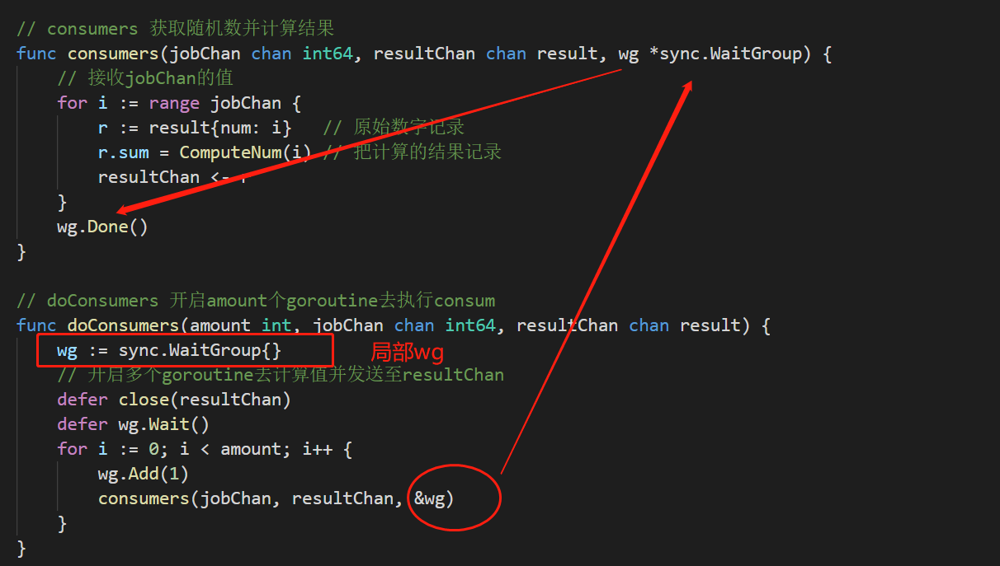
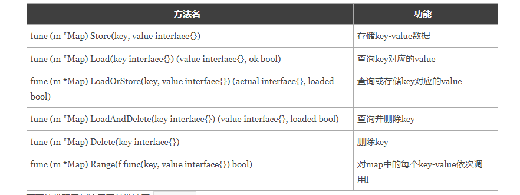
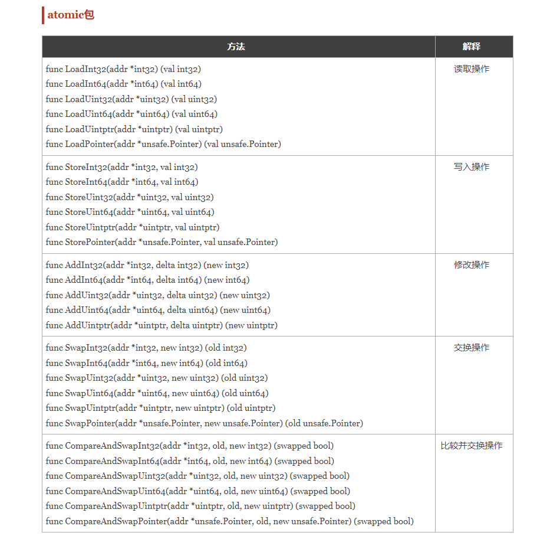
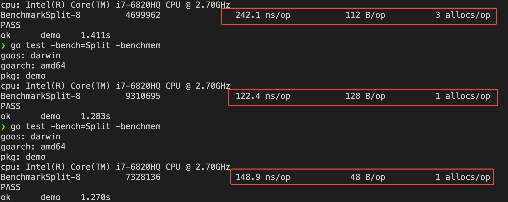

# 并发锁

## 1.1 互斥锁 `sync.Mutex`

```go
// 互斥锁一旦被获得，其他goroutine无法对加锁数据进行读写操作
var m sync.Mutex   // 声明互斥锁
// 写锁
m.Lock()			
m.Unlock()
```

## 1.2 读写锁 `sync.RWMutex`

```go
// 读锁：读锁被获得，其他goroutine仍然获取读锁，但是无法获取写锁
// 写锁：写锁被获得，其他goroutine无法获得读写锁

读写锁能够在 读多写少 或者 读少写多 的业务情况下大幅提高性能，但是对于一个读写操作数量级差距不大的业务中，性能不如互斥锁

var rwm sync.RWMutex   // 声明读写锁
// 写锁
rwm.Lock()			
rwm.Unlock()
// 读锁
rwm.RLock()
rwm.RUnlock()
```

## 1.3 同步`sync.WaitGroup`

```go
var wg sync.WaitGroup   // 声明等待组
wg.Add(num)				// 添加任务
wg.Done()				// 结束任务
wg.Wait()				// 阻塞主进程，直到所有任务都已经完成

################
需要注意sync.WaitGroup是一个结构体，进行参数传递的时候要传递指针
```



## 1.4 仅执行一次`sync.Once`

```go
// 适用场景
1. 存在多goroutine并发操作 
2. 某个操作只想被执行一次

var once sync.Once
once.Do(func...)

// 单例模式
package singleton

import (
    "sync"
)

type singleton struct {}

var instance *singleton
var once sync.Once

func GetInstance() *singleton {
    once.Do(func() {
        instance = &singleton{}
    })
    return instance
}
```

## 1.5 并发安全map`sync.Map`

```go
// 并发安全的map
var m = sync.Map{}
```




# 原子操作

## atomic包

- atomic包效率 高于 互斥锁 高于 非并发



# 网络编程

https://www.liwenzhou.com/posts/Go/15_socket/


# 单元测试

https://www.liwenzhou.com/posts/Go/unit-test/


## 4.1 格式要求

1. 测试文件的名字 ： `xx_test.go`
2. 测试函数的名字：`TestXxx(t *testing.T)`

## 4.2 基准测试




## 本周作业

1. 编写一个回文检测函数，并为其编写单元测试和基准测试，根据测试的结果逐步对其进行优化。（回文：一个字符串正序和逆序一样，如“Madam,I’mAdam”、“油灯少灯油”等。）
2. 把goroutine和channel的作业题好好写一下
3. 上课写的例子自己写一下
4. 下节课讲数据库，自己提前预习下https://www.liwenzhou.com/posts/Go/go_mysql/，自己装备好mysql和redis环境。

