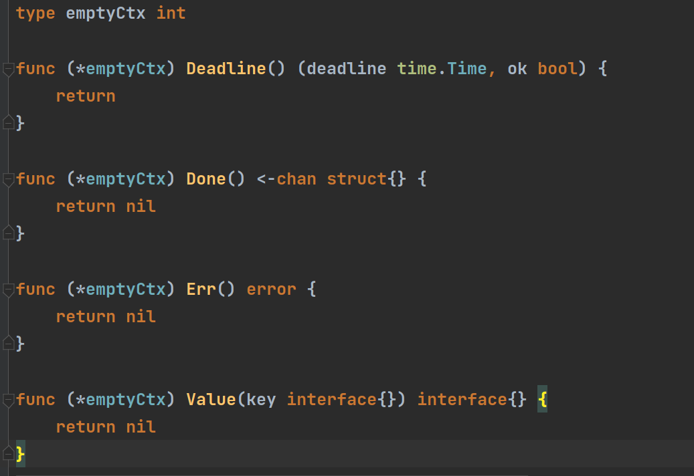
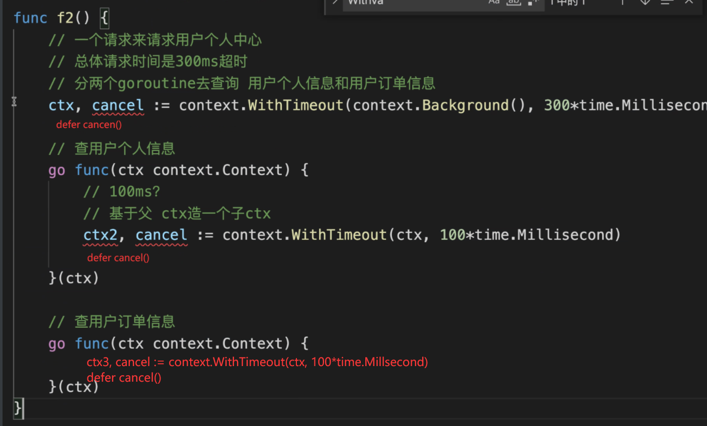

# 网络编程 net/http

https://www.liwenzhou.com/posts/Go/go_http/

## 1.1 客户端

### 1.1.1 `http.Get`

```go
resp, err := http.Get("https://google.com/")   // 向指定网址发送get请求
defer resp.Body.Close()  // 发送完请求，记得关闭请求回复主题


#############################
// get请求携带参数
web = "https://google.com"
// 参数信息
data := url.Values{}
data.Set("name", "zhougongjin")
data.Set("pwd", "zhouzhou123")
// 解析url对象
u, err := url.ParseRequestURI(web)
// 将参数信息绑定到url
u.RawQuery = data.Encode()
// 请求url
http.Get(u.String()) // 在将url处理成字符串格式，并请求


#################################
// 更简单粗暴的携带请求参数
web := "https://baidu.com"
params := url.Values{"name": {"zhougongjin"}, "pwd": {"zhouzhou123"}} // 注意非JSON格式，值要包含在{}中，
print(params.Encode()) // name=zhougongjin&pwd=zhouzhou123
web = web + "?" + params.Encode()
res, err := http.Get(web)
```

### 1.1.2 `http.Post`

```go
resp, err ：= http.Post("https://liwenzhou.com")   // 像网站发送post请求
defer resp.Body.Close()

###################################
// 通过post请求，携带参数信息
web := "http://localhost:8003"
contentType := "application/json"  // 请求数据格式
data := `"name": "zhougongjin", "pwd": "zhouzhou123", "age": 18`   // 反引号保存原来的格式
resp, err := http.Post(web, contentType, strings.NewReader(data))
defer resp.Body.Close()
```

### 1.1.3 `http.PostForm`

```go
resp, err := http.PostForm("https://baidu.com", url.Values{"user": {"zhougongjin"}, "password": {"zhouzhou123"}})
// 发送post请求并携带请求参数
defer resp.Body.Close()

```


发送请求的那一端，发http请求，通常会有GET POST  。。。

```go
htto.Get()

http.Post()  
// form表单格式
// json格式
```

**url.Values**

```go
var query url.Value
```


## 1.2 服务端

### 1.2.1 服务端格式

```go
func serverDemo() {
	// 1、为url绑定视图函数----01
	http.Handle("/order", http.HandlerFunc(f1)) // sum := int64(0)
	// 1、为url绑定试图函数----02
	http.HandleFunc("/index", func(w http.ResponseWriter, r *http.Request) {
		w.Write([]byte("hello go world"))
	})
    
	// 2、绑定服务的端口
	http.ListenAndServe(":8004", nil)
}
```

### 1.2.2 视图函数获取get请求的参数

```go
func get_demo(w http.ResponseWriter, r *http.Request){
	defer r.Body.close()
	name := r.URL.Query().Get("name")
	pwd := r.URL.Query().Get("pwd")
}
```

### 1.2.3 视图函数获取post请求的参数

```go
func postfunc(w http.ResponseWriter, r *http.Request) {
	defer r.Body.Close()
	name := r.PostFormValue("name")
	age := r.PostFormValue("age")
}
```


# Go并发context 

## 2.1 为什么使用context / context的应用场景

```bash
# https://www.liwenzhou.com/posts/Go/go_context/

# context是干啥的
搭配goroutine干活的
- 通知 goroutine 退出
- 请求的场景下携带跟请求相关的数据

# 为什么要用context
在 goroutine 外部如何通知 goroutine 退出？
统一的规范化的通知 goroutine 退出的机制。

# context
context 本身不能实现 goroutine 的退出吗？ 不能
我们需要在 goroutine 中手动的处理 ctx.Done() 的信号
context 本质上是一个接口类型。
携带了 cancelFunc 、超时时间和 ctx.Done() ,以及携带请求相关数据
ctx.Done() 返回的是一个通道
当调用cancelFunc 或者 超时时间到了，ctx.Done() 返回的通道能接收到值。
```

共有的问题：如何在goroutine外部通知goroutine退出？

- 全局变量
- 使用通道变量

有并发风险或者不好管理、不好形成统一的规范

```go
Go1.7 之前都是程序员自己实现，Go1.7之后官方提供了一个统一的比较完善的方案——context。

定义了一个全新的类型，Context（上下文管理），专门用来简化处理多个goroutine之间请求阈数据，取消信号，截止时间之前的相关操作

// context本质上是一个接口类型，定义了必须实现的四个方法 Deadline\Done\Err\Value
type Context interface {
	// Deadline returns the time when work done on behalf of this context
	// should be canceled. Deadline returns ok==false when no deadline is
	// set. Successive calls to Deadline return the same results.
	Deadline() (deadline time.Time, ok bool)    // 当前context取消时间，即工作完成截止时间

	// Done returns a channel that's closed when work done on behalf of this
	// context should be canceled. Done may return nil if this context can
	// never be canceled. Successive calls to Done return the same value.
	// The close of the Done channel may happen asynchronously,
	// after the cancel function returns.
	//
	// WithCancel arranges for Done to be closed when cancel is called;
	// WithDeadline arranges for Done to be closed when the deadline
	// expires; WithTimeout arranges for Done to be closed when the timeout
	// elapses.
	//
	// Done is provided for use in select statements:
	//
	//  // Stream generates values with DoSomething and sends them to out
	//  // until DoSomething returns an error or ctx.Done is closed.
	//  func Stream(ctx context.Context, out chan<- Value) error {
	//  	for {
	//  		v, err := DoSomething(ctx)
	//  		if err != nil {
	//  			return err
	//  		}
	//  		select {
	//  		case <-ctx.Done():
	//  			return ctx.Err()
	//  		case out <- v:
	//  		}
	//  	}
	//  }
	//
	// See https://blog.golang.org/pipelines for more examples of how to use
	// a Done channel for cancellation.
	Done() <-chan struct{}  // 返回一个channel，当前工作完成或者被取消的时候通道被关闭

	// If Done is not yet closed, Err returns nil.
	// If Done is closed, Err returns a non-nil error explaining why:
	// Canceled if the context was canceled
	// or DeadlineExceeded if the context's deadline passed.
	// After Err returns a non-nil error, successive calls to Err return the same error.
	Err() error   // 返回当前通道被关闭的原因
    // 如果当前Context被取消就会返回Canceled错误；
	// 如果当前Context超时就会返回DeadlineExceeded错误；

	// Value returns the value associated with this context for key, or nil
	// if no value is associated with key. Successive calls to Value with
	// the same key returns the same result.
	//
	// Use context values only for request-scoped data that transits
	// processes and API boundaries, not for passing optional parameters to
	// functions.
	//
	// A key identifies a specific value in a Context. Functions that wish
	// to store values in Context typically allocate a key in a global
	// variable then use that key as the argument to context.WithValue and
	// Context.Value. A key can be any type that supports equality;
	// packages should define keys as an unexported type to avoid
	// collisions.
	//
	// Packages that define a Context key should provide type-safe accessors
	// for the values stored using that key:
	//
	// 	// Package user defines a User type that's stored in Contexts.
	// 	package user
	//
	// 	import "context"
	//
	// 	// User is the type of value stored in the Contexts.
	// 	type User struct {...}
	//
	// 	// key is an unexported type for keys defined in this package.
	// 	// This prevents collisions with keys defined in other packages.
	// 	type key int
	//
	// 	// userKey is the key for user.User values in Contexts. It is
	// 	// unexported; clients use user.NewContext and user.FromContext
	// 	// instead of using this key directly.
	// 	var userKey key
	//
	// 	// NewContext returns a new Context that carries value u.
	// 	func NewContext(ctx context.Context, u *User) context.Context {
	// 		return context.WithValue(ctx, userKey, u)
	// 	}
	//
	// 	// FromContext returns the User value stored in ctx, if any.
	// 	func FromContext(ctx context.Context) (*User, bool) {
	// 		u, ok := ctx.Value(userKey).(*User)
	// 		return u, ok
	// 	}
	Value(key interface{}) interface{} // 从context取出键对应的值，多次调用会返回同一个值
}
```


## 2.2 创建空context -- emptyCtx

```go
context.Background()
context.TODO()
# background 和 todo 本质上都是emptyCtx结构体类型，是一个不可取消，没有设置截止时间，没有携带任何值的Context。

// 源码赏析
var (
	background = new(emptyCtx)   // 声明是空接口类型
	todo       = new(emptyCtx)
)

func Background() Context {		// 通过调用函数，返回空接口类型
	return background
}

func TODO() Context {
	return todo
}

//emptyCtx默认实现了context接口的所有方法 
```

- context.TODO()：假设你调用的一个函数必须传递一个context作为参数，但是你暂时还不知道用什么contex, 你就先给他先传个TODO占个位置 (类似于python中的pass)，保证函数正常调用。等到后续你明确了要用哪种context,你再把context.TODO替换掉。

**绝对不要**把context.TODO理解成下面这种用法。

>  老师，你看我的理解对么，就是还暂时用不到context的时候，先占个位置，就是ctx, cancel := context.WithCancel(context.ToDo())，然后业务代码正常传入ctx，等到准备好了，用到了，再把ctx, cancel := context.WithCancel(context.TODO())改成ctx, cancel := context.WithCancel(context.Background())，对吧

context.With系列的函数必须传递明确的ctx，正确的用法是：

- 如果你有别人给你的一个父ctx，那你就把父ctx传进去。

- 如果你没有父ctx或者你就是顶层的ctx,那么你就传一个 context.Backgroud()



##  2.3 with系列

### 2.3.1 WithCancel

- ```go
  func WithCancel(parent Context) (ctx Context, cancel CancelFunc)
  ```

```go
ctx, cancel := context.WithCancel(context.Background())
defer cancel()  // WithCancel调用后在上下文运行操作完成后应该立即调用cancel
```

### 2.3.2 WithDeadline

- ```go
  func WithDeadline(parent Context, deadline time.Time) (Context, CancelFunc)
  ```

```go
d := time.Now().Add(50 * time.Millisecond)
ctx, cancel := context.WithDeadline(context.Background(), d)

// 尽管ctx会过期，但在任何情况下调用它的cancel函数都是很好的实践。
// 如果不这样做，可能会使上下文及其父类存活的时间超过必要的时间。
defer cancel()
```

### 2.3.3 WithTimeout

- ```go
  func WithTimeout(parent Context, timeout time.Duration) (Context, CancelFunc)
  ```

````go
ctx, cancel := context.WithTimeout(context.Background(), time.Millisecond*50)
defer cancel()
````

### 2.3.4 WithValue

- ```go
  func WithValue(parent Context, key, val interface{}) Context
  ```

```go
ctx, cancel := context.WithTimeout(context.Background(), time.Millisecond*50)
// 在系统的入口中设置trace code传递给后续启动的goroutine实现日志数据聚合


var TraceCode string  // 为防止键与内置的键名出现重复，可以自定义类型
ctx = context.WithValue(ctx, TraceCode("TRACE_CODE"), "12512312234")
defer cancel()
注意事项：
```

1. 因为是空接口类型，存的时候任意存，取的时候要做类型断言

2. 不同的包 goroutine 中都可以对context设置值，可能存在key重复了，后面的赋值操作会覆盖前面的。

   1. context.WithValue(ctx, "name", "杨俊")
   2. context.WithValue(ctx, "name", "安小枫")

3. WithValue不要使用**基础数据类型**来作为key，避免被冲突。

4. 要使用自定义类型来作为key

   ```go
   type CtxKey int8
   
   const (
   	CtxName CtxKey = iota
   	CtxAge  CtxKey = iota
   	// ...
   )
   
   func f1() {
   	ctx := context.WithValue(context.Background(), CtxName, "杨俊")
   
   	// 根据key取值
   	value := ctx.Value(CtxName).(string) // 对取出的值做类型断言
   	fmt.Println(value)
   }
   ```
### 2.3.5 继承

```go
// 父ctx结束，子ctx也会结束

比如，订单（父）总超时时长300ms， 处理订单（子1）就超时就不能更多，应该为100ms，计算数据（子2）超时100ms...

```




此外，还有一个我之前在培训机构讲的一个Go语言服务端开发项目实战：https://b23.tv/idab9a 自己动手写个日志收集，是练习goroutine和context的绝佳项目，可以作为进阶学习项目。

