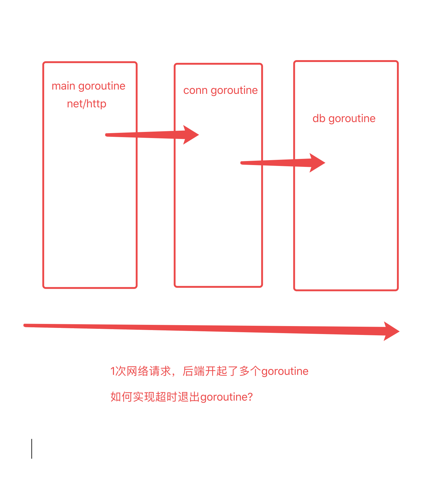

# 网络编程 net/http

https://www.liwenzhou.com/posts/Go/go_http/

## 客户端

发送请求的那一端，发http请求，通常会有GET POST  。。。

```go
htto.Get()

http.Post()  
// form表单格式
// json格式
```

**url.Values**

```go
var query url.Value
```


## 服务端


```go
func serverDemo() {

	// 做好准备：当客户端请求 127.0.0.1:8082/order?id=1234 会携带一个id
	// 我拿到id去查订单数据给用户返回
	// 注册陆路由方式1
	http.Handle("/order", http.HandlerFunc(f1)) // sum := int64(0)
	// 注册路由方式2
	http.HandleFunc("/hello", func(w http.ResponseWriter, r *http.Request) {
		fmt.Fprintf(w, "Hello, %q", html.EscapeString(r.URL.Path))
	})

	http.ListenAndServe(":8082", nil)
}
```

# Go并发context 

## 2.1 为什么使用context / context的应用场景

```bash
# https://www.liwenzhou.com/posts/Go/go_context/
```

共有的问题：如何在goroutine外部通知goroutine退出？

- 全局变量
- 使用通道变量

有并发风险或者不好管理、不好形成统一的规范

Go1.7 之前都是程序员自己实现，Go1.7之后官方提供了一个统一的比较完善的方案——context。




context


想要从零开始创建Context，可以借助两个函数

```go
context.Background()
context.TODO()
```


## with系列

```go
// WithCancel 得到一个字ctx和取消函数
ctx, cancel := context.WithCancel(context.Background())

now := time.Now()
ctx, cancel := context.WithDeadline(context.Background(), now.Add(5*time.Second))
defer cancel()

ctx, cancel := context.WithTimeout(context.Background(), 5*time.Second)
defer cancel()

type MyKey string
ctx := context.WithValue(context.Background(), MyKey("name"), "杨俊")
v, ok := ctx.Value(MyKey("name")).(string)
```


## context推荐项目——日志收集


此外，还有一个我之前在培训机构讲的一个Go语言服务端开发项目实战：https://b23.tv/idab9a 自己动手写个日志收集，是练习goroutine和context的绝佳项目，可以作为进阶学习项目。
