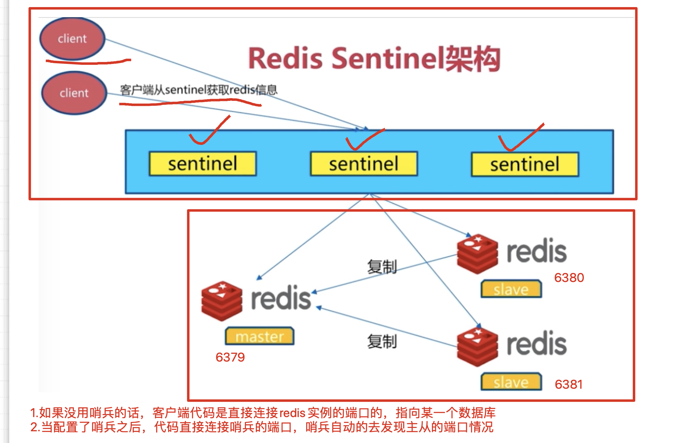

## redis学习

### 五大数据类型，开发必会的技能

老师的博客

https://www.cnblogs.com/pyyu/p/9467279.html

- string，字符串类型
- hash，哈希类型，如同python的dict
- Set，无序集合
- Zset，有序集合
- List，双向队列，向左插入数据，向右插入数据，向左、右，提取数据


### redis安全启动与配置文件，以下都是运维相关的操作了

```
1.redis如何在linux安装呢？
-rpm包安装
-yum自动化安装，在阿里的yum仓库中，有redis的软件包
-源代码编译安装 
```

redis是内存性数据库，断电，数据丢失，进程重启，数据丢失

得配置redis的数据持久化，防止数据丢失

redis支持ms复制，读写分离，防止单点故障，数据丢失

```
1.yum install redis -y 

2.修改redis.conf，更改默认端口，设置密码，开启安全模式等操作
用yum安装的redis，默认配置文件在/etc/redis.conf 

vim /etc/redis.conf #打开如下参数即可

# 这里是绑定redis的启动地址，如果你支持远程连接，就改为0.0.0.0
bind 0.0.0.0  
#更改端口
port 6500
#设置redis的密码
requirepass haohaio
#默认打开了安全模式
protected-mode yes  
#打开一个redis后台运行的参数
daemonize yes 


3.启动redis
为什么systemctl start redis无法连接呢？
是因为这个命令默认连接的是6379端口，我们更改了redis端口，因此无法连接了

请使用如下的命令，指定配置文件启动
[root@s25linux opt]# redis-server /etc/redis.conf

#检查redis的进程
[root@s25linux opt]# ps -ef|grep redis
root       6498      1  0 11:42 ?        00:00:00 redis-server 0.0.0.0:6500

4.连接redis服务端，指定ip地址和端口，以及密码连接redis
-p 指定端口
-h 指定ip地址
auth指令，用于密码验证
[root@s25linux opt]# redis-cli -p 6500 -h 192.168.178.143
192.168.178.143:6500>
192.168.178.143:6500>
192.168.178.143:6500>
192.168.178.143:6500>
192.168.178.143:6500> ping
(error) NOAUTH Authentication required.
192.168.178.143:6500>
192.168.178.143:6500> auth  haohaio
OK
192.168.178.143:6500>
192.168.178.143:6500> ping
PONG
```

```
redis常用命令

keys *  列出redis所有的key
```


### redis数据持久化之RDB机制

```
向redis中写入一些数据，重启进程，查看数据是否会丢失

1.环境准备，准备一个redis.conf配置文件，不开启数据数据持久化
先杀死所有的redis进程，重新写一个配置文件
[root@s25linux s25redis]# cat no_rdb_redis.conf

bind 0.0.0.0
daemonize yes

2.指定该文件启动
[root@s25linux s25redis]# redis-server no_rdb_redis.conf
[root@s25linux s25redis]# ps -ef|grep redis
root       6698      1  0 11:50 ?        00:00:00 redis-server 0.0.0.0:6379


3.登录数据库，写入数据，然后杀死redis进程，查看数据是否存在
```

以上的操作，都是为了演示，redis如果不配置持久化，数据会丢失，请看如下的持久化机制

```
1.配置rdb机制的数据持久化，数据文件是一个看不懂的二进制文件，且配置触发的时间机制
vim s25_rdb_redis.conf ，写入如下内容

daemonize yes		#后台运行
port 6379				#端口 
logfile /data/6379/redis.log #指定redis的运行日志，存储位置
dir /data/6379		#指定redis的数据文件，存放路径 
dbfilename  s25_dump.rdb	#指定数据持久化的文件名字 
bind 127.0.0.1		#指定redis的运行ip地址
#redis触发save指令，用于数据持久化的时间机制  
# 900秒之内有1个修改的命令操作，如set .mset,del
save 900 1		
# 在300秒内有10个修改类的操作
save 300 10
# 60秒内有10000个修改类的操作
save 60  10000


写入了一个key
set  name  很快就下课让大家去吃饭 

#快速的执行了10次的修改类的操作
比如 set  name  hehe
set  name1  haha
...


#新浪微博，1秒中内，写入了20w个新的key，因此也就是每分钟，进行一次数据持久化了

2.创建redis的数据文件夹，
mkdir -p /data/6379

3.杀死之前所有的redis，防止扰乱实验
[root@s25linux s25redis]# pkill -9 redis

4.指定配置了rdb的redis配置文件，启动
redis-server s25_rdb_redis.conf

5.如果没有触发redis的持久化时间机制，数据文件是不会生成的，数据重启进程也会丢

6.可以通过编写脚本，让redis手动执行save命令，触发持久化，在redis命令行中，直接输入save即可触发持久化
127.0.0.1:6379> set addr shahe
OK
127.0.0.1:6379>
127.0.0.1:6379> set  age 18
OK
127.0.0.1:6379>
127.0.0.1:6379>
127.0.0.1:6379> keys *
1) "age"
2) "addr"
3) "name"
127.0.0.1:6379> save
OK

7.存在了rdb持久化的文件之后，重启redis进程，数据也不会丢了，redis在重启之后，会读取dump.rdb文件中的数据

8.rdb的弊端在于什么，如果没有触发持久化机制，就发生了机器宕机，数据就会丢失了，因此redis有一个更好的aof机制

请看下集分解。。。下午来说aof持久化机制

```

## AOF之持久化机制

把修改类的redis命令操作，记录下来，追加写入到aof文件中，且是我们能够看得懂的日志文件

```
1.准备一个新的配置文件，里面定义了aof的功能性参数即可使用
vim  s25_aof_redis.conf 

写入如下内容
daemonize yes
port 6379
logfile /data/6379aof/redis.log
dir /data/6379aof/
appendonly yes	#开启aof功能
appendfsync everysec	#每秒钟持久化一次

2.创建aof的数据文件夹
mkdir -p  /data/6379aof/


3.启动aof的redis的数据库
redis-server  s25_aof_redis.conf 

4.aof机制的数据库，在首次启动的时候，就会生成aof数据文件了，如下
[root@s25linux 6379aof]# ls
appendonly.aof  redis.log


5.登录redis,写入数据
[root@s25linux s25redis]# redis-cli
127.0.0.1:6379>
127.0.0.1:6379>
127.0.0.1:6379> keys *
(empty list or set)
127.0.0.1:6379> set  name zhunbeixiakechifan
OK
127.0.0.1:6379> set  name2  xinkudajiale
OK
127.0.0.1:6379> keys *
1) "name2"
2) "name"


6.写入的操作，会被记录到aof文件日志中

7.杀死所有的redis进程，且重启
[root@s25linux s25redis]# pkill -9 redis
[root@s25linux s25redis]# redis-server s25_aof_redis.conf

8.redis的aof持久化机制，是在重启的时候，redis重新执行一遍aof文件中的命令，实现数据复现

9.如果该aof日志文件被删除，数据也就无法恢复了


```

### redis数据同步复制

在一台机器上运行2个及以上的redis，是redis支持多实例的功能，基于端口号的不同，就能够运行多个相互独立的redis数据库

```
什么是多实例
就是机器上运行了多个redis相互独立的进程
互不干扰的独立的数据库
叫做多个redis数据库的实例，基于配置文件区分即可

```


```
1.上午的最后一步，演示的是，当我们删除aof文件，或者是rdb，aof文件异常损坏，丢失，数据不也没了吗？
```

操作笔记

如图是redis的多实例功能，且配置主从同步的图


```

1.准备好2个redis的配置文件，分别写入如下内容
vim s25-master-redis.conf 

port 6379
daemonize yes      # 后台运行
pidfile /s25/6379/redis.pid
loglevel notice
logfile "/s25/6379/redis.log"
dbfilename dump.rdb
dir /s25/6379
protected-mode no

2.准备第二个配置文件
vim s25-slave-redis.conf 

port 6389
daemonize yes
pidfile /s25/6389/redis.pid
loglevel notice
logfile "/s25/6389/redis.log"
dbfilename dump.rdb
dir /s25/6389
protected-mode no
slaveof  127.0.0.1  6379  #也可直接在配置文件中，定义好复制关系，启动后，立即就会建立复制

3.分别生成2个redis的数据文件夹
mkdir -p /s25/{6379,6389}

4.分别启动2个redis数据库，查看他们的身份复制关系
[root@s25linux s25redis]# redis-server s25-master-redis.conf
[root@s25linux s25redis]#
[root@s25linux s25redis]#
[root@s25linux s25redis]# redis-server s25-slave-redis.conf

5.分别检查他们的进程，以及复制关系
[root@s25linux s25redis]# redis-cli -p 6379  info replication
[root@s25linux s25redis]# redis-cli -p 6389  info replication
通过一条命令，配置他们的复制关系，注意，这个命令只是临时配置redis的复制关系，想要永久修改，还得修改配置文件
redis-cli -p  6389  slaveof  127.0.0.1 6379

6.此时6379已然是主库，6389已然是从库
此时可以向6379中写入数据，能够同步到6389中
6389是一个只读的数据库，无法写入数据
```


### 一主多从的形式，以及主从复制故障切换

```
1.再创建一个配置文件，port是6399，且加入到一主一从的复制关系中去
vim  s25-salve2-redis.conf 
port 6399
daemonize yes
pidfile /s25/6399/redis.pid
loglevel notice
logfile "/s25/6399/redis.log"
dbfilename dump.rdb
dir /s25/6399
protected-mode no
slaveof  127.0.0.1  6379 

2.创建数据文件夹
mkdir -p /s25/6399

3.启动6399的数据库，查看他的身份复制关系
[root@s25linux s25redis]# redis-cli -p 6399 info replication
```

此时问题来了，故障模拟


```
1.环境准备，准备3个redis的数据库实例，分别是 6379、6389、6399，配置好一主两从的关系
[root@s25linux s25redis]# ps -ef|grep redis
root      11294      1  0 15:19 ?        00:00:01 redis-server *:6379
root      11310      1  0 15:19 ?        00:00:01 redis-server *:6389
root      11620      1  0 15:33 ?        00:00:00 redis-server *:6399

分别查看复制关系
[root@s25linux s25redis]# redis-cli -p 6379 info replication
# Replication
role:master
connected_slaves:2
slave0:ip=127.0.0.1,port=6389,state=online,offset=1883,lag=1
slave1:ip=127.0.0.1,port=6399,state=online,offset=1883,lag=1


2.此时直接干掉主库即可
kill 6379的pid即可

3.此时留下2个孤零零的从库，没有了主人，还没发写入数据，很难受

4.此时一位从库，不乐意了，翻身农奴做主人，去掉自己的从库身份，没有这个从库的枷锁，我就是我自己的主人
[root@s25linux s25redis]# redis-cli -p 6399  slaveof no one

5.此时6399已然是主库了，修改6389的复制信息，改为6399即可
[root@s25linux s25redis]# redis-cli -p 6389  slaveof  127.0.0.1 6399
OK

6.此时检查他们的复制关系
[root@s25linux s25redis]# redis-cli -p 6389 info replication
[root@s25linux s25redis]# redis-cli -p 6399 info replication

7.此时可以向主库6399写入数据，6389查看数据即可

```

主库不挂，从库挂掉的场景

```
从库挂掉，无所谓，重新再建立一个从库，加入主从复制即可，。，。
```

你会发现，如此的手动切换复制关系，其实是很难受的，如果在夜里凌晨四点，redis主库突然挂了，你该怎么办？你媳妇愿意让你起来干活吗？

因此你该咋办？是不是得学点别的技术？你希望有什么东西能帮你不？

- 有钱，你搞一个贾维斯
- 希望有一个人，能24h帮你盯着这个主从复制，发现主库宕机之后，自动的帮你进行主从切换

### redis高可用哨兵

redis哨兵的工作原理：

```
配置好redis的哨兵进程，一般都是使用3个哨兵（保安）
哨兵的作用是盯着redis主库，不断询问它是否存活，如果超过30s（设置的时间阈值）都没有回应，3个哨兵会判断主库宕机，谈话进行投票机制，因为3个哨兵，要自动的去选择从库为新的主库，每个哨兵的意见可能不一样
因此引出投票机制，少数服从多数
当多个哨兵达成一致，选择某一个从库阶段，自动的修改他们的配置文件，切换新的主库
此时如果宕机的主库，恢复后，哨兵也会自动将其加入集群，且自动分配为新的从库
这一些都是自动化，无需人为干预，贼牛屁

```



哨兵集群的配置

```
1.准备3个主从复制的redis实例
```


