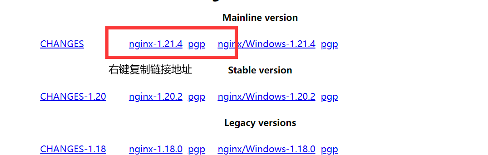
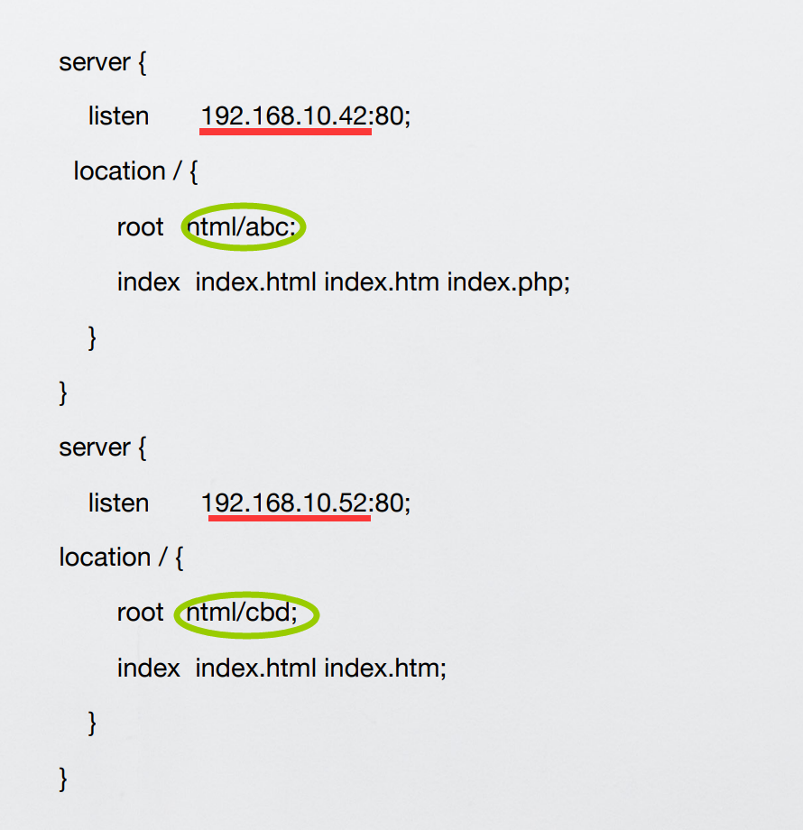
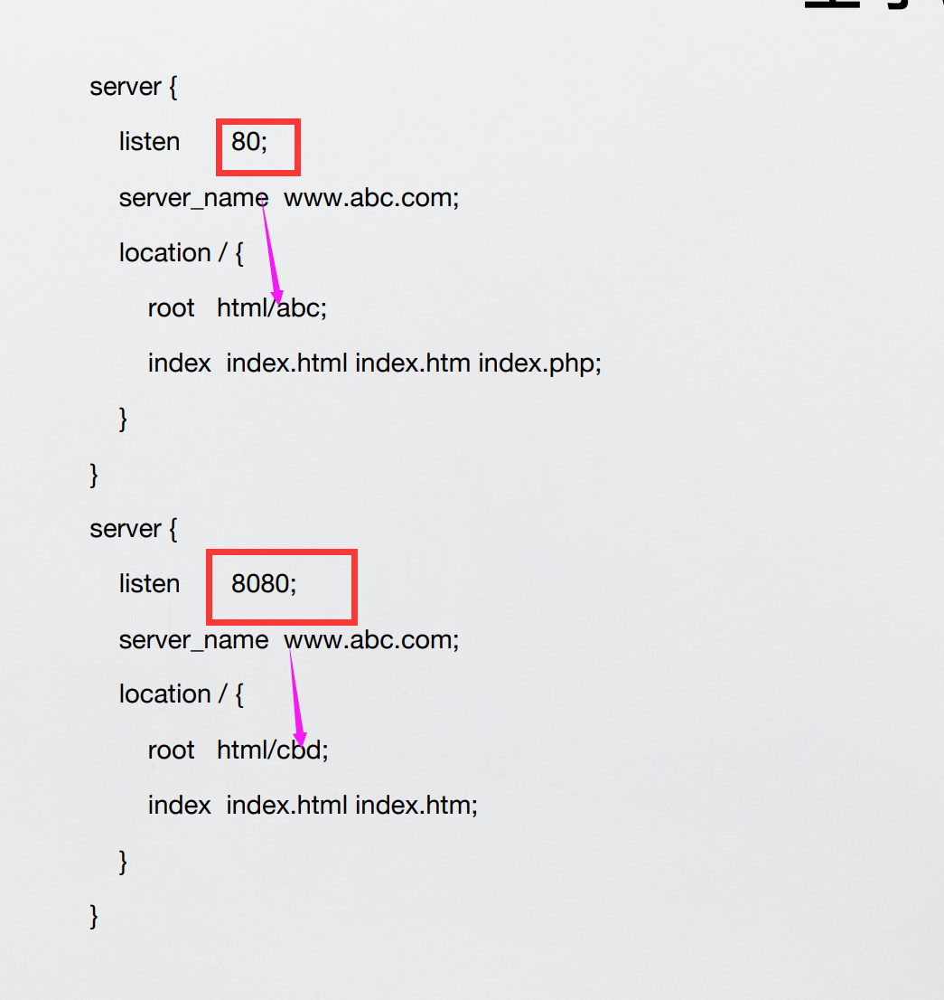
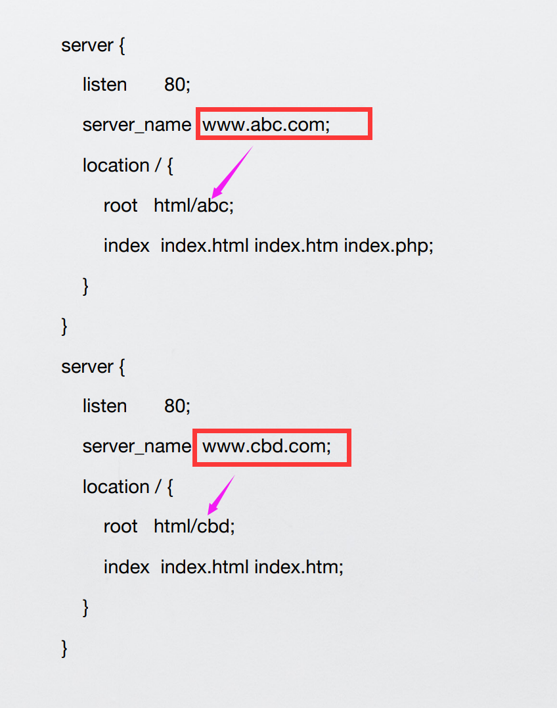
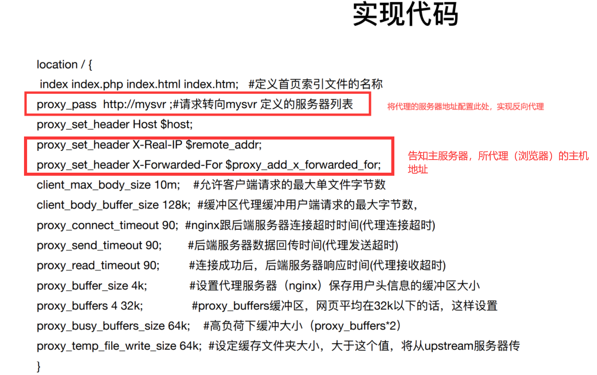
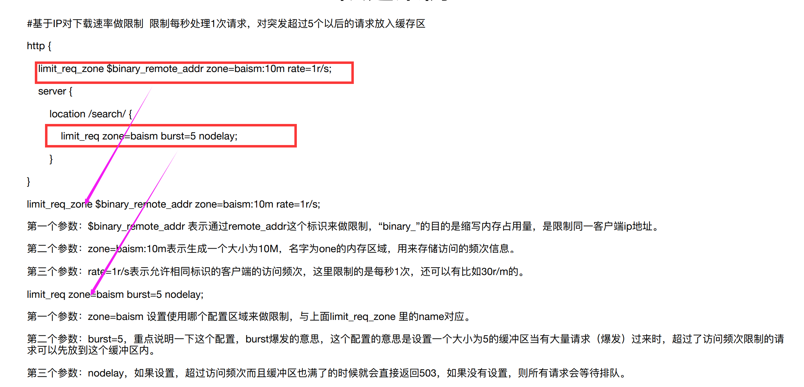
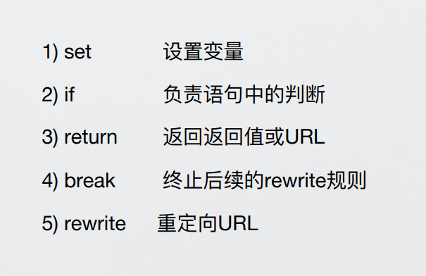

# nginx学习

```
简介：
Nginx(“engine x”)是⼀款是由俄罗斯的程序设计师Igor Sysoev所开发⾼性能的 Web和 反向代理 服务器，也是⼀个 IMAP/POP3/SMTP 代理服务器

延伸版本： tengine（淘宝）、openresrt（章亦春）等

学习笔记全面版：
https://www.zutuanxue.com/home/4/54_282
```

## 一、nginx安装



```
官方网站 http://nginx.org/   复制下载链接

1， 进入Linux环境，运行  wget http://nginx.org/download/nginx-1.21.4.tar.gz -P /opt   

2， 进入文件的下载路径并解压缩 tar -zxvf nginx-1.21.4.tar.gz

3， 编译安装
	./configure --prefix=/opt/nginx/ 
	make && make install
```


## 二、nginx启动关闭

```
1, 检查端口是否被占用  
netstat -ntpl  # 查看80端口是否被占用
lsof -i :80  # 效果同上

2，进入安装位置（如上图）,直接输入nginx, 即可以启动

3，查看启动成功？   （如果不能查看,注意检查云服务器是否开放外部80端口访问权限）
http://主机地址：80/
elinks http://localhost:80 -dump

关闭进程
yum search killall    #搜索包含此命令的包
yum -y install psmisc    # 安装此包
killall nginx   # nginx所有的进程都被强制结束

--检查一下  ：netstat -ntpl
```

### 1，配置文件相关

```
进入配置文件路径，按照自己的需求修改文件之后

功能：
	访问控制：目录验证，目录管理，自定义访问返回信息，限制登陆访问，防盗链。
	日志管理：log_format//access_log ，可以自定义日志文件返回的格式

##删除无用的注释行
sed -i '/#/d' nginx.conf       # 删除#开头的所有的行
sed -i '/^$/d' nginx.conf      # 删掉空行

1，检查配置文件是否有语法错误
.../nginx  -g  .../conf/nginx.conf

2，确认配置文件无误后，快速重启nginx
killall -s HUP nginx 


```

### 2，虚拟主机

```
一般默认的web服务器只能发布一个网站，因为web分享的三要素（IP,port,Domian name）
虚拟主机：把一台物理服务器划分多个‘虚拟’服务器，每一个服务器都有自己的独立的域名和独立目录
```

- 基于ip的虚拟主机


```
测试的时候可以新建逻辑网卡
ifconfig ens33:1 192.168.10.52/24 up  # 新建子网卡
ifconfig ens33:1 down    # 关闭子网卡

缺点：
多个ip，如果公网ip，需要付费
```

- 基于端口的虚拟主机



```
测试的时候直接访问不同端口即可

# 缺点：
端口无法告知公网用户，无法适用于公网客户，适用内部用户
```

- 基于域名的虚拟主机



```
测试的时候，进入 vim /etc/hosts文件，修改DNS对映关系即可

192.168.0.10 www.abc.com
192.168.0.10 www.cbd.com
```

### 3，反向代理

```
代理服务器，客户机在发送请求时，不会直接发送给⽬的主机，⽽是先发送给代理服务器，代理服务接受客户机请求之后，再向主机发出，并接收⽬的主机返回的数
据，存放在代理服务器的硬盘中，再发送给客户机

应用场景：
堡垒机，内网，缓存
```



### 4，nginx 限速

```
限速该特性可以限制某个⽤户在⼀个给定时间段内能够产⽣的HTTP请求数。请求可以简单到就是⼀个对于主⻚的GET请求或者⼀个登陆表格的POST请求。

限速也可以⽤于安全⽬的上，⽐如暴⼒密码破解攻击。通过限制进来的请求速率，并且（结合⽇志）标记出⽬标URLs来帮助防范DDoS攻击。⼀般地说，限流是⽤在
保护上游应⽤服务器不被在同⼀时刻的⼤量⽤户请求湮没。


限速的原理：缓存请求、匀速处理、多余的请求直接丢弃
```




### 5，url重写

```
应用场景：
• 域名变更 （京东）
• ⽤户跳转 （从某个连接跳到另⼀个连接）
• 伪静态场景 （便于CDN缓存动态⻚⾯数据）

条件匹配

#模糊匹配 ~匹配 !~不匹配 ~* 不区分大小写的匹配

#精确匹配 =匹配 !=不匹配
```



### 6，nginx优化

```
标准情况下，软件默认的参数都是对安装软件的硬件标准来设置的，⽬前我们服务器的硬件资源远远⼤于要求的标准，所以为了让服务器性能更加出众，充分利⽤服
务器的硬件资源，我们⼀般需要优化APP的并发数来提升服务器的性能。


Nginx是主进程+⼯作进程模型
• worker_processes 1； ⼯作进程数量 按CPU的总核⼼调整
• worker_cpu_affinity 0010 0100 1000; CPU的亲和⼒
• worker_connections 1024； ⼀个⼯作进程的并发数
• keepalive_timeout 5; ⻓连接时间（s秒）
• keepalive_requests 8192; 每个⻓连接接受最⼤请求数


# 静态资源压缩
• gzip on;      （启⽤ gzip 压缩功能）
• gzip_proxied any; （nginx 做前端代理时启⽤该选项，表示⽆论后端服务器的headers头返回什么信息，都⽆条件启⽤压缩）
• gzip_min_length 1024; （最⼩压缩的⻚⾯，如果⻚⾯过于⼩，可能会越压越⼤，这⾥规定⼤于1K的⻚⾯才启⽤压缩）
• gzip_buffers     4 8k; （设置系统获取⼏个单位的缓存⽤于存储gzip的压缩结果数据流 按照原始数据⼤⼩以8K为单位申请4倍内存空间）
• gzip_comp_level 3; （压缩级别，1压缩⽐最⼩处理速度最快，9压缩⽐最⼤但处理最慢，同时也最消耗CPU,⼀般设置为3就可以了）
• gzip_types       text/plain text/css application/x-javascript application/javascript application/xml; （什么类型的⻚⾯或⽂档启⽤压缩）


# 客户端缓存
语法： expires [time|epoch|max|off]
默认值： expires off
作⽤域： http, server, location
location ~.*\.(js|css)?$
   {
  expires 1h;
 }

```

## 三、nginx集群

```
集群：将多个物理机器组合成为一个逻辑计算器，实现负载均衡和容错。

组成的要素： VIP + nginx（分发器） + 多台web服务器

Nginx集群其实是：虚拟主机+反向代理+upstream分发模块组成的 
虚拟主机：接受和响应请求
反向代理: 带⽤户去数据服务器拿数据
upstream: 告诉Nginx去哪个数据服务器拿数据

```


### 集群分发算法

- 轮询机制

```
每个请求按时间顺序逐⼀分配到不同的后端服务器，如果后端服务器down掉，能⾃动剔除


每个设备的状态设置为:
1.down 表示单前的server暂时不参与负载
2.weight 默认为1.weight越⼤，负载的权重就越⼤。
3.max_fails ：允许请求失败的次数默认为1.当超过最⼤次数时，返回proxy_next_upstream 模块定义的错误
4.fail_timeout: 失败超时时间，在连接Server时，如果在超时时间之内超过max_fails指定的失败次数，会认为在fail_timeout时间内Server不可⽤。默认为10s。
5.backup： 其它所有的⾮backup机器down或者忙的时候，请求backup机器。所以这台机器压⼒会最轻。


upstream web {
 server 192.168.10.42;
 server 192.168.10.43; 
}

server {
listen 80;
server_name localhost;
location / {
proxy_pass http://web;
}
}

```

- 权重机制

```
指定轮询权重，将优秀的服务器权重配置更大，更好发挥性能

upstream web {
 server 192.168.10.42 weight=1;
 server 192.168.10.43 weight=2; 
}

server {
listen 80;
server_name localhost;
location / {
proxy_pass http://web;
}
}

```

- ip_hash

```
每个请求按访问ip的hash结果分配，这样每个访客固定访问⼀个后端服务器，可以解决session的问题。

upstream web {
 ip_hash;
 server 192.168.10.42;
 server 192.168.10.43;
}

server {
listen 80;
server_name localhost;
location / {
proxy_pass http://web;
}
}

ip_hash算法能够保证来⾃同样源地址的请求，都分发到同⼀台主机

```

- 其他的分发器

```
# 基于host
http ｛
	upstream web1 {
	server 192.168.10.42;
	}
	upstream web2 {
	server 192.168.10.43;
	}
	server {
		listen 80;
		server_name www.web1.com;
			location / {
				proxy_pass http://web1;
			}
		}
	server {
		listen 80;
		server_name www.web2.com;
			location / {
				proxy_pass http://web2;
			}
		}
｝


# 基于浏览器
upstream elinks { server 192.168.10.42; }
upstream chrome { server 192.168.10.43; }
upstream any { server 192.168.10.42:81; }
server {
 	listen 80;
 	server_name www.web1.com;
 
    location / {
        proxy_pass http://any;

        if ( $http_user_agent ~* Elinks ) {
            proxy_pass http://elinks;
        }

        if ( $http_user_agent ~* chrome ) {
            proxy_pass http://chrome;
        }
    }
}


# 基于源ip（判断地区，然后使用不同地区的服务器）
upstream bj.server {
	server 192.168.10.42;
}

upstream sh.server {
	server 192.168.10.43;
}

upstream default.server {
	server 192.168.10.42:81;
}

geo $geo {
    default default;
    192.168.10.241/32 bj;
    192.168.10.242/32 sh;
}

location / {
	proxy_pass http://$geo.server$request_uri;
}


```

### 高可用

```
！服务器或者分发器宕机处理

Keepalived的作⽤是检测服务器的状态，如果有⼀台web服务器宕机，或⼯作出现故障，Keepalived将检测到，并将有故障的服务器从系统中剔除，同时使⽤其他服务器代
替该服务器的⼯作，当服务器⼯作正常后Keepalived⾃动将服务器加⼊到服务器群中，这些⼯作全部⾃动完成，不需要⼈⼯⼲涉，需要⼈⼯做的只是修复故障的服务器。

⼀个监控+⾃愈的软件

```

