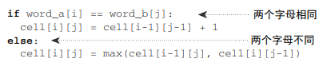

## 数据结构

- 链表
- 数组
- 栈（先入后出，后入先出）
- 散列表（字典）
- 队列（先进先出）
- 树
  - 二叉树
  - ALV树

## 算法

- D&C `分而治之`

  - 快速排序算法

    

    

    

- 广度优先搜索（最短路径问题）

  

- 狄克斯特拉算法（加权最小路径）

  

- 贪婪算法

  不断寻找满足最多要求的小集合，重复过程，直到数量或者要求满足为止

- 动态规划

  

  - 最长公共子序列

    

  - 最长连续子序列

    

* K最近邻算法

