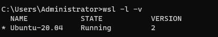
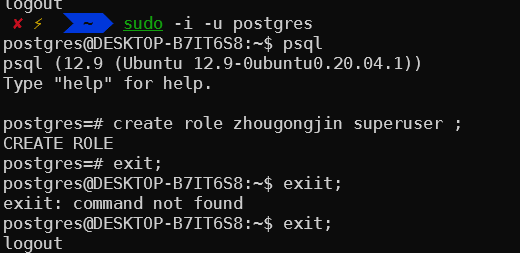
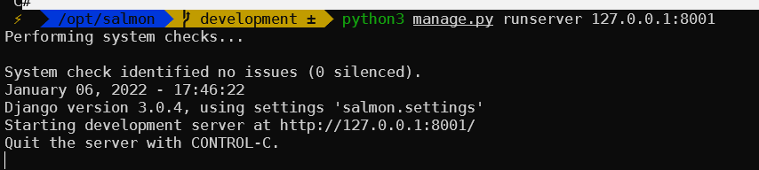

# windows配置项目文件

- 前言

```bash
	首先观察 Django settings文件夹，发现需要配置的数据库有mysql，和postgresql
	同时观察到数据库的host port等变量存放在系统变量中，通过os.getenv("str", default='str2')的方式获取，但是对于windows来说，这些变量不能像linux or mac那样能够自动的创建（创建方式暂时未知），所以，一种解决方案是使用windows的wsl技术，在windows里面创建一个linux子系统，将项目放置在linux中运行
```

## 一、wsl使用教程

```shell
	wsl是win10 系统自带的一个命令，用来结合windows和linux实现文件和命令互通，
	1，可以在powershell中输入 wsl + linux命令实现使用linux命令方式操作windows文件
	2，相反，对于wsl 中的Ubuntu，可以通过 windows命令.exe 方式运行windows命令
	
	地址栏输入 \\wsl$, 可以打开wsl中ubuntu的文件目录（慎重修改），反之，通过在wsl中 cd /mnt/c 、cd /mnt/d...方式进入windows目录中c盘，d盘...，但是实测，执行效率很慢。
	
	最优运行方式还是项目文件放置到ubuntu目录中。
	
	至此，基本思路完成，开始配置
	https://www.jetbrains.com/help/pycharm/using-wsl-as-a-remote-interpreter.html#wsl-terminal
```

### 1， 在微软商店安装 ubuntu和 Windows Terminal（better 终端）

### 2， 安装之后，运行ubuntu，100% 报错

```bash
解决方法，
1，打开设置中开发人员模式，
2，在win终端运行下面命令，打开相关的服务
`dism.exe /online /enable-feature /featurename:VirtualMachinePlatform /all /norestart`
3，打开设置应用与功能中hyper-v功能，
4，最后检查是否开启cpu虚拟化。
5，如果还报错，命令行运行`wsl --update`更新wsl基本可以解决问题

最后重启电脑
```

### 3，配置ubuntu

```bash
	首次进入 ubuntu 系统会设置访客用户名和密码，由于默认的root管理员密码每次登录都会变化，所以要自己设置，使用命令`sudo passwd`设置管理员密码即可
	
	# 设置默认登陆成员为root
	C:\Users\用户名\AppData\Local\Microsoft\WindowsApps\ubuntu1804.exe config --default-user root
```

### 4，Windows Terminal中`wsl -l -v`检查 ubuntu 是否成功配置即可

### 

### 5，外部链接ubuntu（xshell）

https://blog.csdn.net/weixin_43647393/article/details/116013953

**每次打开都还要重新`service ssh start`**

## 二、配置apt源

参考文章https://blog.csdn.net/u010168781/article/details/108230005

### 1、源文件备份

```bash
cp /etc/apt/sources.list /etc/apt/sources.list.bak
```

### 2、检查系统代号

```ba
lsb_release -a
```

### 3 、编辑源列表文件 

```ba
vim /etc/apt/sources.list
```

### 4、将原有的内容注释掉，添加以下内容

```bash
deb http://mirrors.aliyun.com/ubuntu/ focal main restricted universe multiverse
deb http://mirrors.aliyun.com/ubuntu/ focal-security main restricted universe multiverse
deb http://mirrors.aliyun.com/ubuntu/ focal-updates main restricted universe multiverse
deb http://mirrors.aliyun.com/ubuntu/ focal-proposed main restricted universe multiverse
deb http://mirrors.aliyun.com/ubuntu/ focal-backports main restricted universe multiverse
deb-src http://mirrors.aliyun.com/ubuntu/ focal main restricted universe multiverse
deb-src http://mirrors.aliyun.com/ubuntu/ focal-security main restricted universe multiverse
deb-src http://mirrors.aliyun.com/ubuntu/ focal-updates main restricted universe multiverse
deb-src http://mirrors.aliyun.com/ubuntu/ focal-proposed main restricted universe multiverse
deb-src http://mirrors.aliyun.com/ubuntu/ focal-backports main restricted universe multiverse

```

### 5、更新软件列表

```ba
apt-get update
apt-get upgrade
```

### 6、安装oh-my-zsh（选）

```bash
# https://www.jianshu.com/p/37f392355af1
# 查看当前shell
echo $SHELL
# 安装依赖包
sudo apt-get  install zlib1g-dev libbz2-dev libssl-dev libncurses5-dev libsqlite3-dev gcc
# 安装oh-my-zsh
sudo apt install zsh
sh -c "$(curl -fsSL https://gitee.com/shmhlsy/oh-my-zsh-install.sh/raw/master/install.sh)"
# 配置即可

# 字体乱码可使用 powerlines
```

### 7，外部链接mysql

https://blog.csdn.net/sexyluna/article/details/105007828

### 8，外部链接postgresql

https://blog.csdn.net/zhengwei125/article/details/79220671

## 三、配置项目文件(salmon)

```bash
# 下载项目文件
apt install git -y
cd /opt
git clone https://gitlab.sbuild.cn/zzrr3321/salmon.git

# 安装MySQL      https://blog.csdn.net/weixx3/article/details/80782479
apt install mysql-server mysql-client -y
mysql_secure_installation
mysql -uroot
	# 修改密码
	GRANT ALL PRIVILEGES ON *.* TO root@localhost IDENTIFIED BY "bt254618";
	# 创建p6库
	create database p6;

# 安装postgresql 
apt-get install postgresql postgresql-client -y
# 安装成功后，默认创建超级用户postgres，所以，用此用户测试
sudo -i -u postgres
	psql
	# 进入到postgresql，创建root用户，或者其他名字，但是此处有坑，你linux运行项目的用户名，就是你postgresql的用户名，比如，
	# linux whoami 是zhougongjin，那么要在postgres创建用户zhougongjin，下面例子以root管理员为例
		create role root superuser;  
		exit;
	exit;

# !!!!!!!!!!!!!!!!!!!!
# 最后，设置跳过用户验证，在环境变量中添加测试变量 ，详情见下
# 设置环境变量参考文章
# https://www.cnblogs.com/youyoui/p/10680329.html
su - root 
vim ~/.bashrc 
# 如果使用的是zsh
vim ~/.zshrc

export ENV="true"
export DEBUG="true"
export SKIP_AUTH="true"

source ~/.zshrc


# linux终端运行
python3 manage.py makemigrations
python3 manage.py migrate

python3 manage.py runserver 127.0.0.1:8001  # 此处有坑，wsl与win共享端口，但是win优先级更高，所以8000端口大概率被win占用，改成其他少见端口即可。


坑2：
有关graphql路由使用的问题，项目文件默认的url没有带 '/' , 同时配置文件中没有配置APPEND_SLASH（默认为True），所以，默认情况下访问 http://127.0.0.1:8003/graphql/ 会自动地添加 / ,导致访问失败，
解决办法1： 配置文件中添加 APPEND_SLASH = False
解决办法2： graphql 的url中添加个'/'

############################################
注意事项：
tako 与 salamn 使用的 postgresql 要不同，不然数据库迁移会出现报错，为防止此类情况出现，我的解决办法是：
1， 创建单独的postgres数据库 takobase
2， 在linux中创建临时虚拟环境变量
	export DB_NAME=‘takobase’  # 如果要永久保存，就要放置在~/.zshrc中


```






# 杂记

- 本机wsl系统的访客用户名`zhougongjin` , 密码` bt254618`
- 本机wsl系统的管理员用户名`root` , 密码` bt254618`
- 克隆仓库地址`https://gitlab.sbuild.cn/`, 用户名`pengyongkang`，密码` 17816616182.`
- 代码合并

```bash
# 创建本地分支
git checkout -b junior 
# 本地提交 + 拉取云端代码
...
# 新建云端新分支(junior)，并提交到分支
git push --set-upstream origin junior  # origin 为远端仓库名称，junior为分支名称


git remote add origin git@gitlab.sbuild.cn:zzrr3321/salmon.git
git config --global user.name "Mickey Mouse Clubhouse"
git config --global user.email "gitlab内部的邮箱"
git config core.fileMode false  # git忽略文件权限的更改


# git 创建SSH密钥
ssh-keygen -t rsa -C "gitlab内部的邮箱"


# git 合并多个分支
# 通常情况下，对于一个业务涉及到较多的修改，可能产生多次提交记录，对于查看十分不便，这是可以用git rebase对多次提交进行合并操作。

1，git log -10    # 查看最近10条提交记录
2，git rebase -i 26aea33420f39afc61a62a3196f575b3e19a31ff   # 后面的代码为提交的code，注意合并的是code后面的一条记录开始的
3，按照需求，将pick改为 s(保留) 或者 d(删除) , 然后:wq, 在接下来的界面中输入提交信息，然后再次:wq即可
# 出现问题不要慌，git rebase --abort 直接恢复，问题不大

```


- 抽象类和继承类

```bash
# 继承类
 普通的类都是继承类
# 抽象类
 抽象类不能够被实例化，同时抽象类中定义的方法，子类中必须实现
```

- django 相关

```python
# 各种视图之间的关系
https://blog.csdn.net/weixin_43650504/article/details/104494784

# model相关
对于文件类型的字段，不使用 imagefield, 或者 filefield 之类的字段，而是使用自定义的一个类，通过多对多的关系对应上去
枚举类型的字段
class meta:
    adstarct = True  # 设置类为抽象类

# view相关
主要使用drf视图
1，继承自 BaseView（包含了GenericViewSet,
    mixins.CreateModelMixin,
    mixins.RetrieveModelMixin,
    mixins.UpdateModelMixin,
    mixins.DestroyModelMixin,
    mixins.ListModelMixin,）
    五大类介绍： https://www.cnblogs.com/skaarl/p/9487882.html
    

2，get_serializer_class 方法
	主要用来针对不同的请求类型使用对应的序列化器
    def get_serializer_class(self):
        if self.action in ['create', 'update', 'partial_update']:
            return QualityProblemCreateUpdateSerializer
        if self.action == 'reply':
            return QualityProblemReplySerializer
        return super().get_serializer_class()	

3，针对put请求的处理
	@action(methods=['put'], url_name='reply', detail=True, name='reply')    # drf 装饰器，指定处理的请求为put
    def reply(self, request, *args, **kwargs):
        instance = self.get_object()  # get_object() 返回数据对象， get_queryset() 返回数据
        serializer = self.get_serializer_class()(
            data=request.data)
        serializer.is_valid(raise_exception=True)   # 反序列化之前，始终要先实现is_valid()方法, .is_valid()方法使用可选的raise_exception标志，如果存在验证错误将会抛出一个serializers.ValidationError异常。400
        instance = serializer.update(instance, serializer.validated_data)

        return Response(data=self.serializer_class(instance).data, status=HTTP_200_OK)
    
4，create方法解读
	@atomic()
    def create(self, validated_data):
        problems = validated_data.pop('problems', [])   # 保存之前先删除多对多关系字段
        creator_id = self.context["request"].user.id    # 固定方法，拿到request里面的user.id
        updater_id = self.context["request"].user.id

        validated_data.update({     # 给字典更新字段的操作，并非是 drf 的update操作
            "creator_id": creator_id,    
            "updater_id": updater_id,
        })
        instance = super().create(validated_data)  # 继承原生方法中的创建实例方法

        for problem in problems: # problems是关联字段
            try:
                problem_photos = problem.pop('problem_photos', None)  # 删除多对多
                works = problem.pop('works', None)
                obj = QualityProblem.objects.create(**problem)   # 保存实例
                if isinstance(problem_photos, list):   # 判断是否是列表
                    obj.problem_photos.set(problem_photos)   # 保存多对多关系
                if isinstance(works, list):
                    obj.works.set(works)
                instance.problems.add(obj)   # 将实例重新添加到instance上
            except Exception as e:
                raise ValidationError(f'创建失败: {e}
        return instance


5，序列化器
# 如果实例上存在多对多字段，则在模型实例化之前无法设置它们，在这种情况下，实现如下所示
example_relationship = validated_data.pop('example_relationship')
instance = ExampleModel.objects.create(**validated_data)
instance.example_relationship = example_relationship
return instance


# serializers 相关  https://zhuanlan.zhihu.com/p/108055286
主要是使用的自定义的serializers实现对数据进行格式化保存和输出
serializers 初始化的一些属性：
1，required = True # 代表可以接受None空值
2，partial = True # 代表可以局部更新
3，many = True # 代表可以接受列表或者查询集queryset作为初始数据
4，context = {字典} # 可以接受额外的字段进行序列化


serializers 相关方法：
1, def validate_title(self, value):
    '''验证单个字段'''
        pass
2, def validate(self, data):
   '''验证多个字段'''
		pass

   @atomic()
3, def create(self, data):
   '''保存'''
		pass
		super().create(data)	
    
    
    
4, def update(self, data):
    '''更新'''
		pass   
5, def to_representation(self, instance):
    '''重写原生序列化输出的方式，可以自定义序列化以及增减字段操作'''
      return QualityProblemSerializer(instance).data 
6, def to_internal_value(self, instance):
    '''重写原生反序列化输出的方式'''
      return QualityProblemSerializer(instance).data 

class meta:
    model = Account
    fields = '__all__'      # 取所有字段
    # exclude = ('name', )  # 排除哪些字段
    # read_only_fields = ('str', )  # 规定只读字段
    extra_kwargs = {'password': {'write_only': True}}  # 给字段规定额外参数
    
   
serializers 相关api：
0, .data() # 最原始获取数据方法
1, .is_valid() # 判断是否通过校验， raise_exceptions=TRUE会在检验未通过的时候抛出异常
2, .errors() # 生成的错误消息的字典
3, .instance() # 初始化对象或者查询集传递给序列化实例时，可以通过.instance访问。如果没有传递初始化对象，那么.instance属性将是None。
4, .initial_data() # 数据传递给序列化器实例时，未修改的数据可以通过.initial_data获取。如果没有传递data关键字参数，那么.initial_data属性就不存在，就是前端传过来的数据
5, .validated_data() # 验证后的数据
6, .save() # 将验证的数据保留到对象实例中

                                      
# 获取前端请求的参数
--------->views：
# 获取url参数   http://example.com/api/purchases?username=denvercoder9
username = self.request.query_params.get('username', None)
# 获取body参数
request.data.get("aaa")


--------->serializers:
# 获取url参数    http://example.com/api/purchases?username=denvercoder9   
	# 如果函数形式参数未含有参数request
     def validate(self):
     	user = self.context["request"].user   # self.context["request"]表示从上下文中取出request
     # 如果函数形式参数含有参数request
     def validate(self，request):
     	user = request.user   # self.context["request"]表示从上下文中取出request    
                                      
                                      
                                      
     # yu                                
     def get_serializer_context(self):
        """
        Extra context provided to the serializer class.
        """
        return {
            'request': self.request,
            'format': self.format_kwarg,
            'view': self
        }
                                      
                                      
                                      
# 获取body参数
def validate(self, attrs):
    attrs["total_hours"]...
    pass


```

- 状态码

```bash
返回状态码和对应的提示信息
100: 已经接受部分请求
200: 请求成功
201: 请求成功，已经新建了资源
202: 请求成功，但是尚未处理，正在排队
204: 请求成功，但是没有内容返回
301: 永久重定向
302: 临时重定向
304: 没有修改
400: 客户端请求错误
401: 没有权限
403: 没有认证，禁止请求
404: 请求未找到
500: 服务器内部错误
```

# 实操项目杂记

- 实现字段多选的功能

```python
# 对于枚举类型，本项目一般采取的字段定义方式是使用自定义的enumfield字段，但是，此种类型只能是是是实现单选的功能，并不能实现多选的功能，解决思路
1，定义一个单独的枚举字段数据库
2，采用多对多的关系字段，关联到上面的数据库， 
	多对多字段常用操作：  # https://www.cnblogs.com/clschao/articles/10446301.html
    添加关系： obj.field.set(*[obj1, obj2])   obj.field.set(obj1, obj2)
    清空所有关系： obj.field.clear()
    删除某段关系： obj.field.remove(obj1)
    先清空再设置： obj.field.set(obj1)
eg:
class ApplicableEducationTypeChoice(models.Model):
    '''
    安保管理 - 教育资料库 - 适用教育类型多项选择
    '''
    class Meta:
        db_table = "applicable_education_type_choices"
        verbose_name_plural = verbose_name = "适用教育类型多项选择"

    APPLICABLE_EDUCATION_TYPE_ENUM = OrderedDict({
        "admission_education": "入场教育",
        "special_work_education": "特殊工种教育",
        "highrisk_work_education": "高风险作业教育",
        "special_education": "专项教育",
        "general_knowledge": "常识普及",
    })

    applicable_education_type = EnumField(
        enum_data=APPLICABLE_EDUCATION_TYPE_ENUM,
        help_text='适用教育类型',
        unique=True)


    

class EducationDataset(GenericModel):
    '''
    安保管理 - 教育资料库
    '''
    class Meta:
        db_table = "education_datasets"
        verbose_name_plural = verbose_name = "教育资料库"

    applicable_education_type = models.ManyToManyField(   # 实现多对多的字段对应关系
        ApplicableEducationTypeChoice,
        help_text='适用教育类型',
        related_name="education_datasets")
```


# 知识点扩充

## 1，django配置文件之lazysetting对象

```bash
# 看项目settings配置文件，惊奇发现，没有用原生的写死的settings.py，而是使用的LazySetting对象来获取项目的配置
https://www.cnblogs.com/time-read/p/10580378.html
https://zhuanlan.zhihu.com/p/150778023
# 好处：
LazySetting顾名思义，就是延迟获取配置内容。比如，我们定义了一个对象A，并对其添加了一些属性，对A初始化时，我们将A的属性的值设置为空，当我们要访问A其中的一个属性时，此时属性的值为空，我们才加载属性的值，并将空值设置为对应的值，返回属性值，下次获取属性值时，属性值不为空，直接返回属性值。

# 为什么用？
django项目在初始化的时候， 通过LazySetting，我们就可以在django获取某个配置的值之前，将配置的值先自定义为某个值，django再去获取该配置的值的时候，配置已经有了值，直接返回该配置的值。

# 项目涉及
	首先发现，配置完成项目，首次运行之后，虽然能够正常的进入web网页端，但是返回信息 {"error": "获取用户登录认证信息失败"}  ，出现这种问题，先从中间件方面考察
	MIDDLEWARE = [
    # 安全中间件
    'django.middleware.security.SecurityMiddleware',
    # 默认处理Session 存储的中间件
    # 'django.contrib.sessions.middleware.SessionMiddleware',
    # 重定向，访问控制
    'django.middleware.common.CommonMiddleware',
    # 跨站点请求伪造的保护
    # 'django.middleware.csrf.CsrfViewMiddleware',
    # 用户认证，向每个接收到的HttpRequest对象添加user属性，表示当前登录的用户，依赖于 SessionMiddleware
    # 'django.contrib.auth.middleware.AuthenticationMiddleware',
    # 常用消息中间件，如flash message, 依赖于 SessionMiddleware
    # 'django.contrib.messages.middleware.MessageMiddleware',
    # 点击劫持，安全中间件
    'django.middleware.clickjacking.XFrameOptionsMiddleware',
    "salmon_app.middlewares.jwt_user_middleware.JWTUserMiddleware",
    "salmon_app.middlewares.get_headers_middleware.GetHeadersMiddleware",
    # captures the current request and user in thread local storage.
    'crum.CurrentRequestUserMiddleware',]
发现除了，自带的中间件之外，自定义了三个劫持中间件，进入首个中间件后观察到，
  ...
                      if not cur_user:
                        return JsonResponse(
                            {"error": f"{settings.PROJECT_CODE}项目下暂无用户"},
                            status=status.HTTP_401_UNAUTHORIZED,
                            json_dumps_params={'ensure_ascii': False}
                        )
  ...
  
  定位到问题所在，没有携带用户信息，往上再看，发现定义了绕开的方式，
```

## 2，postgresql学习

```bash
# 教程参考 http://www.postgres.cn/docs/12/index.html
# linux 进入数据库， 出现报错一般是数据库未启动
1,初次进入数据库
psql -U postgres
2,创建创建远程用户
create user zhougongjin with password 'bt254618';
create database zhougongjin owner zhougongjin     # 第一个zhougongjin是数据库，第二个zhougongjin是用户
grant all privileges on databasse zhougongjin to zhougongjin # 含义同上，赋予数据库权限给用户

psql -U zhougongjin -d zhougongjin -h 127.0.0.1 -W
----参数含义: -U指定用户 -d要连接的数据库 -h要连接的主机 -W提示输入密码。注意参数的大小写


# 常用命令参考  https://blog.csdn.net/u010856284/article/details/70142810
\du 查看所有的用户
\l  查看所有的数据库
\c + 数据库  进入到数据库中     eg: \c postgres  
\d  \dt  查看数据库中的表格
\di  查看索引信息


# 数据类型    https://www.runoob.com/postgresql/postgresql-data-type.html
数值类型、货币类型、字符类型、日期时间类型、布尔类型、枚举类型、几何类型（点线面）、网络地址类型、位串类型、文本搜索类型、uuid类型、XML类型、JSON类型、数组类型、复合类型、范围类型、对象标识符类型、伪类型、
```


## 3，pytest学习

1，测试函数、类

```python
# 参考文献https://learning-pytest.readthedocs.io/zh/latest/doc/test-function/mark.html
##### 测试函数
def test_func1():
    assert 1 == 2 

##### 测试类
class TestClass:
    def test_one(self):
        x = "this"
        assert "h" in x

    def test_two(self):
        x = "hello"
        assert hasattr(x, "check")
    
```

2，测试执行
	1，在终端运行 `pytest ***.py` 即可
	2，额外参数
		-v 用于显示每个测试函数的执行结果
    	-q 只显示整体测试结果
    	-s 用于显示测试函数中print()函数输出
   	 	-x, --exitfirst, exit instantly on first error or failed test
   	 	-h 帮助
	3，标记测试函数
		3.1 显示指定
			`pytest main.py::test_func1`
		3.2 模糊匹配
			`pytest -k func1 main.py `
		3.3 使用`pytest.mark`对函数进行标记

```python
# main.py

@pytest.mark.m1
def test_func1():
    assert 1 == 1

@pytest.mark.m2
def test_func2():
    assert 1 != 1
    
# 查询
$ pytest -m m1 main.py
```

3，跳过测试

`@pytest.mark.skip(reason = '....')`使用此装饰器装饰跳过想要跳过的测试函数

4，预见的错误

`@pytest.mark.xfail()`使用此装饰器装饰那些已经知道会出错的函数，不跳过，仍然在结果中显式提示

5，给函数传递测试参数

`pytest.mark.parametrize(argnames, argvalues)`参数化测试，即每组参数都独立执行一次测试

```python
@pytest.mark.parametrize('passwd',
                      ['123456',
                       'abcdefdfs',
                       'as52345fasdf4'])
def test_passwd_length(passwd):
    assert len(passwd) >= 8
```

6，测试固件 --- Fixture

固件装饰的函数，一般会在测试执行之前或者测试执行之后加载运行（eg：连接关闭数据库）

```python
@pytest.fixture()
def postcode():
    return '010'


def test_postcode(postcode):
    assert postcode == '010'
```

- 固件的作用域 --- scope
  - `function`: 函数级，每个测试函数都会执行一次固件；
  - `class`: 类级别，每个测试类执行一次，所有方法都可以使用；
  - `module`: 模块级，每个模块执行一次，模块内函数和方法都可使用；
  - `session`: 会话级，一次测试只执行一次，所有被找到的函数和方法都可用。

- 自动执行 --- autouse

  ```python
  @pytest.fixture(scope='session', autouse=True)
  ```

- 重命名 --- name，指定固件的名称

  ```python
  @pytest.fixture(name='age')
  def calculate_average_age():
      return 28
  
  def test_age(age):
      assert age == 28
  ```
  
- 固件参数化 --- `@pytest.fixture(params = [('redis', '6379'), 'elasticsearch', '9200'])`

  ```python
  @pytest.fixture(params=[
      ('redis', '6379'),
      ('elasticsearch', '9200')
  ])
  # 固件参数化需要使用 pytest 内置的固件 request，并通过 request.param 获取参数。
  def param(request):
      return request.param
  
  
  @pytest.fixture(autouse=True)
  def db(param):
      print('\nSucceed to connect %s:%s' % param)
  
      yield
  
      print('\nSucceed to close %s:%s' % param)
  
  
  def test_api():
      assert 1 == 1
  ```

  


## 4，graphql学习

```python
# graphql python相关库  graphene    
# 基础配置教程https://www.howtographql.com/graphql-python/0-introduction/

# 类方法使用
1，创建模型对象
class LinkType(DjangoObjectType):
    '''创建类，继承DjangoObjectType方法，实现graphql的类'''
    class Meta:
        model = Link


2，创建query类，并注册在主schema文件中，实现数据的返回
class Query(graphene.ObjectType):
    '''创建query类，实现对数据进行序列化返回，包括数据库所有字段验证，过滤等相关操作'''
    users = graphene.List(UserType)

    def resolve_users(self, info):
        '''对数据库的序列化操作方法'''
        return get_user_model().objects.all()


    
3，创建createxxx  &&   mutation类，并注册，实现对数据的保存
class CreateLink(graphene.Mutation):
    '''指定类里面的所有字段'''
    id = graphene.Int()
    url = graphene.String()
    description = graphene.String()
    posted_by = graphene.Field(UserType)

    class Arguments:
        '''定义可以发送到服务器的字段'''
        url = graphene.String()
        description = graphene.String()

    def mutate(self, info, url, description):
        '''对数据的处理和保存, 主执行的函数'''
        user = info.context.user or None

        link = Link(url=url, description=description, posted_by=user)
        link.save()

        return CreateLink(
            id=link.id,
            url=link.url,
            description=link.description,
            posted_by=link.posted_by,
        )
    
    
class Mutation(graphene.ObjectType):
    create_link = CreateLink.Field()
```


## 5，redis

```bash
# redis优秀介绍文章
https://juejin.cn/post/7049148028875178020
```


