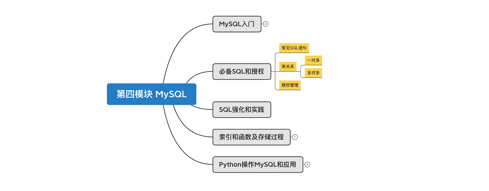
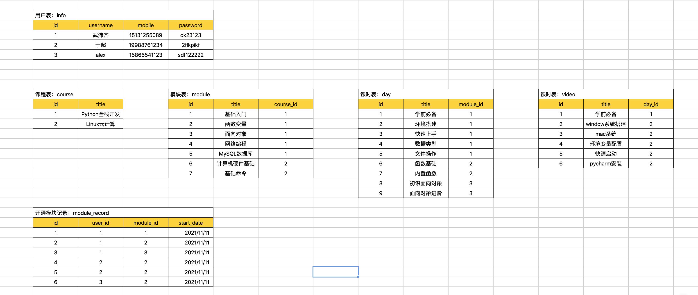
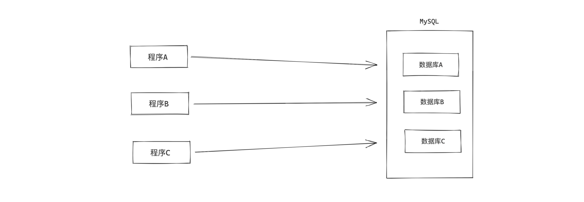

# day26 必备SQL和表关系及授权



课程目标：掌握开发中最常见的SQL语句和表关系及授权相关知识点。

课程概要：

- 必备SQL（8个必备）
- 表关系
- 授权


## 1. 必备SQL语句

上一节讲解了最基础SQL语句：增删改查，其实在日常的开发中还有很多必备的SQL语句。

这一部分的SQL语句都是围绕着对 表中的数据进行操作的。


提示：今天的所有操作我都只会在 MySQL自带的客户端工具上进行操作。


例如：现在创建如下两张表。


```sql
create database day26db default charset utf8 collate utf8_general_ci;
```

```sql
create table depart(
	id int not null auto_increment primary key,
    title varchar(16) not null
)default charset=utf8;


create table info(
	id int not null auto_increment primary key,
    name varchar(16) not null,
    email varchar(32) not null,
    age int,
    depart_id int
)default charset=utf8;
```

```sql
insert into depart(title) values("开发"),("运营"),("销售");

insert into info(name,email,age,depart_id) values("武沛齐","wupeiqi@live.com",19,1);
insert into info(name,email,age,depart_id) values("于超","pyyu@live.com",49,1);
insert into info(name,email,age,depart_id) values("alex","alex@live.com",9,2);
insert into info(name,email,age,depart_id) values("tony","tony@live.com",29,1);
insert into info(name,email,age,depart_id) values("kelly","kelly@live.com",99,3);
insert into info(name,email,age,depart_id) values("james","james@live.com",49,1);
insert into info(name,email,age,depart_id) values("李杰","lijie@live.com",49,1);
```


### 1.1 条件

根据条件搜索结果。


```sql
select * from info where age > 30;
select * from info where id > 1;
select * from info where id = 1;
select * from info where id >= 1;
select * from info where id != 1;
select * from info where id between 2 and 4;   -- id大于等于2、且小于等于4

select * from info where name = '武沛齐' and age = 19;
select * from info where name = 'alex' or age = 49;
select * from info where (name = '李杰' or email="pyyu@live.com")  and age=49;

select * from info where id in (1,4,6);
select * from info where id not in (1,4,6);
select * from info where id in (select id from depart);
# select * from info where id in (1,2,3);

# exists select * from depart where id=5，去查数据是否存在，如果存在，如果不存在。
select * from info where exists (select * from depart where id=5);
select * from info where not exists (select * from depart where id=5);

select * from (select * from info where id>2) as T where age > 10;
```

```sql
select * from info where info.id > 10;
select * from info where id > 10;
```


### 1.2 通配符（效率极其低下）

一般用于模糊搜索。

- `%` ：任意n个字符
- `_`： 任意一个字符


```sql
select * from info where name like "%沛%";
select * from info where name like "%沛";
select * from info where email like "%@live.com";
select * from info where name like "武%齐";
select * from info where name like "k%y";
select * from info where email like "wupeiqi%";


select * from info where email like "_@live.com";
select * from info where email like "_upeiqi@live.com";
select * from info where email like "__peiqi@live.com";
select * from info where email like "__peiqi_live.co_";
```

注意：数量少，数据量大的搜索。


### 1.3 映射

想要获取的列。


```sql
select * from info;

select id, name				from info;
select id, name as NM 		from info;
select id, name as NM, 123  from info;
注意：少些select * ,自己需求。

select 
	id,
	name,
	666 as num,
	( select max(id) from depart ) as mid, -- max/min/sum
	( select min(id) from depart) as nid, -- max/min/sum
	age
from info;
```

```sql
select 
	id,
	name,
	( select title from depart where depart.id=info.depart_id) as x1
from info;

# 注意：效率很低

select 
	id,
	name,
	( select title from depart where depart.id=info.depart_id) as x1,
	( select title from depart where depart.id=info.id) as x2
from info;
```

- `case ... when ... then ... else ...` ： 相当于 ‘’ if ... else ... "

```sql
select 
	id,
	name,
	case depart_id when 1 then "第1部门" end v1
from info;

select 
	id,
	name,
	case depart_id when 1 then "第1部门" else "其他" end v2
from info;

select 
	id,
	name,
	case depart_id when 1 then "第1部门" end v1,
	case depart_id when 1 then "第1部门" else "其他" end v2,
	case depart_id when 1 then "第1部门" when 2 then "第2部门" else "其他" end v3,
	case when age<18 then "少年" end v4,
	case when age<18 then "少年" else "油腻男" end v5,
	case when age<18 then "少年" when age<30 then "青年" else "油腻男" end v6
from info;
```


### 1.4 排序


```sql
select * from info order by age desc; -- 倒序
select * from info order by age asc;  -- 顺序

select * from info order by id desc;
select * from info order by id asc;
select * from info order by age asc,id desc; -- 优先按照age从小到大；如果age相同则按照id从大到小。


select * from info where id>10 order by age asc,id desc;
select * from info where id>6 or name like "%y" order by age asc,id desc;
```


### 1.5 取部分

一般要用于获取部分数据。


```sql
select * from info limit 5;   										-- 获取前5条数据
select * from info order by id desc limit 3;						-- 先排序，再获取前3条数据
select * from info where id > 4 order by id desc limit 3;			-- 先排序，再获取前3条数据


select * from info limit 3 offset 2;	-- 从位置2开始，向后获取前3数据  offset n:起始位置，从某一行开始展示数据
```

数据库表中：1000条数据。

- 第一页：`select * from info limit 10 offset 0;`
- 第二页：`select * from info limit 10 offset 10;`
- 第三页：`select * from info limit 10 offset 20;`
- 第四页：`select * from info limit 10 offset 30;`
- ...


### 1.6 分组


```sql
select age,max(id),min(id),count(id),sum(id),avg(id) from info group by age; -- 最大值，最小值，计数，加总，均值
```

```sql
select age,count(1) from info group by age;
```


```sql
select depart_id,count(id) from info group by depart_id;
```


```sql
select depart_id,count(id) from info group by depart_id having count(id) > 2;  -- ！！！分组后的聚合结果筛选不能用where，要使用having
```


```sql
select count(id) from info;
select max(id) from info;
```


```sql
select age,max(id),min(id),sum(id),count(id) from info group by age;
```

```sql
select age,name from info group by age;  -- 不建议
select * from info where id in (select max(id) from info group by age);
```

```sql
select age,count(id) from info group by age having count(id) > 2;
select age,count(id) from info where id > 4 group by age having count(id) > 2;  -- 聚合条件放在having后面
```

```
到目前为止SQL执行顺序：
    where 
    group by
    having 
    order by
    limit 
```

```sql
select age,count(id) from info where id > 2 group by age having count(id) > 1 order by age desc limit 1;
- 要查询的表info
- 条件 id>2
- 根据age分组
- 对分组后的数据再根据聚合条件过滤 count(id)>1
- 根据age从大到小排序
- 获取第1条
```


### 1.7 左右连表

多个表可以连接起来进行查询。


展示用户信息&部门名称：

```
主表 left outer join 从表 on 主表.x = 从表.id 
```

```sql
select * from info left outer join depart on info.depart_id = depart.id;
```

```sql
select info.id,info.name,info.email,depart.title from info left outer join depart on info.depart_id = depart.id;
```


```
从表 right outer join 主表 on 主表.x = 从表.id
```

```sql
select info.id,info.name,info.email,depart.title from info right outer join depart on info.depart_id = depart.id;
```

为了更加直接的查看效果，我们分别在 depart 表 和 info 中额外插入一条数据。

```sql
insert into depart(title) values("运维");
```

这样一来主从表就有区别：

- info主表，就以info数据为主，depart为辅。

  ```sql
  select info.id,info.name,info.email,depart.title from info left outer join depart on info.depart_id = depart.id;
  ```

- depart主表，，就以depart数据为主，info为辅。

  ```sql
  select info.id,info.name,info.email,depart.title from info right outer join depart on info.depart_id = depart.id;
  ```


```
select * from info left outer join depart on ....
select * from depart left outer join info on ....
```

简写：`select * from depart left join info on ....`


```sql
-- 内连接:    表  inner join 表  on 条件
select * from info inner join depart on info.depart_id=depart.id;

+----+-----------+------------------+------+-----------+----+--------+
| id | name      | email            | age  | depart_id | id | title  |
+----+-----------+------------------+------+-----------+----+--------+
|  1 | 武沛齐    | wupeiqi@live.com |   19 |         1 |  1 | 开发   |
|  2 | 于超      | pyyu@live.com    |   49 |         1 |  1 | 开发   |
|  3 | alex      | alex@live.com    |    9 |         2 |  2 | 运营   |
|  4 | tony      | tony@live.com    |   29 |         1 |  1 | 开发   |
|  5 | kelly     | kelly@live.com   |   99 |         3 |  3 | 销售   |
|  6 | james     | james@live.com   |   49 |         1 |  1 | 开发   |
|  7 | 李杰      | lijie@live.com   |   49 |         1 |  1 | 开发   |
+----+-----------+------------------+------+-----------+----+--------+
```

```
到目前为止SQL执行顺序：
    join 
    on 
    where 
    group by
    having 
    order by
    limit 
```

写在最后：多张表也可以连接。


### 1.8 联合


```sql
select id,title from depart 
union
select id,name from info;


select id,title from depart 
union
select email,name from info;
-- 列数需相同
```

```sql
select id from depart 
union
select id from info;

-- 自动去重
```

```sql
select id from depart 
union all
select id from info;

-- 保留所有
```


### 小结

到目前为止，你已经掌握了如下相关指令（SQL语句）：

- 数据库
- 数据表
- 数据行
  - 增加
  - 删除
  - 修改
  - 查询（各种变着花样的查询）


## 2.表关系

`外键约束`：

```sql
constraint '外键的名字' foreign key 表(列)'本表的列' references 表(列)'外键表的列'
```


在开发项目时，需要根据业务需求去创建很多的表结构，以此来实现业务逻辑，一般表结构有三类：

- 单表，单独一张表就可以将信息保存。
  
- 一对多，需要两张表来存储信息，且两张表存在 `一对多` 或 `多对一`关系。
  
- 多对多，需要三张表来存储信息，两张单表 + 关系表，创造出两个单表之间`多对多关系`。
  


在上述的表：一对多的 `info.depart_id`字段、多对多的 `boy_girl.boy_id` 、`girl_id` 直接用整型存储就可以，因为他们只要存储关联表的主键ID即可。

在开发中往往还会为他们添加一个 **外键约束**，保证某一个列的值必须是其他表中的特定列已存在的值，例如：`info.depart_id`的值必须是 `depart.id`中已存在的值。


**一对多示例：**


```sql
create table depart(
	id int not null auto_increment primary key,
    title varchar(16) not null
)default charset=utf8;


create table info(
	id int not null auto_increment primary key,
    name varchar(16) not null,
    email varchar(32) not null,
    age int,
    depart_id int not null,
    constraint fk_info_depart foreign key (depart_id) references depart(id)
)default charset=utf8;
```

如果表结构已创建好了，额外想要增加外键：

```sql
alter table info add constraint fk_info_depart foreign key info(depart_id) references depart(id);
```

删除外键：

```sql
alter table info drop foreign key fk_info_depart;
```


**多对多示例：**


```sql
create table boy(
	id int not null auto_increment primary key,
    name varchar(16) not null
)default charset=utf8;

create table girl(
	id int not null auto_increment primary key,
    name varchar(16) not null
)default charset=utf8;


create table boy_girl(
	id int not null auto_increment primary key,
    boy_id int not null,
    girl_id int not null,
    constraint fk_boy_girl_boy foreign key boy_girl(boy_id) references boy(id),
    constraint fk_boy_girl_girl foreign key boy_girl(girl_id) references girl(id)
)default charset=utf8;
```

如果表结构已创建好了，额外想要增加外键：

```sql
alter table boy_girl add constraint fk_boy_girl_boy foreign key boy_girl(boy_id) references boy(id);
alter table boy_girl add constraint fk_boy_girl_girl foreign key boy_girl(girl_id) references girl(id);
```

删除外键：

```sql
alter table info drop foreign key fk_boy_girl_boy;
alter table info drop foreign key fk_boy_girl_girl;
```


在以后项目开发时，设计表结构及其关系的是一个非常重要的技能。一般项目开始开发的步骤：

- 需求调研
- 设计数据库表结构（根据需求）
- 项目开发（写代码）

大量的工作应该放在前2个步骤，前期的设计完成之后，后续的功能代码开发就比较简单了。


### 案例：简易版路飞学城



```sql
create database luffy default charset utf8 collate utf8_general_ci;

use luffy;
```

```sql
create table info(
	id int not null auto_increment primary key,
    username varchar(16) not null,
    mobile char(11) not null,
    password varchar(64) not null
)default charset=utf8;
```

```sql
create table course(
	id int not null auto_increment primary key,
    title varchar(16) not null
)default charset=utf8;


create table module(
	id int not null auto_increment primary key,
    title varchar(16) not null,
    course_id int not null,
    constraint fk_module_course foreign key (course_id) references course(id)
)default charset=utf8;


create table day(
	id int not null auto_increment primary key,
    title varchar(16) not null,
	module_id int not null,
    constraint fk_day_module foreign key (module_id) references module(id)
)default charset=utf8;


create table video(
	id int not null auto_increment primary key,
    title varchar(16) not null,
	day_id int not null,
    constraint fk_video_day foreign key (day_id) references day(id)
)default charset=utf8;
```

```sql
create table module_record(
	id int not null auto_increment primary key,
    user_id int not null,
    module_id int not null,
    constraint fk_user_id foreign key module_record(user_id) references info(id),
    constraint fk_module_id foreign key module_record(module_id) references module(id)
)default charset=utf8;
```


## 3. 授权

之前我们无论是基于Python代码 or 自带客户端 去连接MySQL时，均使用的是 **root** 账户，拥有对MySQL数据库操作的所有权限。



如果有多个程序的数据库都放在同一个MySQL中，如果程序都用root账户就存在风险了。

**这种情况怎么办呢？**

> 在MySQL中支持创建账户，并给账户分配权限，例如：只拥有数据库A操作的权限、只拥有数据库B中某些表的权限、只拥有数据库B中某些表的读权限等。


### 3.1 用户管理

在MySQL的默认数据库 `mysql` 中的 `user` 表中存储着所有的账户信息（含账户、权限等）。

```
mysql> show databases;
+--------------------+
| Database           |
+--------------------+
| information_schema |
| day26              |
| mysql              |
| performance_schema |
| sys                |
+--------------------+
10 rows in set (0.00 sec)

mysql> select user,authentication_string,host from  mysql.user;
+----------------------------------+-------------------------------------------+-------------------------------+
| user                             | authentication_string                     | host                          |
+----------------------------------+-------------------------------------------+-------------------------------+
| root                             | *FAAFFE644E901CFAFAEC7562415E5FAEC243B8B2 | localhost                     |
| mysql.session                    | *THISISNOTAVALIDPASSWORDTHATCANBEUSEDHERE | localhost                     |
| mysql.sys                        | *THISISNOTAVALIDPASSWORDTHATCANBEUSEDHERE | localhost                     |
+----------------------------------+-------------------------------------------+-------------------------------+
3 rows in set (0.00 sec)
```


- 创建和删除用户

  ```
  create user '用户名'@'连接者的IP地址' identified by '密码';
  ```

  ```sql
  create user wupeiqi1@127.0.0.1 identified by 'root123';
  drop user wupeiqi1@127.0.0.1;
  
  create user wupeiqi2@'127.0.0.%' identified by 'root123';
  drop user wupeiqi2@'127.0.0.%';
  
  create user wupeiqi3@'%' identified by 'root123';
  drop user wupeiqi3@'%';
  
  create user 'wupeiqi4'@'%' identified by 'root123';
  drop user 'wupeiqi4'@'%';
  ```

- 修改用户

  ```
  rename user '用户名'@'IP地址' to '新用户名'@'IP地址';
  ```

  ```sql
  rename user wupeiqi1@127.0.0.1 to wupeiqi1@localhost;
  
  rename user 'wupeiqi1'@'127.0.0.1' to 'wupeiqi1'@'localhost';
  ```

- 修改密码

  ```
  set password for '用户名'@'IP地址' = Password('新密码')
  ```

  ```sql
  set password for 'wupeiqi4'@'%' = Password('123123');
  ```


### 3.2 授权管理

创建好用户之后，就可以为用户进行授权了。

- 授权

  ```
  grant 权限 on 数据库.表 to   '用户'@'IP地址'
  ```

  ```sql
  grant all privileges on *.* TO 'wupeiqi'@'localhost';         -- 用户wupeiqi拥有所有数据库的所有权限
  grant all privileges on day26.* TO 'wupeiqi'@'localhost';     -- 用户wupeiqi拥有数据库day26的所有权限
  grant all privileges on day26.info TO 'wupeiqi'@'localhost';  -- 用户wupeiqi拥有数据库day26中info表的所有权限
  
  grant select on day26.info TO 'wupeiqi'@'localhost';          -- 用户wupeiqi拥有数据库day26中info表的查询权限
  grant select,insert on day26.* TO 'wupeiqi'@'localhost';      -- 用户wupeiqi拥有数据库day26所有表的查询和插入权限
  
  grant all privileges on day26db.* to 'wupeiqi4'@'%';
  
  
  注意：flush privileges;   -- 将数据读取到内存中，从而立即生效。
  ```

  - 对于权限

    ```
    all privileges  除grant外的所有权限
    select          仅查权限
    select,insert   查和插入权限
    ...
    usage                   无访问权限
    alter                   使用alter table
    alter routine           使用alter procedure和drop procedure
    create                  使用create table
    create routine          使用create procedure
    create temporary tables 使用create temporary tables
    create user             使用create user、drop user、rename user和revoke  all privileges
    create view             使用create view
    delete                  使用delete
    drop                    使用drop table
    execute                 使用call和存储过程
    file                    使用select into outfile 和 load data infile
    grant option            使用grant 和 revoke
    index                   使用index
    insert                  使用insert
    lock tables             使用lock table
    process                 使用show full processlist
    select                  使用select
    show databases          使用show databases
    show view               使用show view
    update                  使用update
    reload                  使用flush
    shutdown                使用mysqladmin shutdown(关闭MySQL)
    super                   􏱂􏰈使用change master、kill、logs、purge、master和set global。还允许mysqladmin􏵗􏵘􏲊􏲋调试登陆
    replication client      服务器位置的访问
    replication slave       由复制从属使用
    ```

  - 对于数据库和表

    ```
    数据库名.*            数据库中的所有
    数据库名.表名          指定数据库中的某张表
    数据库名.存储过程名     指定数据库中的存储过程
    *.*                  所有数据库
    ```

- 查看授权

  ```
  show grants for '用户'@'IP地址'
  ```

  ```sql
  show grants for 'wupeiqi'@'localhost';
  show grants for 'wupeiqi4'@'%';
  ```

- 取消授权

  ```
  revoke 权限 on 数据库.表 from '用户'@'IP地址'
  ```

  ```sql
  revoke ALL PRIVILEGES on day26.* from 'wupeiqi'@'localhost';
  
  revoke ALL PRIVILEGES on day26db.* from 'wupeiqi4'@'%';
  注意：flush privileges;   -- 将数据读取到内存中，从而立即生效。
  ```


一般情况下，在很多的 正规 公司，数据库都是由 DBA 来统一进行管理，DBA为每个项目的数据库创建用户，并赋予相关的权限。


## 总结

本节主要讲解的三大部分的知识点：

- 常见SQL语句，项目开发中使用最频繁的知识点。
- 表关系，项目开发前，项目表结构设计时必备知识点。
  - 单表
  - 一对多
  - 多对多
- 授权，在MySQL中创建用户并赋予相关权限。


## 作业

本节讲解 SQL语句、表结构 是以后项目开发中最最最常见知识点，为了让大家能有更多的联系和实践，单独为了大家设置了1天的时间作为本节课程的练习，详见 day27 。


